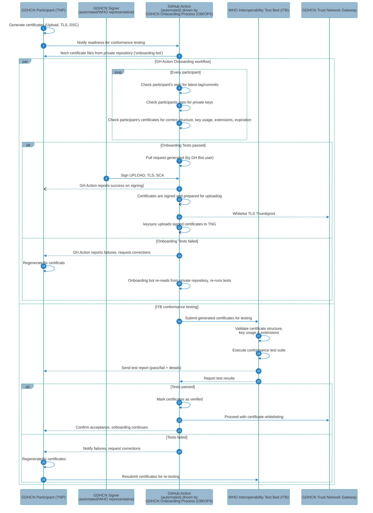

# Certificate Conformance Testing via the Interoperability Test Bed (ITB) during the GDHCN GH action driven Onboarding Process

Sequence diagram showing a GDHCN Part (Trust Network Part, TNP) sending
generated certificates to the [Interoperability Test Bed (ITB)](https://interoperable-europe.ec.europa.eu/collection/interoperability-test-bed-repository/solution/interoperability-test-bed)
during the onboarding process, with the ITB validating the certificates and reporting
results back to both the onboarding process and the participant.

