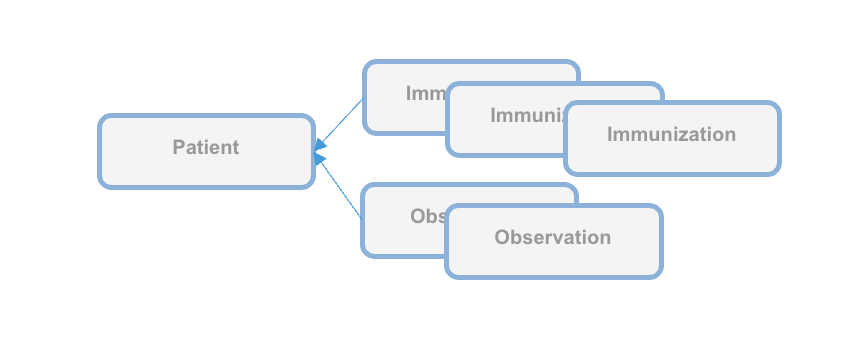

# Business Requirements - WHO SMART Trust v1.3.0

* [**Table of Contents**](toc.md)
* **Business Requirements**

## Business Requirements

## Business Requirements

This digital health trust network is a network of stakeholders that securely exchange and uses health information based on trust, security, and privacy principles, and is designed to ensure that health information is handled in a secure, private, and compliant manner. Through the GDHCN, WHO serves as the custodian of a digital health trust network.

It has been broken up into the following sections:

* [Key Concepts](concepts.md)
* [Functional Requirements](functional.md)
* [Use Cases](use_cases.md)
* [Personas](system-actors.md)
* [Data Dictionary](artifacts.md#terminology-value-sets)

In addition to the key concepts used throughout this document, which are defined below, additional documentation may be found on:

* [GDHCN Administrative and Operational Framework](GDHCN_Administrative_and_Operational_Framework.pdf)
* [Glossary](concepts.md)
* [Certificate Governance](concepts_certificate_governance.md)
* [Onboarding Process](concepts_onboarding.md)

The *GDHCN Administrative and Operational Framework* should be considered the authoritative source of definitions and concepts in case of any discrepancies.

### Concepts Glossary

#### GDHCN Trust Network

The GDHCN Trust Network is a Trust Network comprised of the GDHCN Secretariat and GDHCN Participants. The GDHCN Trust Network operationalizes Trust Domains through a Trust Network Gateway by enabling bilateral verification and utilization of Verifiable Digital Health Certificates and the utilization of Trusted Services by GDHCN Participants.

#### GDHCN Secretariat

The WHO Secretariat serves as the operational and management leadership of the GDHCN, and in this role, the GDHCN Secretariat.

#### GDHCN Participant

A GDHCN Participant is participant of the Trust Network that adheres to the Terms of Participation and manages the necessary technical infrastructure and governance processes. GDHCN Participants are responsible for making bilateral determinations related to the utilization of Trusted Services.

#### Eligible GDHCN Participant

An Eligible GDHCN Participant is one of the following:

* a WHO Member State or Associate Member, or sub-national unit thereof;
* a State Party recognized by the International Health Regulations, or sub-national unit thereof;
* the United Nations (UN) and other intergovernmental organizations in effective relations with WHO;
* a fund, programme, specialized agency, or related organization within the UN system; or
* an organization officially delegated by one of the organizations mentioned above that can abide by the GDHCN Terms of Participation and fulfils one or more of the following health service functions: 
* Public Health Agency;
* Health Professions Education Accreditation Agency;
* Health Services Licensing Agency; or
* Public Health Security Agency. Once accepted to the GDHCN, after the successful conclusion of the Onboarding Process, will be referred to as **GDHCN Participant**. An Eligible GDHCN Participant that has initiated the Onboarding Process will be referred to as an **Eligible GDHCN Applicant**.
 

#### Terms of Participation (TOP)

Participation in the GDHCN is subject to the Onboarding Process set forth by the GDHCN Secretariat in its sole and absolute discretion, and in accordance with WHO rules, regulations, policies and practices, as may be amended from time to time. The requirements for the GDHCN Terms of Participation are comprised of the following components:

* ****TOP0**** Sharing of necessary credentials to establish an mTLS (mutual transport layer security) connection between a GDHCN Participant’s backend system(s) and the Trust Network Gateway;
* ****TOP1**** Compliance, during initial Onboarding Process and during routine validation periods, with technical specifications required for a PKI;
* ****TOP2**** Compliance, during initial Onboarding Process and during routine validation periods, with technical specifications for Verifiable Digital Health Certificates and APIs of Trusted Services for each applicable Trust Domain;
* ****TOP3**** Compliance with policy and regulatory standards that GDHCN Participants pertaining to Trusted Services that a GDHCN Trust Participants operates or utilizes for each applicable Trust Domain; and
* ****TOP4**** Provision of supporting documentation (e.g. mandate, legal framework) demonstrating that it is an Eligible GDHCN Participant, as may be requested by WHO, at its sole discretion, from time to time.

#### Business Owner Representative

The individual identified by a GDHCN Participant as having the primary business and programmatic responsibility for the GDHCN Participant for the implementation of the use cases covered by a Trust Domain.

#### Key Master Representative

The individual identified by a GDHCN Participant as having the primary responsibility for the management of the Public Key Infrastructure, including the generation of any needed public-private key pairs, and the configuration and management of the connections between the GDHCN Participant’s Public Key Infrastructure and the GDHCN Trust Network Gateway.

#### Legal Representative

The individual designated by a GDHCN Participant as having the primary responsibility for reviewing the requirements related to a Trust Domain on behalf of this GDHCN Participant. This person should be someone that the GDHCN Secretariat can consult in relation to any legal or policy issues that may arise, such as changes to this document or changes to one of its Annexes that defines a Trust Domain.

#### Technical Representative

The individual designated by a GDHCN Participant as having the primary overall responsibility for the security, technical matters and systems infrastructure of this GDHCN Participant for the applicable Trust Domain including ensuring compliance with technical specifications.

#### Letter of Application

A formal application sent via a verifiable and secure channel from an Eligible GDHCN Participant to the GDHCN Secretariat to join the GDHCN Trust Network and participate within a particular Trust Domain.

#### Onboarding Process

The processes required for an Eligible GDHCN Participant to join the GDHCN Trust Network. At the successful conclusion of the Onboarding Process, the Eligible GDHCN Participant shall be considered a GDHCN Participant. Sometimes simply referred to as “Onboarding”.

#### Health Professions Education Accreditation Agency

An organization or organizational unit that is responsible for establishing and/or implementing procedures for accreditation of health professions education institutions. See https://apps.who.int/iris/rest/bitstreams/1473223/retrieve and https://applications.emro.who.int/docs/em_rc50_r9_en.pdf?ua=1

#### Health Services Licensing Agency

An organization or organizational unit that is responsible for establishing and/or implementing procedures for licensure, and the licensing of organizations or individuals to provide clinical, health system or public health services within their jurisdiction. Licensing comprises processes through which duly authorized governmental authorities, such as recognized professional organizations, grant permission to an individual or healthcare organization to operate or engage in a medical occupation or profession. See: https://apps.who.int/iris/rest/bitstreams/1473223/retrieve and https://cdn.who.int/media/docs/default-source/documents/health-systems-strengthening-glossary.pdf.

#### Public Health Agency

An organization, or organizational unit, that is responsible for establishing procedures for and/or implementation of activities related to the protection, promotion, and improvement of public health within a specific jurisdiction or domain. May also be referred to as a Ministry of Health, Department of Health, or Public Health Authority.

#### Public Health Security Agency

An organization, or organizational unit, that is responsible for establishing procedures for and/or implementing required activities, both proactive and reactive, for minimizing the danger and impact of acute public health events that endanger people’s health across geographical regions and international boundaries. See: https://www.who.int/health-topics/health-security.

#### Public Key Infrastructure (PKI)

The Public Key Infrastructure (PKI) is the trust model based on public key certificates and certificate authorities. It is the means for publishing and distributing Trust Lists comprising the public keys that can be used to digitally verify the issuer of a Verifiable Digital Health Certificates.

#### Signing Certificate Authority (SCA)

Each GDHCN Participant maintains one or more Signing Certificate Authority (SCA), certificates of which are relatively long lived. The SCA issues public key certificates for the national, short lived, Document Signers. The SCA acts as a trust anchor such that relying GDHCN Participants can use the SCA certificate to validate the authenticity and integrity of the regularly changing DSC certificates.

#### Holder

A Holder is an individual that has Verifiable Digtial Health Certificate in their possesion, received from an Issuer. The Holder may choose to share the Verifiable Digital Health Certificate with a Receiver.

#### Receiver

A Reciever is a system authorized by a Trust Network Participant to receive from a Holder a Veritifable verify, and utilize the content within.

#### Issuer

An Issuer a system authorized by a Trust Network Participant to generate Verifiable Digital Health Certificates which are provided to a Holder. An Issuer is responsible for generating the content that is digitally signed within the Verifiable Digital Health Certificate. In order to sign this content, an Issuer should either itself be a Document Signer or utilize a Document Signer service, as authorized by the jurisdicitonal policy.

#### Document Signer

A Document Signer utilizes the private key of a private-public key pair to digitally sign Verifiable Digital Health Certificates. A single private key is expected to sign a large quantity of Verifiable Digital Health Certificates. The corresponding public key is referred to as a Document Signer Certificate (DSC).

#### Document Signer Certificates (DSCs)

Document Signer Certificates are the public key certificates associated to Document Signers which are issued or recognized by the GDHCN Participant.

#### Encryption Key Certificate Governance

The process and technical specifications regarding the management and use of encryption keys for Verifiable Digital Health Certificates, Public Key Infrastructure, and for securing connections with Trusted Services and the Trust Network Gateway.

#### Trust Domain

A Trust Domain consists of:

* Defined use cases and business processes related to the utilization of Verifiable Digital Health Certificates;
* the open, interoperable technical specifications that identify or define the applicable Trusted Services and Verifiable Digital Health Certificates; and
* a set of policy and regulatory standards describing expected behavior of GDHCN Participants in relation to operation of the Trusted Services and utilization of Verifiable Digital Health Certificates (e.g. data minimization, privacy, scope of use).

#### Trust Lists

Universal verifier applications that support different credential standards are complicated by wide variability in format of the credential payloads, signatures, key formats, and key distribution methods. Public keys formats include x509 certificates, JSON Web Key Sets (JWKS), and DID documents. Signing key distribution methods include API gateways, hosted by issuer at a pre-defined URL, embedded in certificates, and by block-chain based resolution. Establishing root of trust by trust anchor or distributing trust list has been accomplished by API gateway, hosted URL, private dissemination and other bilateral sharing agreements.

While some variability is expected in an approach that preserves sovereignty, there are opportunities for alignment in key format and distribution for the sake of fostering interoperability. With that goal, we provide a unifying trust list format to assemble and share public key infrastructure for all credential specifications used by existing trust networks. Importantly, this format does not enforce a particular policy framework for participants of the trust network.

The GDHCN currently supports two means for key distribution of keys using trust lists

* [EU DCC API](openapi/index.md) **required**
* [Decentralized Identifier (DID)](concepts_did.md) optional

#### Trust Network

A Trust Network is a means to authenticate the encryption public keys used by participants within a network to perform encryption services, verify digital signatures, establish secure connections between systems, and otherwise make use of encryption public keys.

**Trust Network**


#### Trust Network Gateway (TNG)

The Trust Network Gateway (TNG) is the open-source software and its IT operational infrastructure, utilizing open standards, for a Public Key Infrastructure and metadata management services which is used to operationalize one or more Trust Domains. The Trust Network Gateway can be interacted with using the [API](openapi) once a mTLS connection has been established.

##### Trust Network Gateway - Trust Anchor (TNGTA)

The Trust Anchor public key certificate of the TNG. The corresponding private key is used to sign the list of all SCA certificates offline.

##### Trust Network Gateway - Transport Layer Security (TNGTLS)

The TLS server public key certificate of the TNG.

#### Trust Network Participant (TNP)

Trust Network Participant (TNP) is an acronym used to label certificates, infrastructure, or technical artifacts made available by GDHCN Participants under the GDHCN Trust Network.

##### GDHCN Participant Backend System

A GDHCN Participant's Backend System for managing the local part of information. The implementation of GDHCN Participant's Backend System is not in the scope of this document. A national backend can be also understood as a trusted party on-boarded in the Trust Network Gateway (can be a script, a proxy or a web server as well).

##### Trust Network Participant - Data Exchange Certificate Authority (TNPDECA)

The DSCA public key certificate of a GDHCN Participants (could be more than one).

The DECA public key certificate of a GDHCN Participants (could be more than one). The DECA is a certificate which acts a trust anchor in the verification of the certificate chain for the DESCs issued by a Trust Network Participant"

##### Trust Network Participant - Document Signing Certificate Authority (TNPDSCA)

The DSCA public key certificate of a GDHCN Participants (could be more than one). The DSCA is a certificate which acts a trust anchor in the verification of the certificate chain for the DSCs issued by a Trust Network Participant"

##### Trust Network Participant - Transport Layer Security (TNPTLS)

The TLS client authentication public key certificate of a GDHCN Participant's Backend System.

##### Trust Network Participant - Transport Layer Security (TNPUP)

The public key certificate that a GDHCN Participant uses to sign data packages that are uploaded to the TNG.

##### Trust Network Participant Verifier

A system utilized by a GDHCN Participant to verify the digital signature of a Verifiable Digital Health Certificate.

#### Trusted Service

A service (digital or otherwise) related to the issuance, management, verification, exchange, or other relevant processes, of Verifiable Digital Health Certificates which is defined using open, interoperable digital health standards.

#### Verifiable Digital Health Certificate

Verifiable Digital Health Certificate: A digital representation of a data set comprising a certificate or document, designed for a set of specific clinical or public health use cases which is defined using open, interoperable digital health standards; that contains within, or is associated to, a digital signature which can be verified by the public key of a public-private encryption key pair, and which is issued by a GDHCN Participant.

The specific Verifiable Digital Health Certificates are defined in the [Content Profiles](trust_domains.md)

### Certificate Governance

This document describes the Public Key Certificate Governance utilized by the WHO GDHCN. See the [concepts](concepts.md) document for further information.

**Note:** In the embedded image the following relabels apply:

* DCCG -> TNG
* CSCA -> SCA
* DCC -> GDHCN
* NB -> TNP

#### Context

The core functionality is the secure and trusted exchange of signature keys for GDHCN Trust Network Gateway (TNG) which acts as a central repository for the public keys. GDHCN Participants are empowered to publish the public keys that they use to sign Verifiable Digital Health Certificate. Relying GDHCN Participants can use the TNG to fetch up-to-date public key material on a timely basis.

The trust model of the GDHCN framework is a Public Key Infrastructures (PKI). Each GDHCN Participant maintains one or more Signing Certificate Authority (SCA), certificates of which are relatively long lived. The SCA issues public key certificates for the short lived, Document Signers (i.e. signers for digital health certificates), which are called Document Signer Certificates (DSCs). The SCA acts as a trust anchor such that relying GDHCN Participants can use the SCA certificate to validate the authenticity and integrity of the regularly changing DSC certificates. Once validated, the GDHCN Participant can provide these certificates (or just the public keys contained therein) to their validation applications.

Besides SCAs and DSCs, the TNG **also** relies on PKI to authenticate transactions, sign data, as the basis for authentication and as a means to ensure integrity of the communication channels between the GDHCN Participant and the TNG.<

The following picture presents a high-level overview of the system.

**Overview**


#### Scope of Document

Digital signatures can be used to achieve data integrity and authenticity. Public Key Infrastructures establish trust by binding public keys to verified identities (or issuers). This is necessary to allow other participants to verify the data origin and the identity of the communication partner and decide about trust. In the TNG, multiple public key certificates are used for authenticity. This document defines which public key certificates are used and how they should be designed in order to allow broad interoperability between the different GDHCN Participants. This document is based on [1] and [2]. It provides more details on the necessary public key certificates and it gives guidance on certificate templates and validity periods for countries that want to operate their own SCA. Since DSCs shall be verifiable for a defined time-frame (starting from the issuing, expire after a given time), it is necessary to define a verification model for all signatures applied on the public key certificates and the digital health certificate. Legal and administrative procedures are not in the scope of this document, they must be defined separately.

#### Terminology

The key words "MUST", "MUST NOT", "REQUIRED", "SHALL", "SHALL NOT", "SHOULD", "SHOULD NOT", "RECOMMENDED", "NOT RECOMMENDED", "MAY", and "OPTIONAL" in this document are to be interpreted as described in BCP 14 ([RFC2119](https://tools.ietf.org/html/rfc2119), [RFC8174](https://tools.ietf.org/html/rfc8174)) when, and only when, they appear in all capitals, as shown here.

These [concepts](concepts.md) and the following table contains abbreviations and terminology used throughout this document.

| | |
| :--- | :--- |
| Certificate | Or public key certificate. An X.509 v3 certificate that contains the public key of an entity |
| EC-DSA | Elliptic Curve Digital Signature Algorithm. A cryptographic signature algorithm based on elliptic curves |
| mTLS | Mutual TLS. The Transport Layer Security Protocol with mutual authentication |
| RSA | Asymmetric cryptographic algorithm based on integer factorization used for digital signatures or asymmetric encryption |

#### TNG communication flows and security services

This section gives an overview of the communication flows and security services in the TNG system. It also defines which keys and certificates are used to protect the communication, the uploaded information, the digital health certificates, and a signed trust list that contains all on-boarded SCA certificates. The following figure gives a high-level overview of the TNG communication flow and security services. The following sub-sections will explain the design in more detail.

**Trust Model**


##### General

The TNG works as a data hub that allows the exchange of signed data packages for GDHCN Participants. In the current phase, the signed data packages contain the DSC that are used by the GDHCN Participants. This allows other GDHCN Participant Backends to fetch them and distribute the information to their validation apps. Even if the DSCs are already signed by the SCA, this approach allows to extend the system later to allow Backends the upload of different, potentially unsigned, content (like validation rules).

Uploaded data packages are provided by the TNG “as is”, meaning that the TNG does not add or delete DSCs from the packages it receives. The Backend systems of the GDHCN Participants shall be enabled to verify the end-to-end integrity and authenticity of the uploaded data (see Section "Integrity and authenticity of uploaded data").

In addition to this - GDHCN Participant Backend systems and the TNG will use mutual TLS authentication to establish a secure connection (see Section "Authentication and connection establishment"). So this is in **addition** to the signatures in the data exchanged.

##### Authentication and connection establishment

The TNG uses Transport Layer Security (TLS) with mutual authentication to establish an authenticated encrypted channel between the GDHCN Participant's Backend and the Trust Network Gateway environment and utitlize its [API](openapi). Therefore, the TNG holds a TLS server certificate, abbreviated TNGTLS - and the GDHCN Participant's Backends hold a TLS client certificate – abbreviated TNPTLS. Certificate templates are provided in Section "Certificate Templates".

Every GDHCN Participant's Backend can provide their own TLS certificate. This certificate will be whitelisted explicitly and thus may be issued by a publicly trusted certificate authority (e.g. a certificate authority that follows the baseline requirements of the CA Browser forum), by a jurisdictional certificate authority or it can be self-signed. Every GDHCN Participant is responsible for their jurisdictional data and the protection of the private key used to establish the connection to the TNG. Clearly, the “bring your own certificate” approach requires a well-defined registration and identification process as well as revocation and renewal procedures that are described in Section "Registration of GDHCN Participant Backends".

The TNG uses a whitelist where the TLS certificates of GDHCN Participant Backends are added after their successful registration. Only GDHCN Participant Backends that authenticate themselves with a private key that corresponds to a certificate from the whitelist can establish a secure connection to the TNG.

The TNG will also use a TLS certificate that allows the GDHCN Participant Backends to verify that they are indeed establishing a connection to the “real” TNG and not some malevolent entity posing as TNG. The TNGTLS certificate will be issued from a publicly trusted CA (included in all major browsers). It is the responsibility of the GDHCN Participants to verify that their connection to the TNG is secure (for example by checking the fingerprint of the TNGTLS certificate of the server connected to against the one provided post registration).

##### Signing Certificate Authorities and Validation Model

All GDHCN Participants that take part in the GDHCN framework MUST use an SCA to issue the DSCs. GDHCN Participants MAY have more than one SCA, e.g. in case of delegation authorities. Each GDHCN Participant can either use existing certificate authorities or they can set up a dedicated (possibly self-signed) certificate authority for the SCA system. The GDHCN Participants MUST present their SCA certificate(s) to the GDHCN Secretariat during the official [on-boarding procedure](concepts_onboarding.md). After successful registration of the GDHCN Participant (see section "Registration of GDHCN Participant Backends" for more details), the GDHCN Secretariat will update a signed trust list that contains all SCA certificates that are active. The GDHCN Secretariat will use a dedicated asymmetric key pair to sign the trust list and the certificates in an offline environment. The private key will not be stored on the online TNG system, such that a compromise of the online system does not enable an attacker to compromise the trust list. The corresponding trust anchor certificate TNGTA will be provided to the GDHCN Participants during the onboarding process. GDHCN Participants can retrieve the trust list from the TNG for their verification procedures.

The SCA is defined as the certificate authority that issues DSCs, hence GDHCN Participants that use a multi-tier CA hierarchy (e.g. Root CA -> SCA -> DSCs) MUST provide the subordinate certificate authority that issues the DSCs. So in that case - if a GDHCN Participant uses an existing certificate authority - the GDHCN system will **ignore** anything above the SCA – and whitelist only the SCA as the trust anchor (even though it is a sub-ordinate CA). This is as the ICAO model [2] only allows for exactly two levels - a 'root' SCA and a single 'leaf' DSC signed by just that SCA. In case a GDHCN Participant operates its own SCA, the GDHCN Participant is responsible for the secure operation and key management of that CA. It must be noted that the SCA acts as the trust anchor for DSCs and therefore, protecting the private key of the SCA is essential for the integrity of the Trust Network environment.

The verification model in the Trust Network PKI is the shell model (for example, defined in [3]), which states that all certificates in the certificate path validation must be valid at a given time (i.e. the time of signature validation). Therefore, the following restrictions apply:

* The SCA SHALL NOT issue certificates that are valid longer than the CA certificate itself (see [2, Section 5]).
* The document signer SHALL NOT sign documents that are valid longer than the DSC itself. GDHCN Participants that operate their own SCA MUST define validity periods for their SCA and all issued certificates, and they MUST take care of certificate renewal. Section "Certificate authorities, validity periods and renewal" contains recommendations for validity periods.

##### Integrity and authenticity of uploaded data

GDHCN Participants can use the TNG to upload and download digitally signed data packages after successful mutual authentication. In the beginning, these data packages contain the DSCs of the GDHCN Participants.

The key pair that is used by the GDHCN Participant's Backend for the digital signature of uploaded data packages in the TNG system is called Trust Network Participant upload signature key pair and the corresponding public key certificate is abbreviated by TNPUP certificate. Each Trust Network Certificate brings its own TNPUP certificate, which can be self-signed, or issued by an existing certificate authority, such as a public certificate authority (i.e. a certificate authority that issues certificate in accordance with the CAB-Forum baseline requirements). The TNPUP certificate shall be different from any other certificates used by the GDHCN Participant (i.e. SCA, TLS client or DSCs).

The GDHCN Participants MUST provide the upload certificate to the GDHCN Secretariat during the initial registration procedure (see Section "Registration of GDHCN Participant Backends" for more details). Every GDHCN Participant is responsible for their jurisdiction's data and it must protect the private key that is used for signing the uploads. Other GDHCN Participants can verify the signed data packages using the upload certificates that are provided by the TNG.

The TNG verifies the authenticity and integrity of the uploaded data with the TNPUP certificate before it is provided to other GDHCN Participants.

##### Requirements on the technical TNG architecture

The requirements on the technical TNG architecture can be summarized as follows:

* The TNG uses mutual TLS authentication to establish an authenticated encrypted connection with the GDHCN Participant Backends. Therefore, the TNG maintains a whitelist of registered TNPTLS client certificates.
* The TNG uses two digital certificates (TNGTLS and TNGTA) with two distinct key pairs. The private key of the TNGTA key pair is maintained offline (not on the online components of the TNG).
* The TNG maintains a trust list of the TNPSCA certificates that is signed with the TNGTA private key.
* The ciphers used MUST meet the requirements from Section "Cryptographic requirements".

#### Certificate Life-cycle Management

##### Registration of GDHCN Participant Backends

GDHCN Participants MUST register with the GDHCN Secretariat to take part in the TNG system. This section describes the technical and operational procedure that MUST be followed to register a GDHCN Participant Backend. Legal and administrative procedures are not in the scope of this document, they must be defined separately.

The GDHCN Secretariat and the GDHCN Participant MUST exchange information on technical contact persons for the on-boarding process. It is assumed that the technical contact persons are legitimated by their GDHCN Participants and identification/authentication is performed through other channels.

The GDHCN Participant MUST provide three digital certificates during the registration and identification process:

* The Trust Network Participant's TLS certificate TNPTLS
* The Trust Network Participant's upload certificate TNPUP
* The Trust Network Participant's SCA certificate(s) TNPSCA

All provided certificate MUST adhere to the requirements defined in Section "Certificate templates". The GDHCN Secretariat will verify that the provided certificate adheres to the requirements of Section "Certificate templates". 

 After the identification and registration, the GDHCN Secretariat

* adds the TNPSCA certificate(s) to the trust list signed with the private key that corresponds to the TNGTA public key
* adds the TNPTLS certificate to the whitelist of the TNG TLS endpoint
* adds the TNPUP certificate to the TNG system
* provides the TNGTA and TNGTLS public key certificate to the GDHCN Participant

##### Certificate authorities, validity periods and renewal

In case a GDHCN Participant wants to operate its own SCA, the SCA certificates will most probably be self-signed certificates. They act as the trust anchor of the Network Participant state and therefore the GDHCN Participant must strongly protect the private key corresponding to the SCA certificate’s public key. It is recommended that the GDHCN Participants use an offline system for their SCAs, i.e. a computer system that is not connected to any network. Multi-person control should be used to access the system (e.g. following the four eyes principle). After signing DSCs, operational controls should be applied and the system that holds the private SCA key should be stored safely with strong access controls. Hardware Security Modules or Smart Cards can be used to further protect the SCA private key.

###### Validity periods

Digital certificates contain a validity period that enforces certificate renewal. Renewal is necessary to use fresh cryptographic keys and to adapt the key sizes when improvements in computation or new attacks threaten the security of the cryptographic algorithm that is used. The shell model applies (see Section "Signing Certificate Authorities and Validation Model"). The following validity periods are recommended based on the assumption of the one-year maximum validity for Verifiable Digital Health Certificates :

* SCA: 4 years
* DSC: 2 years
* Upload: 1-2 years
* TLS Client authentication: 1-2 years

For a timely renewal, the following usage period for the private keys are recommended:

* SCA: 1 year
* DSC: 6 months

GDHCN Participants MUST create new upload certificates and TLS certificates timely, e.g. one month, before expiration in order to allow smooth operation. SCA and DSC SHOULD be renewed at least one month before the private key usage ends (considering the necessary operational procedures). GDHCN Participants MUST provide updated SCA, upload and TLS certificates to the GDHCN Secretariat.

Expired certificates SHALL be removed from the whitelist and trust list.

GDHCN Participants and the GDHCN Secretariat MUST keep track of the validity of their own certificates. There is no central entity that keeps record of the certificate validity and informs the participants.

The following picture shows the private key usage periods and certificate lifetimes for the recommended times in case that GDHCN Participants want to operate their own SCA (assuming one-year maximum lifetime of signed documents).

**Validity Times**


GDHCN Participants might define different validity periods for their public key certificates.

##### Revocation of certificates

In general, public key certificates can be revoked by their issuing CA using certificate revocation lists or Online Certificate Status Responder. SCAs for the Trust Network system SHOULD provide certificate revocation lists (CRLs). Even if these CRLs are currently not used by other GDHCN Participants (see [2, Section 5.1]), they SHOULD be integrated for future applications. In case an SCA decides not to provide CRLs, the DSC certificates of this SCA must be renewed when CRLs become mandatory.

A SCA SHOULD NOT use the Online Certificate Status Protocol (OCSP) for their DSCs, due to privacy concerns. GDHCN Participant Verifiers SHOULD NOT use OCSP for verification of the DSCs and SHOULD use CRLs. It is RECOMMENDED that the GDHCN Participants' Backend performs necessary validation of DSC certificates downloaded from the Trust Network Gateway and only forward a set of trusted and validated DSC to GDHCN Participant Verifiers. GDHCN Participant Verifiers SHOULD NOT perform any revocation checking on DSC in their verification process. One reason for this is to protect the privacy of the holders of Verifiable Digital Health Certificates by avoiding any chance that the use of any particular DSC can be monitored by its associated OCSP responder.

GDHCN Participants can remove their DSCs from the TNG on their own using valid upload and TLS certificates. It must be noted that removing a DSC certificate will mean that all health certificates issued with this DSC will become invalid when GDHCN Participants fetch the updated DSC lists. Clearly, the protection of private key material corresponding to DSCs is crucial.

GDHCN Participants MUST inform the GDHCN Secretariat when they must revoke upload or TLS certificates, for example due to compromise of the GDHCN Participant Backend. The GDHCN Secretariat can then remove the trust for the affected certificate, e.g. by removing it from the TLS whitelist. The GDHCN Secretariat can remove the upload certificates from the TNG database. Packages signed with the private key corresponding to this upload certificate will become invalid when GDHCN Participants remove the trust of the revoked upload certificate.

In case that an SCA must be revoked, GDHCN Participants SHALL inform the GDHCN Secretariat as well as other GDHCN Participants that they have trust relationships with. The GDHCN Secretariat will issue a new trust list where the affected certificate is no longer contained. All DSCs issued by this SCA will become invalid when GDHCN Participants update their GDHCN Participant Backend trust store.

In case the TNGTLS certificate or the TNGTA certificate must be revoked, the GDHCN Secretariat and the GDHCN Participants must work together to establish a new trusted TLS connection and trust list.

##### Certificates for Staging Environments

The GDHCN Participants and the GDHCN Secretariat will use non-production environments (development, acceptance, testing, etc.) to test the system before they move to production or when new features are released. It is mandatory that public key certificates and the related key material are not reused between the production and the non-production environments. Hence, GDHCN Participants MUST use different public key certificates and private keys for the production and all the non-production environments. This applies to the TNPTLS, TNPUP certificates of the GDHCN Participants and all DSCs. The TNGTA certificates will be different for production and non-production environments.

There are multiple reasons why certificates should not be reused across different environments. One reason is that the corresponding private keys must be copied from one system to the other and typically non-production environments do not enjoy the same level of protection as production environments. This puts the security of the private keys at risk. In the scope of the Trust Network system there is an additional risk that DSCs issued for testing purpose are published on the production TNG and these DSCs could be used to issue valid health certificates.

#### Certificate Templates

The following sections contain cryptographic requirements and guidance as well as requirements on certificate templates. For the TNG certificates, this section defines the certificate templates. Please also refer to the certificate generation examples in the [certificate preparation guide](concepts_onboarding_checklist.md).

##### Cryptographic requirements

Cryptographic algorithms and TLS cipher suites shall be chosen based on the current recommendation from the German Federal Office for Information Security (BSI) or SOG-IS. These recommendations and the recommendations of other institutions and standardization organization are quite similar. The recommendations can be found in the technical guidelines TR 02102-1 and TR 02102-2 ([source](https://www.bsi.bund.de/EN/Service-Navi/Publications/TechnicalGuidelines/tr02102/tr02102_node.html)) or SOG-IS Agreed Cryptographic Mechanisms ([source](https://www.sogis.eu/uk/supporting_doc_en.html)).

###### Requirements on the DSC

The requirements from [2, Section 3.3.2] apply. Hence, it is strongly RECOMMENDED that Document Signers use the Elliptic Curve Digital Signature Algorithm (ECDSA) with NIST-p-256 (as defined in appendix D of FIPS PUB 186-4). Other elliptic curves are not supported. Due to the space restrictions of the digital health certificate, GDHCN Participants SHOULD NOT use RSA-PSS, even if it is allowed as a fallback algorithm. In case GDHCN Participants use RSA-PSS, they SHOULD use a modulus size of 2048 or max. 3072 bit. SHA-256 SHALL be used as cryptographic hash function (see ISO/IEC 10118-3:2004).

###### Requirements on TLS, Upload and SCA

For digital certificates and cryptographic signatures in the TNG context, the major requirements on cryptographic algorithms and key length are summarized in the following table (as of 2021):

| | | |
| :--- | :--- | :--- |
| EC-DSA | Min. 250 Bit | SHA-2 with an output length ≥ 256 Bit |
| RSA-PSS (recommended padding)RSA-PKCS#1 v1.5 (legacy padding) | Min. 3000 Bit RSA Modulus (N) with a public exponent e > 2^16 | SHA-2 with an output length ≥ 256 Bit |
| DSA | Min. 3000 Bit prime p, 250 Bit key q | SHA-2 with an output length ≥ 256 Bit |

The recommended elliptic curve for EC-DSA is again NIST-p-256 due to its widespread implementation.

###### SCA certificate (TNPSCA)

The following table gives guidance on the TNPSCA certificate template in case that a GDHCN Participant decides to operate its own SCA for the DCC system. **Bold** entries are required (MUST be included in the certificate), **italic** entries are recommended (SHOULD be included). For absent fields, no recommendations are defined.

| | |
| :--- | :--- |
| **Subject** | **cn= <non-empty and unique common name>**,**o=<Provider>**,**c=<GDHCN Participant>** |
| **Key Usage** | **certificate signing**,**CRL signing**(at minimum) |
| **Basic Constraints** | **CA = true, path length constraints = 0** |

In accordance to [2, Section 5], the subject name MUST be non-empty and unique within the GDHCN Participant's jurisdiction. The country code (c) MUST match the jurisdiction that will use this SCA. The certificate MUST contain a unique subject key identifier (SKI) according to RFC 5280.

##### Document Signer (DSC)

The following table provides guidance on the DSC certificate template in accordance to [2, Section 5]. **Bold** entries are required (MUST be included in the certificate), **italic** entries are recommended (SHOULD be included). For absent fields, no recommendations are defined.

| | |
| :--- | :--- |
| **Serial Number** | **unique serial number** |
| **Subject** | **cn=<non-empty and unique common name>**,**o=<Provider>**,**c=<GDHCN Participant that uses this DCS>** |
| **Key Usage** | **digital signature**(at minimum) |

The DSC MUST be signed with the private key corresponding to an SCA certificate that is used by the GDHCN Participant.

The following extension are to be used in accordance to [2, Section 5]:

* The certificate MUST contain a Authority Key Identifier (AKI) matching the Subject Key Identifier (SKI) of the issuing SCA certificate
* The certificate SHOULD contain a unique Subject Key Identifier (in accordance to RFC 5280)

In addition, the certificate SHOULD contain the CRL distribution point extension pointing to the certificate revocation list (CRL) that is provided by the SCA that issued the DSC.

The following extensions are to be used as defined in [2, Appendix A4]. Countries MAY also include an extendedKeyUsage entry with **zero** or more (i.e. up to 3) entries from:

| | |
| :--- | :--- |
| extendedKeyUsage | 1.3.6.1.4.1.1847.2021.1.1 for Test Issuers |
| extendedKeyUsage | 1.3.6.1.4.1.1847.2021.1.2 for Vaccination Issuers |
| extendedKeyUsage | 1.3.6.1.4.1.1847.2021.1.3 for Recovery Issuers |

These values are defined as non-critical, therefore all applications should handle new and/or unknown OIDs gracefully.

##### Upload Certificates (TNPUP)

The following table provides guidance for the GDHCN Participant Backend upload certificate. **Bold** entries are required (MUST be included in the certificate), **italic** entries are recommended (SHOULD be included). For absent fields, no recommendations are defined.

| | |
| :--- | :--- |
| **Subject** | **cn= <non-empty and unique common name>**,**o=<Provider>**,**c=<GDHCN Participant that uses this upload certificate>** |
| **Key Usage** | **digital signature**(at minimum) |

##### GDHCN Participant TLS Client Authentication (TNPTLS)

The following table provides guidance for the GDHCN Participant Backend TLS client authentication certificate. **Bold** entries are required (MUST be included in the certificate), **italic** entries are recommended (SHOULD be included). For absent fields, no recommendations are defined.

| | |
| :--- | :--- |
| **Subject** | **cn=<non-empty and unique common name>**,**o=<Provider>**,**c= <GDHCN Participant that uses this TLS>** |
| **Key Usage** | **digital signature**(at minimum) |
| **Extended Key Usage** | **client authentication (1.3.6.1.5.5.7.3.2)** |

* The certificate MAY also contain the extended key usage **server authentication (1.3.6.1.5.5.7.3.1)** but is not required.

Beware that self-signed certificates should also contain the key usage **Certificate signing** (`keyCertSign`), so that OpenSSL can verify the (self) signature of the certificate.

##### Trust list signature certificate (TNGTA)

The following table defines the TNG Trust Anchor certificate.

| | |
| :--- | :--- |
| **Subject** | **cn= Digital COVID Certificate Gateway, o=<Provider> , c=<GDHCN Participant>** |
| **Key Usage** | **digital signature**(at minimum) |

##### TNG TLS Server certificates (TNGTLS)

The following table defines the TNG TLS certificate.

| | |
| :--- | :--- |
| **Subject** | **cn=<FQDN or IP address of the TNG>**,**o=<Provider>**,**c= <GDHCN Participant>** |
| **SubjectAltName** | **dnsName: <TNG DNS name> or iPAddress: <TNG IP address>** |
| **Key Usage** | **digital signature**(at minimum) |
| **Extended Key Usage** | **server authentication (1.3.6.1.5.5.7.3.1)** |

* The certificate MAY also contain the extended key usage **client authentication (1.3.6.1.5.5.7.3.2)** but is not required.

The TLS certificate of the TNG will be issued by a publicly trusted certificate authority (included in all major browsers and operating systems, following the CAB Forum baseline requirements).

#### REFERENCES

[1] Interoperability of health certificates – Trust Framework – v. 1.0 – 12.03.2021 – eHealth Network – available at https://ec.europa.eu/health/sites/health/files/ehealth/docs/trust-framework_interoperability_certificates_en.pdf - last accessed 27.04.2021
 [2] Technical Specifications for Digital COVID Certificates Volume 1 V1.0.5 - eHealth Network – available at https://ec.europa.eu/health/sites/health/files/ehealth/docs/digital-green-certificates_v1_en.pdf - last accessed 27.04.2021
 [3] ETSI EN 319 102-1: Electronic Signatures and Infrastructures (ESI); Procedures for Creation and Validation of AdES Digital Signatures; Part 1: Creation and Validation – version 1.1.1, 2016 – available at https://www.etsi.org/deliver/etsi_en/319100_319199/31910201/01.01.01_60/en_31910201v010101p.pdf – last accessed 23.04.2021

### Onboarding Process

The following describes the on-boarding processes for the Global Digital Health Certification Network (GDHCN).

The GDHCN Secretariat manages the Onboarding Process and Letters of Applications of eligible GDHCN Participants to connect as a trusted party to the trust network. Prepared onboarding records will be handed over to the GDHCN Secretariat with the request to process the technical on-boarding of the trusted party. An organizational and technical successful application results in a confirmation and the GDHCN Participant can connect to the trust network as a trusted party.

Please review the:

* [Concepts](concepts.md) underpinning the description of these on-boarding processes including the general description of the Terms of Participation;
* [Onboarding Overview](concepts_onboarding.md) describing the overview of the onboarding process;
* [Certificate Governance](concepts_certificate_governance.md) describing the governance of public key certificates;

An eligible GDHCN Participant should complete the [Onboarding Checklist](concepts_onboarding_checklist.md) which contains guiding videos through the onboarding process.

After positively assessing the Letter of Application and assessing the Technical Evaluation Form, WHO will:

* provide the necessary technical specifications and configuration information to connect to their back-end systems to the WHO GDHCN Trust Network Gateway (TNG)
* invite the GDHCN Participant to register their production certificates and promote them to the production environment.

The [GDHCN Administrative and Operational Framework](GDHCN_Administrative_and_Operational_Framework.pdf) should be considered the authoritative source of definitions and concepts in case of any discrepncies.

#### Overview of the Onboarding Process

The full GDHCN onboarding process is divided it into three main stages as per the following figure:

Figure 1: Onboarding Stages

##### Prepare Key Material Submission

To establish a connection with the Trust Network Gateway (TNG) and become a participant of the GDHCN, the participant is required to prepare their own key materials for us to onboard onto the gateway. This process necessitates technical expertise for the preparation of X.509 certificates, which are to be stored in a GitHub repository owned by the participant for submission.

In order to start the onboarding participants need to Prepare Key Material Submission.

Please follow the steps described in the: [tng-participant-template](https://github.com/WorldHealthOrganization/tng-participant-template) and [README.md](https://github.com/WorldHealthOrganization/tng-participant-template/blob/main/README.md).

For more information, you can check the following resources:

A [Diagram](https://smart.who.int/trust/OnboardingProcessInteractionParticipantAndWHO.png) that gives and overview about the steps in order to start the Full Onboarding.

The [document](https://smart.who.int/trust/blob/docs/OnboardingProcess_Documents/input/pagecontent/concepts_onboarding_process_full.html) contain a detailed description of the tasks to be carried out by the participant. Note: Please note that the participant’s work begins at step 8 and ends at step 14.

Once we have received your submission and successfully onboarded the material, we will contact you to start the next phase of testing.

##### Perform Acceptance Testing

After we contacted the participant about successful onboarding, a connectivity test should be the first action of the process. When connectivity is successfully established the participant should execute their acceptance tests. These acceptance tests must be performed on dedicated test environment called User Acceptance Testing (UAT) which already connects other trust network participants, that applied for onboarding.

The [Trust Network Gateway API](openapi) can be used for interaction keeping the full functionality of the EU DCC Gateway. In addition, various HL7 FHIR services are being added.

The participant needs to [communicate the results] of their tests to us, a quality check about the communicated results will be carried out, so that we can check for any issues or approve their readiness for production rollout.

##### Go Live on Production Environment

Once the acceptance stage has been successfully completed and approved, the process to Go Live on Production Environment can commence. This involves submitting the key material targeted for the production environment (as outlined in stage 1), followed by onboarding to the production environment. The participant will be notified once the Go Live on Production Environment has been successful.

#### Onboarding Application Requirements

Eligible GDHCN Participants are invited to submit a signed with:

* the necessary information to connect to the production environment
* attestation to comply with the Terms of Participation.

The application of the GDHCN Participant must contain at least:

* One or more TNPSCAs, one TNPTLS and one TNPUP ;
* A statement about the acceptance of keys and processes of other jurisdictions which are present in the gateway lists; and
* Contact Persons - Technical, Legal, Business Owner.

#### Letters of Application

##### Letters of Application - DDCC

DDCC: The Trust Domain for the Digital Documentation of COVID-19 Certificates

* [Letter of Application for DDCC using the Transitive Trust](Letter_of_Application_Transitive_Trust.docx)
* [Letter of Application for DDCC by the Full Onboarding Process](Letter_of_Application_DDCC.docx)
* [Letter of Application for DDCC by the Full Onboarding Process - Arabic Version](Letter_of_Application_DDCC-Arabic.docx)
* [Letter of Application for DDCC by the Full Onboarding Process - Chinese Version](Letter_of_Application_DDCC_Chinese.docx)
* [Letter of Application for DDCC by the Full Onboarding Process - French Version](Letter_of_Application_DDCC_French.docx)
* [Letter of Application for DDCC by the Full Onboarding Process - Russian Version](Letter_of_Application_DDCC_Russian.docx)
* [Letter of Application for DDCC by the Full Onboarding Process - Spanish Version](Letter_of_Application_DDCC-Spanish.docx)

##### Letters of Application - PH4H

* [Letter of Application for PH4H - English Version](PH4H_Letter_of_Application_ENGLISH.pdf)
* [Letter of Application for PH4H - Spanish Version](PH4H_Letter_of_Application_SPANISH.pdf)

##### Letters of Application - IPS Pilgrimage

#### Secretariat Tasks

The secretariat must handle the following tasks to establish the on-boarding process:

* The organizational identity and contact will be established in an offline process by WHO through it's Member State country offices with appropriate contacts at ministries of health or appropriate public health agency.
* providing a Secure Channel for the GDHCN Participant to deliver secure and trustworthy applications SCA and/or DID information;
* creation and Securing a Key Pair (Trust Anchor) to sign/confirm on-boarding requests for the gateway;
* delivering the Public Key of the Trust Anchor to the Gateway Operations; and
* transmitting On-boarding Requests to the Gateway Operations.

#### Details of the Onboarding Process

This document describes the standard onboarding process (so called Future Onboarding Process - FOP).

**Note:** In the embedded image the following relabels apply:

* DCCG -> TNG
* CSCA -> SCA
* DCC -> VDHC (Verifiable Digital Health Certificate)
* NB -> TNP

It is highly recommended:

* **To use certificates issued from a public CA which follows the CAB Forum Rules**
* **Not to reuse any certificates across the different staging environments**

In the following description the required steps are divided into three sections:

**[1]** - **[29]** - Application and Verification
 **[30]** - **[59]** Setup
 **[60]** - **[End]** Participant Onboarding


##### Application and Verification

**[1]** The eligible Trust Network Participant (TNP) has to submit its Statement of Interest [link to the form. [Document 5] ] to gdhcn-support@who.int .

**[2 – 3]** WHO validates all provided data and verify that such a data follows WHO compliance with Trusted Network Terms of Participation (TOP 0 – 3) https://smart.who.int/trust/concepts.html as well as: Participant´s eligibility criteria, governmental entity/health agency, contact details of approvers and individuals. [See Elegibility Criteria]. [Document 16]

< see chapter 9.5 in TOP details > [Document 6]

**[4 - 5]** In case no compliance with WHO governance rules is given, the application is rejected. The rejection is communicated to the TNP by email.

**[6]** TNP needs to modify the data they shared with WHO and re-apply it.

**[7]** If the WHO’s technical team gives a positive opinion, the eligible Trust Network Participant will be invited to start the onboarding process. The following information is included:

1. The necessary technical specifications and configuration information to connect the local backend systems to the WHO TNG
1. The request to provide the necessary information to be onboarded to the different environments (UAT, PROD, DEV (optional))
1. The request to comply with the Trust Network Terms of Participation

**[8]** The TNP receives the confirmation and necessary technical information to connect to the TNG and register the certificates.

For a successful connection to the Trust Network Gateway there are the following steps [9] – [11] to prepare:

**[9]** Create certificates per environment. Details can be found here: https://smart.who.int/trust/concepts_CertificatePreperation.html

1) Certificates must be prepared for all environments (self-signed allowed) following the requirements in Certificate Governance - Authentication: TNPTLS - Upload: TNPUP - SCA(s): TNPSCA

**Note** The participant must provide the CA certificate as well as the TLS certificate.

If the participant uses a self-signed TLS certificate, the TLS certificate can simply be copied and renamed to CA.crt.

In all other cases, the participant provides the appropriate CA certificate.

2) Prepare public keys in PEM format in your private GitHub repository (see [11]) dedicated to the used environment keys.

3) The prepared public keys must be tagged by the generated GPG keys:

1. Tag the version of your latest information by using git tag + signing commands either from terminal or developer IDE. Please note that an update in GitHub web desktop itself is not working, because the platform will use an intermediate key.
1. The bot user clones the latest tag of your private repo and verifies the signature of the tag against the onboarded GPG keys
1. After verification of the provisioned material, the content will be taken over for the participant

**[10]** Create the GPG keys per environment and per each user needed.

Follow the instructions to create a key: https://docs.github.com/en/authentication/managing-commit-signature-verification/generating-a-new-gpg-key

Use Algorithm RSA or EC with minimum key length of 4096 bit (RSA) or 256 bit (EC).

**[11]** The TNP creates the private GitHub repositories per environment

1. Create a private git repository on GitHub.
1. Prepare the following information to be provided in the onboarding request:
* Environment repository URL’s (all private to hide uploader's identity) (DEV (optional), UAT, PROD)
* Invite the WHO bot user to the private repository (with read rights). The bot user is: [tng-bot](https://github.com/tng-bot) for PROD and [tng-bot-dev](https://github.com/tng-bot-dev) for DEV (optional) and UAT environments.

**[12]** Upon GitHub repository creation and invitation to GitHub bot user to WHO is sent, validity for accepting this invitation is 7 days by default. If no action is taken it loses validity.

**[13]** Invitation for GitHub bot user must be accepted by WHO within 7 days since invitation was emitted.

**[14]** TNP is ready for onboarding according to WHO requirements and governance and has collected the following information in the Letter of Application [Document 16]:

* the URL of the private GitHub repositories for each environment (UAT, PROD, DEV (optional))
* the GPG keys per used environment and authorized/responsible person
* 3-digit ISO Participant code
* The contact details (including email address) of the people authorized to provide the certificates of the TNPThe TNP exchanges the Letter of Application to WHO.

**[15]** The Letter of Application is received and processed by WHO. The TNP .

**[16 - 17]** The verification and confirmation of the named people that are allowed to provide the key material for the TNP takes place through either of different channels:

1. Through a Face to Face meeting
1. Through Diplomat Channel signed confirmation.

When the Letter of Application is received, identification of individuals take place with passport, finger printing or similar.

**[18]** WHO acknowledges the Letter of Application and proceeds to validate the provided data. At this stage verification of rules compliance takes place. Verification is in detailed according to process and individuals involved in the request.

**[19]** In case the compliance rules verification failed, WHO need to inform the TNP by email.

**[20]** The TNP receive an email with information indicating that validations failed. Corrective activities have to be taken.

**[21]** WHO is checking for each provided GPG key, if the given email address is included in the GPG key.

**[22]** Validate that GPG key matches cryptographic/governance criteria

* Key length (min. 3072 bit for RSA and min. 256 bit for ECDSA)
* mail address in GPG key must match with the provided mail address in the Letter of Application

**[23]** WHO is collecting the required information to be provided to the operations team (OPS):

* GPG keys of all confirmed people and for all requested environments (UAT, PROD and optional DEV)
* the URL's of the applicant private GitHub repositories
* 3-digit ISO participant code of the TNP
* the confirmation that the invitation for the GitHub bot users has been accepted

##### Setup

**[30]** The collected onboarding information is sent to the operations (OPS) team. The onboarding (OB) team is informed as well.

**[31 - 35]** The onboarding data is taken over to the configuration files by the OPS team to automate the GitHub processes. As a result, a Pull Request (PR) is created. Dependent on the environment, the subsequent steps differ.

**[38]** For UAT (and optional DEV), an auto signing process signs the keys.

**[36 -37]** For PROD environment, the PR is verified by WHO. After successful verification, the air-gapped signing process is performed to sign the keys. Follow to **[47]**

**[39]** The service provider checks the PR as well.

**[40 - 41]** In case the verification failed, WHO is informed about the outcome.

**[42]** Correction.

**[43]** In case the verification was successful the whitelisting of the certificates is initiated.

**[44 - 46]** and the participant will be informed that the preparation has been completed successfully.

**[47]** TSI Verification of Pull Request in PROD Environment.

**[48 - 50]** In case Pull Request failed, TSIS to communicate to Participant for them to Correct

#### Participant Onboarding

**[60]** The participant is connecting to UAT environment and the following steps has to be performed to check the connection:

2) Test the other Trustlist Routes in the same style (e. g. with DSC/SCA/Upload/Authentication…)

**[61]** In case the connection fails, some corrective actions must be performed to analyze and solve the issue(s). The operations team is supporting the TNP.

**[62]** After the connection to the TNG is established the participant can start the dry run test on UAT.

This test includes the listed steps:

a) Upload one or more DSCs to the TNG

b) Delete at least one DSC again (revocation of a DSC)

c) Optional: Upload it again (if it is required for further testing)

d) Download the trust list from the TNG gateway [(API)](openapi)

e) Provide sample VDHC s to be verified by the service provider

f) Validate some sample VDHC 's to ensure the validation implementation is working fine

**[63]** After executing all required steps, the participant must provide the test results to the onboarding team.

**[64 - 65]** The onboarding team checks the results and provides feedback to the participant.

**[66]** In case of any issues additional corrective actions are bespoken and solved with the participant.

**[67]** If the Dry Run Test has passed successfully, the whitelisting of the certificates in the gateway (PROD environment) continues.

**[68 - 69]** The Onboarding team informs the TNP to be ready to connect to TNG PROD environment.

**[70]** The participant is allowed and enabled to connect to TNG PROD environment (for detailed information see [60]).

**[71]** In case the connection fails, some corrective actions must be performed to analyze and solve the issue(s). The operations team is supporting the TNP.

**[72]** After the connection to the TNG PROD is established the Production Readiness Test can start.

**[73 - 74]** After executing all required steps, the participant must provide the test results to the service provider by mail.

**[75]** The service provider checks the results.

**[76]** and in case of any issues additional corrective actions are bespoken and solved with the participant.

**[77 - 80]** After passing the Production Readiness Test, the participant is allowed to use the TNG PROD environment. A confirmation email is sent to the participant and to WHO with the confirmation about the successfully passed test and the completion of the onboarding process.

### Use Cases

#### Federated PKD Aggregation

Keys from Local PKDs are aggregated in a federated PKD for use by verification applications.

**ACTORS:**

* Local PKD – acts as a node within a trust network​
* Aggregating/Federated PKD – trusted aggregation of public keys and trusted services from nodes

**TRANSACTION:** Mirror Local PKD

#### Federated Verification

Verifications can cryptographically verify health credentials using keys retrieved from the Federated PKD.

**ACTORS:**

* Universal Verification Application – verifies health documents using Public Key Infrastructure (PKI)​
* Local PKD – acts as a node within a trust network​
* Aggregating/Federated PKD – trusted aggregation of public keys and trusted services from nodes

**TRANSACTION:** Request PKD

#### Dynamic Business Rule Validation​

Validate one or more verified COVID credential against a dynamic business rule.​

**ACTORS:**

* Universal Verification Application – executes business rules against verified health documents​
* Business Rules Library – trusted service, provided by a node within a trust network, to share business rules using Clinical Quality Language (CQL) specification​

**PRE-CONDITION:** Verification Application has passed Verification Workflow​

**TRANSACTIONS:** Request Business Rule Updates, Execute Business Rule​

**OUT OF SCOPE:** consolidating business rules across trust network members​

### Background

Business rules for health credentials are the instructions, guidelines, and regulations that express health policies such as "this course of vaccines meets jurisdiction entry requirements" or "this patient should complete their immunization schedule". These policies can support a range of scenarios such as evaluating proof of vaccination or providing continuity of care.

Applying business rules in the context of trust networks for health credentials requires a computable and standards-based approach for defining the rules and subsequently evaluating them against credentials. For example, individuals who wish to test their vaccine credentials against border entry requirement prior to travel must be able to evaluate the business rules for a variety of destination jurisdictions against a variety of credential formats.

The WHO DDCC effort uses [Clinical Quality Language (CQL)](https://cql.hl7.org/), a standard for health domain business rules, as the computable representation of business rules to apply against health credentials in its Global Trust Network. CQL defines a human readable representation of logic that can be evaluated against clinical knowledge, including health credentials. CQL is a domain specific language intended to be usable by clinical domain experts to both author and read clinical expressions and does not require software development expertise. Once CQL has been authored, running it against clinical knowledge first requires translating the CQL into its canonical representation, the Expression Logical Model (ELM). The resulting ELM expression of the CQL can be run against a DDCC health credential using a CQL execution engine. The result can be packaged and shared, meaning that the execution of CQL does not require a central server and is platform independent. This ensures that the CQL can be run on health data without requiring personal health data to be shared.

Health credentials can be specified using multiple standards. DDCC health credentials, which can be evaluated against CQL business rules, are specified using the [Fast Healthcare Interoperability Resources (FHIR)](https://www.hl7.org/fhir/overview.html) standard. FHIR is a standard that supports the electronic exchange of healthcare information. The FHIR standard is based on common internet standards widely used across industry such as the Hypertext Transfer Protocol (HTTP), JavaScript Object Notation (JSON), representational state transfer (REST), and the Open Authorization (OAuth) standard.

#### Business Rules in Practice

Using CQL to apply business rules against health credentials in practice is a process that takes place over a few steps. For example, given a scenario where a health ministry intends to implement requirements for COVID-19 testing for entry into a country, the following steps would be followed through the lifecycle of the rules:

1. **Conceptualizing the rules:**First, the rules themselves need to be decided at a governance level. In this example the health ministry may decide to require a negative COVID-19 test within 72 hours to allow entry into a county
1. **Authoring the rules:**The rules can be written in CQL by clinical domain experts. For this example, the CQL would express the 72 hour timeframe and indicate which COVID-19 tests are acceptable.
1. **Publishing the rules:**The CQL rules can be packaged as a FHIR Library resource and published with an online trust health service. In this example publishing the rules would allow a traveler to retrieve the published rules to run in a universal verifier application against their SMART Health Card before traveling to ensure that they meet the entry requirements.
1. **Verify the health credentials:**Before CQL can be run against health credentials the credentials need to be validated to ensure that they are authentic. This validation can make use of federated cryptography infrastructure to share authentication infrastructure across jurisdictions.
1. **Convert the health credentials to the format supported for verification:**The WHO DDCC effort defines a FHIR-based common standard for health credentials against which CQL can be run. Credentials in other standards can be converted to the DDCC FHIR standard using FHIR StructureMaps and ConceptMaps defined in the DDCC Implementation Guide.
1. **Execute CQL against the health credentials:**Once the credentials have been converted, the CQL can be run against them and a result determined. In this example the results would show whether or not the traveler meets the travel requirements.

### CQL Authoring

CQL expresses the logic of business rules in a way that is both human readable and computable. The logic must be written against a common standard format for representing the credentials for the logic to be computed against health credentials in a scalable and standardized way.

#### Authoring Tools

CQL can be authored using any text editor, however using an integrated development environment (IDE) that specifically supports CQL can streamline the experience. The [Visual Studio (VS) Code](https://code.visualstudio.com/) IDE has a [CQL extension](https://marketplace.visualstudio.com/items?itemName=jonnokc.clinical-quality-language) that supports syntax highlighting when writing CQL.

#### CQL Structure

CQL artifacts are organized around the concept of a library. A CQL library can be thought of as a container for a specific instance of business logic. A CQL file begins with a declaration of the library name and version:

```
library DDCCPass version '1.0.0'

```

Each CQL library operates against one or more specific data models. In the case of CQL intended to be run against DDCC health credentials the data model is FHIR, which can be specified with the `using` declaration:

```
using FHIR version '4.0.1'

```

CQL libraries can also contain terminology declarations, including codesystems and valuesets. These declarations allow the CQL to define a local name to represent a codesystem or valueset used in the CQL logic:

```
valueset "WHO Specimen Sample Origin": 'https://smart.who.int/ddcc/ValueSet-who-ddcc-sample-origin-covid-19.html'

```

The local name can then be used to reference the codesystem or valueset in the CQL:

```
define "ValidSampleOrigin": [Observation] O where O.method in "WHO Specimen Sample Origin"

```

The code systems and value sets referenced in DDCC health credentials can be found in the DDCC IG:

* [DDCC IG Code Systems](https://smart.who.int/ddcc/artifacts.html#terminology-code-systems)
* [DDCC IG Value Sets](https://smart.who.int/ddcc/artifacts.html#terminology-value-sets)

Complete information on authoring CQL, including examples, can be found in the [CQL Authoring Guide](https://cql.hl7.org/02-authorsguide.html). Additional guidelines and best practices can be found in the [CRMI IG CQL Guidelines](https://build.fhir.org/ig/HL7/crmi-ig/branches/master/using-cql.html).

#### CQL for Health Credentials

The WHO DDCC IG specifies health credentials using the FHIR standard, and the CQL for expressing business rules against credentials operates on the FHIR resources that make up a credential. The DDCC health credential document Bundle contains a minimal [Patient](https://smart.who.int/ddcc/StructureDefinition-DDCCPatient.html) resource along with appropriate linked [Immunization](https://smart.who.int/ddcc/StructureDefinition-DDCCImmunization.html) resources representing information on vaccines administered and [Observation](https://smart.who.int/ddcc/StructureDefinition-DDCCObservation.html) resources representing test results.



#### Packaging CQL for Distribution

CQL can be packaged for distribution in a [FHIR Library](https://hl7.org/fhir/library.html) resource, intended for describing and sharing knowledge artifacts like CQL. The [CRMI IG Packaging Guidelines](https://build.fhir.org/ig/HL7/cqf-measures/packaging.html) provide information on how CQL libraries should be packaged. Examples of CQL packaged in FHIR Libraries can be found in the [DDCC IG Knowledge Artifact Libraries](https://smart.who.int/ddcc/artifacts.html#knowledge-artifacts-libraries).

#### Example CQL

The following example CQL shows a simple example of business rules applied to immunizations:

```
// Declare the name and version of the Library of functions
library DDCCPass version '1.0.0'

// The version of FHIR we are using
using FHIR version '4.0.1'

// Execute all business rules relative to a specific Patient content
context Patient

// Define boolean valued business rule to check if there is an immunization that was completed
define "Completed Immunization": exists ("Completed Immunizations")

// Define a list of completed immunizations for which the dose number is the same as the series dose
// Immunization resources are queried from those that reference the Patient we are executing against
define "Completed Immunizations":
  [Immunization] I
    where ( I.protocolApplied.doseNumber.value = I.protocolApplied.seriesDoses.value )

```

#### References

CQL authoring resources:

* [CQL Introduction](https://cql.hl7.org/01-introduction.html)
* [CQL Authoring Guide](https://cql.hl7.org/02-authorsguide.html)
* [CRMI IG CQL Guidelines](https://build.fhir.org/ig/HL7/crmi-ig/branches/master/using-cql.html)
* [CRMI IG Packaging Guidelines](https://build.fhir.org/ig/HL7/cqf-measures/packaging.html)

### CQL Execution

Once CQL has been authored and packaged into a FHIR Library for distribution the CQL can be run in a CQL execution environment. Before being run, CQL must first be converted into its ELM representation using the [CQL-to-ELM Translator](https://github.com/cqframework/clinical_quality_language/blob/master/Src/java/cql-to-elm/OVERVIEW.md). This conversion can be accomplished using the [CQL to ELM Translation Service](https://github.com/cqframework/cql-translation-service), which is also available as a [docker image](https://hub.docker.com/r/cqframework/cql-translation-service). The resulting ELM can then be run in a CQL Execution Engine. Available CQL Execution Engines include:

* [JavaScript CQL Execution Framework](https://github.com/cqframework/cql-execution)
* [Java CQL Evaluation Engine](https://github.com/cqframework/cql-engine)

There is also a [CQL Evaluator](https://github.com/cqframework/clinical-reasoning), which combines the CQL-to-ELM Translator with the Java CQL Evaluation Engine.

#### Terminology

Running CQL also requires the appropriate terminology references to be present. Running CQL in the Java CQL Evaluation Engine requires access to a [FHIR terminology server](http://hl7.org/fhir/R4/terminology-service.html). The JavaScript CQL Execution Framework, in addition to supporting the use of terminology servers, also allows terminology resources to be passed into the library at the time of execution.

#### Structure Maps and Concept Maps

The [DDCC Implementation Guide](https://smart.who.int/ddcc/) defines both the common standard representation against which the CQL can be written and the mappings for translating various source formats into the common representation. The source formats are

* [SMART Health Cards: Vaccination & Testing (SMART Health Cards)](https://build.fhir.org/ig/HL7/fhir-shc-vaccination-ig/)
* [European Union Digital COVID Certificates (EUDCC)](https://health.ec.europa.eu/publications/technical-specifications-eu-digital-covid-certificates-volumes-1-5_en)
* [International Civil Aviation Organization Visible Digital Seals (ICAO VDS-NC)](https://www.icao.int/Security/FAL/TRIP/PublishingImages/Pages/Publications/Guidelines%20-%20VDS%20for%20Travel-Related%20Public%20Health%20Proofs.pdf)
* [Digital Infrastructure for Verifiable Open Credentialing (DIVOC)](https://divoc.egov.org.in/)

The common representation that these source health credential formats need to be transformed to before evaluating CQL business rules is the [World Health Organization Digital Documentation of COVID-19 Certificates (WHO DDCC)](https://smart.who.int/ddcc/content_profiles.html)

Translating across formats requires correctly mapping both the structure of the credential and the clinical concepts expressed within that structure.

Mapping the structure requires pulling data from the source format and expressing it in the destination format. For example, the name of the credential holder has different representations in each of the formats and needs to be correctly mapped to the destination format. Mapping the structure of the credential is accomplished using [FHIR StructureMaps](https://fhir-ru.github.io/structuremap.html). StructureMaps define rules that describe how two different structures are related to each other and provides the logic that defines how instances can be converted from one structure to the other in an automated fashion.

In addition to mapping the overall structure, clinical concepts need to be correctly mapped. For example, one format may use LOINC to represent the type of a medical test while another format may use SNOMED CT. Mapping the clinical concepts from one format to another is accomplished using [FHIR ConceptMaps](https://fhir-ru.github.io/conceptmap.html). A ConceptMap defines a mapping from a set of concepts in one code system to concepts in another code system.

Using the StructureMaps to translate formats requires a [mapping engine](https://confluence.hl7.org/display/FHIR/Using+the+FHIR+Mapping+Language#UsingtheFHIRMappingLanguage-MappingEngineImplementations). Note that using the Java mapping engine also requires the use of a terminology server; it uses [tx.fhir.org](https://tx.fhir.org) by default.

References:

* [DDCC IG Structure Maps](https://smart.who.int/ddcc/artifacts.html#terminology-structure-maps)
* [DDCC IG Concept Maps](https://smart.who.int/ddcc/artifacts.html#terminology-concept-maps)
* [Mapping Engine Implementations](https://confluence.hl7.org/display/FHIR/Using+the+FHIR+Mapping+Language#UsingtheFHIRMappingLanguage-MappingEngineImplementations)

### CQL Primer

This document describes how to run business rules written in [Clinical Quality Language (CQL)](https://cql.hl7.org/) against credentials to validate that provided data meets jurisdictional business requirements.

#### Overview

The following high level steps, described in detail below, can be used to run CQL business rules against a vaccination record:

* Start with a vaccination credential in a supported format and a set of business rules written in CQL
* Set up the [Matchbox](https://github.com/ahdis/matchbox) FHIR Server for transforming credentials
* Identify the correct StructureMap for converting the vaccination credential into the DDCC CoreDataSet logical model
* Use Matchbox to transform the credential to a DDCC CoreDataSet logical model instance and then to the corresponding DDCC resource instance
* Set up the CQL Translation Service for converting CQL into the Expression Logical Model (ELM) representation
* Set up a [Node.js](https://nodejs.org/) project with appropriate CQL dependencies to provide an execution environment for the ELM representation
* Run the business rules against the FHIR instance

#### Convert Vaccination Credentials to DDCC Resource Instance

The process starts with converting the vaccination credential to be evaluated into the DDCC FHIR model. For the examples used in this document we'll start with an example credential payload in the SHC format, which you can download:

```
curl https://raw.githubusercontent.com/WorldHealthOrganization/ddcc/main/structuremap-tests/fixtures/shc/example-00-b-jws-payload-expanded.json --output example-00-b-jws-payload-expanded.json

```

Credentials can be converted using the appropriate StructureMaps using the [Matchbox](https://github.com/ahdis/matchbox) FHIR Server.

##### Running the Matchbox Docker Image

The Matchbox server can be run via its docker image. The following command starts the docker image on a local machine listening on port 8080:

```
docker run -d -p 8080:8080 --restart unless-stopped eu.gcr.io/fhir-ch/matchbox:v314

```

**NOTE: At the time of writing the latest version of Matchbox does not correctly handle the required StructureMap transformations; ensure that the version of Matchbox you're testing with has been updated. The Matchbox docker image does not appear to have a correct`latest`tag, so be sure to specify the actual version number of the latest docker image.**

Running Matchbox in this fashion uses an in-memory data store rather than a backing database, so will not persist state across different container instantiations.

##### Loading IGs Into Matchbox

Matchbox needs the appropriate IGs to be loaded in order to perform the desired translations. The DDCC IG and the SHC IG can be loaded via the following curl commands against the Matchbox server:

```
curl -X 'POST' \
  'http://localhost:8080/matchbox/fhir/ImplementationGuide' \
  -H 'accept: application/fhir+json' \
  -H 'Content-Type: application/fhir+json' \
  -d '{ "resourceType": "ImplementationGuide", "version": "1.0.0", "name": "fhir.who.ddcc", "url": "http://smart.who.int/ddcc/package.tgz" }'

```

```
curl -X 'POST' \
  'http://localhost:8080/matchbox/fhir/ImplementationGuide' \
  -H 'accept: application/fhir+json' \
  -H 'Content-Type: application/fhir+json' \
  -d '{ "resourceType": "ImplementationGuide", "version": "0.6.2", "name": "hl7.fhir.uv.shc-vaccination", "packageId": "hl7.fhir.uv.shc-vaccination" }'

```

##### Converting the Vaccination Credential Into a DDCC FHIR Resource

This is a two step process. The first step is to convert the vaccination credential payload into the DDCC CoreDataSet logical model using the [appropriate StructureMap from the DDCC IG](https://smart.who.int/ddcc/artifacts.html#terminology-structure-maps):

```
curl -X 'POST' \
'http://localhost:8080/matchbox/fhir/StructureMap/$transform?source=http://smart.who.int/ddcc/StructureMap/CertSHCtoCoreDataSet' \
-H 'accept: application/fhir+json' \
-H 'Content-Type: application/fhir+json' \
-d @example-00-b-jws-payload-expanded.json \
-o example-00-a-DDCCCoreDataSet.json

```

This should result in a new file containing the vaccine information in the intermediary CoreDataSet format. The data in the intermediary format can then be converted to a DDCC FHIR resource instance:

```
curl -X 'POST' \
'http://localhost:8080/matchbox/fhir/StructureMap/$transform?source=http://smart.who.int/ddcc/StructureMap/CoreDataSetVSToAddBundle' \
-H 'accept: application/fhir+json' \
-H 'Content-Type: application/fhir+json' \
-d @example-00-a-DDCCCoreDataSet.json \
-o example-00-a-DDCC.json

```

**NOTE: At the time of writing these conversion steps did not work correctly, particularly the second one, and the CQL has not been tested against the final version**

The record is now ready to be evaluated against the business rules.

#### Running CQL Against Converted Vaccination Credentials

Running CQL business rules against a record requires translating the CQL to the Expression Logical Model (ELM) representation and running the ELM in a CQL execution engine. For this document we'll start with one of the [examples from the DDCC IG](https://smart.who.int/ddcc/artifacts.html#knowledge-artifacts-libraries):

```
// Declare the name and version of the Library of functions
library DDCCPass version '1.0.0'

// The version of FHIR we are using
using FHIR version '4.0.1'

// Execute all business rules relative to a specific Patient content
context Patient

// Define boolean valued business rule to check if there is an immunization that was completed
define "Completed Immunization": exists ("Completed Immunizations")

// Define a list of completed immunizations for which the dose number is the same as the series dose
// Immunization resources are queried from those that reference the Patient we are executing against
define "Completed Immunizations":
  [Immunization] I
    where ( I.protocolApplied.doseNumber.value = I.protocolApplied.seriesDoses.value )

```

You can place this example in a file called `DDCCPass.cql` and modify it as desired before proceeding.

##### Translating CQL to ELM

CQL can be translated to ELM using the CQL Translation Service docker image. The following command starts the docker image on a local machine listening on port 8081:

```
docker run -d -p 8081:8080 --restart unless-stopped cqframework/cql-translation-service:latest

```

Once the translation service is running the CQL can be translated to ELM using the following curl command:

```
curl -X "POST" \
--url "http://localhost:8081/cql/translator/" \
--header "Content-Type: application/cql" \
--header "Accept: application/elm+json" \
--data-binary @DDCCPass.cql \
--output DDCCPassELM.json

```

##### Extracting ELM From a FHIR Library

As an alternative to translating the CQL, if the desired CQL already exists and the ELM translation is packaged with the CQL as part of a FHIR Library then the ELM can be extracted from the Library. This document describes how to extract the ELM using a simple Node.js project. Node.js will first need to be installed if it is not already available. A new Node.js project can be set up using npm:

```
mkdir ExtractELM
cd ExtractELM
npm init --yes

```

The following example JavaScript code can serve as a starting point:

```
// This example loads a FHIR Library, extracts the ELM, and writes it to a file

const { argv, exit } = require('process');
const fs = require('fs');

if (argv.length < 4) {
  console.log(`Usage: ${argv[0]} ${argv[1]} <FHIR-Library> <ELM-File>`);
  exit();
}

const libraryFile = argv[2];
const elmFile = argv[3];

// Load the Library contents and parse the JSON
const library = JSON.parse(fs.readFileSync(libraryFile), 'utf8');

// Find the ELM data
const elmContent = library.content?.find(c => c.contentType === 'application/elm+json')
if (!elmContent?.data) {
  console.log('No ELM content found in Library');
  exit();
}

// Base64 decode the ELM
const elm = atob(elmContent.data);

// Write the ELM to the desired output file
fs.writeFileSync(elmFile, elm);

```

An example FHIR Library containing ELM can be downloaded:

```
curl https://raw.githubusercontent.com/WorldHealthOrganization/ddcc/main/input/resources/Library-DDCCPass-1.0.0.json --output Library-DDCCPass-1.0.0.json

```

Once the FHIR Library has been downloaded the code can be run to extract the ELM from the Library:

```
node main.js Library-DDCCPass-1.0.0.json DDCCPassELM.json

```

Running the script should produce a file with the desired ELM translation.

##### Running ELM Against Converted Vaccination Credentials

The ELM translation of the CQL can be run against the vaccination record using the [JavaScript CQL Execution Framework library](https://github.com/cqframework/cql-execution) along with the [JavaScript CQL Execution FHIR Data Source](https://github.com/cqframework/cql-exec-fhir). This document describes how to set this up in a simple Node.js project. Node.js will first need to be installed if it is not already available. A new Node.js project with the needed CQL libraries can be set up using npm:

```
mkdir CQLDemo
cd CQLDemo
npm init --yes
npm install cql-execution cql-exec-fhir

```

Once the project is set up the ELM from the CQL business rules can be evaluated against the vaccination credential that was converted to the DDCC resource instance. The following example JavaScript code can serve as a starting point:

```
// This example loads an ELM file and vaccination records and evaluates
// the ELM against each record

const { argv, exit } = require('process');
const fs = require('fs');
const cql = require('cql-execution');
const cqlfhir = require('cql-exec-fhir');

if (argv.length < 4) {
  console.log(`Usage: ${argv[0]} ${argv[1]} <ELM-file> <vaccination-record>...`);
  exit();
}

const elmFile = argv[2];
const recordFiles = argv.slice(3);

// Load the ELM and set up the execution environment
const elm = JSON.parse(fs.readFileSync(elmFile), 'utf8');
const library = new cql.Library(elm);
const executor = new cql.Executor(library);

// Load all the vaccination records
const patientSource = cqlfhir.PatientSource.FHIRv401();
const records = recordFiles.map(filename => JSON.parse(fs.readFileSync(filename, 'utf8')));
patientSource.loadBundles(records);

// Execute the business rules against the records and show the results
const results = executor.exec(patientSource);
console.log(results);

```

This code can be run to execute the business rules against the resource using the following command:

```
node main.js DDCCPassELM.json example-00-a-DDCC.json

```

Running the script should produce results that look similar to this:

```
Results {
  patientResults: {
    "ac1efa5f-9a92-48be-95a1-0550f18a349c": {
      Patient: [FHIRObject],
      'Completed Immunizations': [Array],
      'Completed Immunization': true
    }
  },
  unfilteredResults: {},
  localIdPatientResultsMap: { 'ac1efa5f-9a92-48be-95a1-0550f18a349c': { DDCCPass: {} } },
  patientEvaluatedRecords: {
    'ac1efa5f-9a92-48be-95a1-0550f18a349c': [ [FHIRObject], [FHIRObject] ]
  }
}

```

### Requirements

There are a number of requirements that must be met in the process of exchanging trusted health documents.

#### Health content​ interoperability

**Is the correct content included in the certificate/credential or health document?​**

Consensus data models, controlled vocabularies and data transformations allow consumers of health documents to understand content of a health document in a computable manner. Shared formats for expressing health policies in executable business rule libraries further allow consumers to validate the content against their own public health policies. Here these artifacts are defined using healthcare data specifications aligned with [Health Level Seven International (HL7)](https://www.hl7.org/). HL7 is a not-for-profit, ANSI-accredited standards developing organization dedicated to providing a comprehensive framework and related standards for the exchange, integration, sharing and retrieval of electronic health information.

#### Trust interoperability and trust networks​

**Is the vaccine credential, COVID certificate or other trusted health document verifiably from the purported issuer?​**
 **Has the certificate remained unaltered since it was issued?​**

Existing health data certificate standards use various well-defined methods of providing digital signatures in health documents based on public key cryptography methods. Public key distribution within the federated registry is standardized to allow actors across networks to retrieve and process public keys, metadata, business rules, revocation data from any other actor. Universal verifier applications can use the content shared within the federated registry to extract digital signatures from health documents and verify issuer and integrity of the document content according to the specifications established by the credential standard.

**Is the certificate issuer trusted by the verifier?​**

The federated registry facilitates determination of trust through services for verifiers to discover issuers from within other networks and access governance policies for those networks. It provides infrastructure for technical governance of participating networks.

#### Identity authentication and identity binding

**Is the individual person who they purport to be?​**
 **Is the certificate about this person?​**

Identity authentication and identity binding is out of scope for this framework and is determined by policies established at the individual verifier level.

