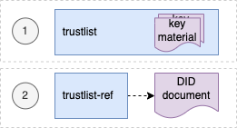

# DID Trustlist v2 - WHO SMART Trust v1.3.0

* [**Table of Contents**](toc.md)
* [**Data Models and Exchange**](data_exchange.md)
* [**DID Trustlist Specification**](concepts_did.md)
* **DID Trustlist v2**

## DID Trustlist v2

#### GDHCN Trustlists

This specification describes the publication of Global Digital Health Certification Network (GDHCN) key material as Decentralized Identifier (DID) documents. DIDs are specified by the [W3C DID Core Specification](https://www.w3.org/TR/did-core/). The [DID concept](concepts_did.md) summarizes the core drivers and usage of the DID format in scope of GDHCN.

A key to real interoperability among existing trust networks is to find alignment on trust list formats.

| | | |
| :--- | :--- | :--- |
| 2.0.0 | Draft | 2.0.0 is in pre-released state for verification and feedback. On technical level in the API "v2" is used to address DID documents following version two specification |
| 1.0.0 | Released | 1.0.0 is deprecated and will be replaced by version 2.0.0 |

##### Trustlists 2.0.0

Version 2.0.0 introduces two **variant**s of the trust lists - embedded and by reference.



For each of development (DEV), user-acceptence testing (UAT) and production (PROD) **environment**s there is a trust list according to the following table:

| | | |
| :--- | :--- | :--- |
| DEV | Embedded | [https://tng-cdn-dev.who.int/v2/trustlist/did.json](https://tng-cdn-dev.who.int/v2/trustlist/did.json) |
| DEV | Reference | [https://tng-cdn-dev.who.int/v2/trustlist-ref/did.json](https://tng-cdn-dev.who.int/v2/trustlist-ref/did.json) |
| UAT | Embedded | [https://tng-cdn-uat.who.int/v2/trustlist/did.json](https://tng-cdn-uat.who.int/v2/trustlist/did.json) |
| UAT | Reference | [https://tng-cdn-uat.who.int/v2/trustlist-ref/did.json](https://tng-cdn-uat.who.int/v2/trustlist-ref/did.json) |
| PROD | Embedded | [https://tng-cdn.who.int/v2/trustlist/did.json](https://tng-cdn.who.int/v2/trustlist/did.json) |
| PROD | Reference | [https://tng-cdn.who.int/v2/trustlist-ref/did.json](https://tng-cdn.who.int/v2/trustlist-ref/did.json) |

The embedded type of trustlist carries the key material directly within the DID documents' verificationMethod property and supports immediate verification. On the root level it contains all keys imported from the trust network gateway (TNG).

The reference type lists link other DID documents, which may contain the actual key material. Therefore reference type trustlists contain only DID ids that can be used to resolve DID documents. This helps to keep the main trustlist documents concise and supports dynamic discovery of DID structures and key material.

###### DID trustlists structure

Version 2.0.0 introduces a hierarchical structure for DID documents, to support more fine grained resolution and discovery of key material. These DID documents are parameterized by the following according to the levels in the following table.

| | |
| :--- | :--- |
| **root** | A fixed parameter for all trusted key material or trusted DID references of GDHCN. |
| **$domain** | Contains trusted key material or DID references of GDHCN for a supported trust domain.**$domain**should be one of the codes in the[GDHCN Trust Domain Value Set](ValueSet-Domains.md). |
| **$participant** | Contains trusted key material or DID references of GDHCN for a trusted participant.**$participant**should be one of the codes in the[GDHCN Participant Value Set](ValueSet-Participants.md). |
| **$usage** | Contains trusted key material or DID references of a supported key usage type.**$usage**type is one of the key usages codes in the[GDHCN Key Usage Value Set](CodeSystem-KeyUsage.md). |

The levels are organized hierarchically so that they function as filters following an AND logic operation when resolving or discovering key material. Note that "-" character can be used as a wildcard on each sublevel of root. This allows to omit filtering on the respective level effectively matching all content of that level.

The following examples outline the expected behavior of embedded trustlist:

* tng-cdn.who.int/v2/trustlist/did.json matches all keys for all **$domain**s, **$participant**s and key **$usage** types.
* tng-cdn.who.int/v2/trustlist/**$domain**/**$participant**/did.json matches all key **$usage** types for a specific **$domain** AND **$participant**.
* tng-cdn.who.int/v2/trustlist/-/**$participant**/did.json matches all key **$usage** types across all **$domain**s for a specific **$participant**.
* tng-cdn.who.int/v2/trustlist/**$domain**/**$participant**/**$usage**/did.json matches all keys for a specific key **$usage** type for a given **$domain** AND **$participant**.
* tng-cdn.who.int/v2/trustlist/-//did.json matches key material or references for all **$domain**s for a specific **$participant** without filtering the key usage types.
* tng-cdn.who.int/v2/trustlist/-/**$participant**/**$usage**/did.json matches keys or references in all **$domain**s for a specific **$participant** and specific key **$usage** type.
* tng-cdn.who.int/v2/trustlist/**$domain**/-/**$usage**/did.json matches keys for all **$participant**s of a specific **$domain** filtered by there key **$usage** type.
* tng-cdn-who.int/v2/trustlist/-/- matches key material for all **$domain**s and all **$participant**s without filtering a specific **$usage** type so the did.json may contain SCA and DSC keys.

And the following examples outline the expected behavior of reference type trustlist:

* tng-cdn.who.int/v2/trustlist-ref/did.json contains all DID document references of the next sub-level as DID id.
* tng-cdn.who.int/v2/trustlist-ref/**$domain**/did.json contains all **$participant** level DID document references as DID id for the given **$domain**.
* tng-cdn.who.int/v2/trustlist-ref/**$domain**/**$partcipant**/did.json contains all key **$usage** type level DID document references as DID id for the selected **$domain** and **$participant**.
* tng-cdn.who.int/v2/trustlist-ref/**$domain**/**$participant**/**$usage**/did.json contains a reference to a DID the embedded trustlist that correlates to the selected **$domain**, **$participant** and key **$usage** type and that contains the key material.

Note: all levels of the reference type trustlist may contain additional DID references linking trusted external DID documents.

The [did trustlists structure diagram](https://smart.who.int/trust/did-trustlist-structure.drawio.png) depicts the reference and contains relations of the trustlist types for the defined levels.


###### Example DID documents

Reference type DID document linking the embedded trustlist for **$domain**: DCC, **$participant**: XXA and key **$usage** type: DSC.

```
{
    "@context": [
        "https://www.w3.org/ns/did/v1",
        "https://w3id.org/security/suites/jws-2020/v1"
    ], 
        "id": "did:web:worldhealthorganization.github.io:tng-cdn-dev:v2:trustlist-ref:DCC:XXA:DSC",
        "controller": "did:web:worldhealthorganization.github.io:tng-cdn-dev:v2:trustlist-ref:DCC:XXA",
        "verificationMethod": [
        "did:web:worldhealthorganization.github.io:tng-cdn-dev:v2:trustlist:DCC:XXA:DSC"
    ], 
        "proof": {
        "type": "JsonWebSignature2020",
            "created": "2024-11-10T12:00:35Z",
            "nonce": "SC56sBBcqqTXh0EPdFlaOWDXxSpwupVa",
            "proofPurpose": "assertionMethod",
            "verificationMethod": "did:web:raw.githubusercontent.com:WorldHealthOrganization:tng-participants-dev:main:WHO:signing:DID",
            "jws": "eyJiNjQiOmZhbHNlLCJjcml0IjpbImI2NCJdLCJhbGciOiJFUzI1NiJ9..MEQCICxoXFEI-o0SupgO0U5BhKjRI1AZaAtAtw_byQMgLm6CAiBTtyJYF7ZMgWTlmivMv5A4In3K6LBEF0AXiCYM2VSSIg"
    }
}

```

Embedded trustlist for **$domain**: DCC, **$participant**: XXA and key **$usage** type: DSC with key matrial:

```
{
  "@context": [
    "https://www.w3.org/ns/did/v1",
    "https://w3id.org/security/suites/jws-2020/v1"
  ],
  "id": "did:web:worldhealthorganization.github.io:tng-cdn-dev:v2:trustlist:DCC:XXA:DSC",
  "controller": "did:web:worldhealthorganization.github.io:tng-cdn-dev:v2:trustlist:DCC:XXA",
  "verificationMethod": [
    {
      "id": "did:web:worldhealthorganization.github.io:tng-cdn-dev:v2:trustlist:DCC:XXA:DSC#XPjhL9Znd1M=",
      "type": "JsonWebKey2020",
      "controller": "did:web:worldhealthorganization.github.io:tng-cdn-dev:v2:trustlist:DCC:XXA",
      "publicKeyJwk": {
        "kty": "EC",
        "kid": "XPjhL9Znd1M=",
        "x5c": [
          "MIICuTCCAmCgAwIBAgIUD9k1Q64Eav5r07DQ4Gff/7h7r6QwCgYIKoZIzj0EAwIwdDELMAkGA1UEBhMCWEExFDASBgNVBAgMC1hYQSBDb3VudHJ5MRgwFgYDVQQHDA9YQSBDYXBpdG9sIENpdHkxDDAKBgNVBAoMA1dITzEMMAoGA1UECwwDUiZEMRkwFwYDVQQDDBBOYXRpb25YQV9UTlBfU0NBMB4XDTI0MDgwMjEzNDM0M1oXDTI2MDgwMjEzNDM0M1owfzELMAkGA1UEBhMCWEExFDASBgNVBAgMC1hYQSBDb3VudHJ5MRgwFgYDVQQHDA9YQSBDYXBpdG9sIENpdHkxDDAKBgNVBAoMA1dITzEMMAoGA1UECwwDUiZEMSQwIgYDVQQDDBtIZWFsdGggQWRtaW5pc3RyYXRpb24gb2YgWEEwWTATBgcqhkjOPQIBBggqhkjOPQMBBwNCAAT3TVbWYsSYYarCUv8sfvmv2y0GjDEI+PAkm/92na/zAOoV8O2w7rov/Txk3wwz/jMoKvx+IgSfYoyygtGetYEdo4HEMIHBMA4GA1UdDwEB/wQEAwIHgDAdBgNVHQ4EFgQUhjRj4qGi0+rt7ka7GLiol6q2+78wHwYDVR0jBBgwFoAUoir+zkKsSL7OkG8dPyThX49GLtEwPQYDVR0fBDYwNDAyoDCgLoYsaHR0cDovL2NybC5leGFtcGxlZG9tYWluLmV4YW1wbGUvQ1JML1NDQS5jcmwwMAYDVR0lBCkwJwYLKwYBBAGON49lAQEGCysGAQQBjjePZQECBgsrBgEEAY43j2UBAzAKBggqhkjOPQQDAgNHADBEAiATU7uopFD4U3mLHHQn+0ncg4gb5ZazhhrXMXwzAD4NbgIgd3jcskFPyOoBGut8oyXu+nKYKr5zFCqmXkYlILqCo6Q=",
          "MIICMDCCAdWgAwIBAgIUFqWc0xbrcpAettDF8gEymTzDtSkwCgYIKoZIzj0EAwIwdDELMAkGA1UEBhMCWEExFDASBgNVBAgMC1hYQSBDb3VudHJ5MRgwFgYDVQQHDA9YQSBDYXBpdG9sIENpdHkxDDAKBgNVBAoMA1dITzEMMAoGA1UECwwDUiZEMRkwFwYDVQQDDBBOYXRpb25YQV9UTlBfU0NBMB4XDTI0MDgwMjA3MTY0MVoXDTI4MDgwMjA3MTY0MVowdDELMAkGA1UEBhMCWEExFDASBgNVBAgMC1hYQSBDb3VudHJ5MRgwFgYDVQQHDA9YQSBDYXBpdG9sIENpdHkxDDAKBgNVBAoMA1dITzEMMAoGA1UECwwDUiZEMRkwFwYDVQQDDBBOYXRpb25YQV9UTlBfU0NBMFkwEwYHKoZIzj0CAQYIKoZIzj0DAQcDQgAEeKTWEuRQ4ftDRaTBA6++wea8ODmEqCLE/nWTcvcX069g3YlWEokVgEIMEumXcez++bcIayhRYDi4itAqd5DmJ6NFMEMwEgYDVR0TAQH/BAgwBgEB/wIBADAOBgNVHQ8BAf8EBAMCAQYwHQYDVR0OBBYEFKIq/s5CrEi+zpBvHT8k4V+PRi7RMAoGCCqGSM49BAMCA0kAMEYCIQC2+Bl6No20L/uSxr4bJSPDAAJ37UhhH52ppOElxB1dqgIhANbn1ZF0DNWYyH+eKBTrY+14zbzhDxlXWh/Go1OM9ZZ/"
        ],
        "crv": "P-256",
        "x": "APdNVtZixJhhqsJS_yx--a_bLQaMMQj48CSb_3adr_MA",
        "y": "AOoV8O2w7rov_Txk3wwz_jMoKvx-IgSfYoyygtGetYEd"
      }
    }
  ],
  "proof": {
    "type": "JsonWebSignature2020",
    "created": "2024-11-10T12:00:21Z",
    "nonce": "Gp3uOuUTNgAFxm31fIjNy7yYt34aOP0g",
    "proofPurpose": "assertionMethod",
    "verificationMethod": "did:web:raw.githubusercontent.com:WorldHealthOrganization:tng-participants-dev:main:WHO:signing:DID",
    "jws": "eyJiNjQiOmZhbHNlLCJjcml0IjpbImI2NCJdLCJhbGciOiJFUzI1NiJ9..MEYCIQD8AbUnGxHgmkqNQTzl6E0ZJocZ0N-vrziFB9-jgRSXbgIhAJUB0Wq5YUJPcywS15JMdoiVJDV_ubWuEZwRnuM5A8QB"
  }
}

```

Note: Specific keys use base64 encoded key id (kid) as identifier, It is represented as fragments (#) in verification method id and can be resolved using client side filtering.

###### Environments & Repositories

The trustlists are maintained using GitHub and published via GitHub pages.

| | | |
| :--- | :--- | :--- |
| Development | [https://github.com/WorldHealthOrganization/tng-cdn-dev](https://github.com/WorldHealthOrganization/tng-cdn-dev) | [https://worldhealthorganization.github.io/tng-cdn-dev](https://worldhealthorganization.github.io/tng-cdn-dev) |
| UAT | [https://github.com/WorldHealthOrganization/tng-cdn-uat](https://github.com/WorldHealthOrganization/tng-cdn-uat) | [https://tng-cdn-uat.who.int](https://tng-cdn-uat.who.int) |
| Production | tbd. | [https://tng-cdn.who.int](https://tng-cdn.who.int) |

##### Trustlist Specification 1.0.0

[Initial specification](concepts_did.md) is deprecated.

