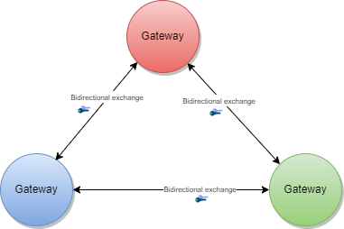
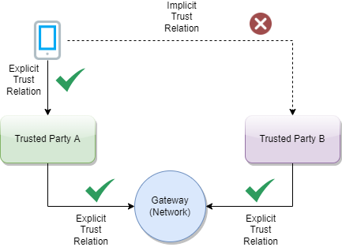
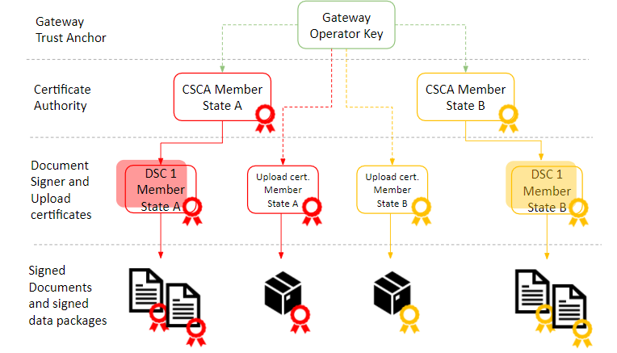

# Data Models and Exchange - WHO SMART Trust v1.3.0

* [**Table of Contents**](toc.md)
* **Data Models and Exchange**

## Data Models and Exchange

## Data Models and Exchange

### Actors

Actors produce, manage, or act on health information. Actors relevant to the SMART Trust Network are as follows.

####

This actor fulfills the following requirements:

####

This actor fulfills the following requirements:

####

This actor fulfills the following requirements:

####

This actor fulfills the following requirements:

####

This actor fulfills the following requirements:

#### Business Rules Library

Trusted service, provided by a node within a trust network, to share business rules using Clinical Quality Language (CQL) specification.

#### Product Catalogue

Used to manage and publish product master data for health products, devices and commodities that may be referenced in a Verifiable Digital Health Certificates.

#### Terminology Service

Used to manage and publish mappings between various local code systems and required vocabularies that are utilized Verifiable Digital Health Certificates.

### Publish Keys

#### Trigger Events

The Trust Network Participant, or one of its authorized Issuers, generates a new public-private key pair for use for document signing.

#### Message Semantics

See the [EU DCC Open API](openapi/index.md#/GDHCN/postTrustedCertificate) documentation. The key usage is DSC for Document Signing Certificate

#### Expected Actions

The Trust Anchor will validate the submitted key material and distribute it to other Trust Network Participants

### Mirror Local PKD

#### Trigger Events

#### Message Semantics

#### Expected Actions

Steps include:

* Local PKD onboarding (one-time). Onboarding may include evaluating Local PKD format, providing the Federated PKD access, and signing of business agreements.
* Local PKD public keys are mirrored (periodic)
* Mirrored public keys are merged into a master list (periodic)
* Master list is digitally signed for distribution

Local PKDs participating in the Federated PKD are expected to:

* Have an existing public key infrastructure used for issuing trusted health documents (e.g. COVID credentials)
* Have permissions/policies in place that allow sharing the public keys
* Can share public keys in one of the following formats: 
* X.509
* JSON Web Keys (JWK)
* [Decentralized Identifiers](https://www.w3.org/TR/did-1.0/) (DID) according to the [GDHCN specification](concepts_did_gdhcn.md) specification.
 

Federated PKDs are expected to:

* Have a means for retrieving local public key directories / nodes members represented in the aggregation services
* Have permissions/policies in place that allow sharing the public keys from trust node members
* Have an existing public key infrastructure used for signing list of keys my node members
* Can share list of public keys in the following format: 
* [Decentralized Identifiers](https://www.w3.org/TR/did-1.0/) (DID) according to the [GDHCN specification](concepts_did_gdhcn.md) specification.
 

### Sign Health Certificate (HCERT) Claim

#### Trigger Events

The claim payload of a [HCERT](hcert_spec.md) has been generated and is ready to be signed by an Issuer acting on behalf of a Trust Network Participant.

#### Message Semantics

The output should be a valid signed [HCERT](hcert_spec.md)

#### Expected Actions

<h4 id="put_keys_api} Publish Verification Keys - API

#### Trigger Events

A Trust Network Partcipiant publish keys to the Trust Network Gateway for use by Verification Applications. Keys may be coded for a variety of uses including following the [certificate governance](concepts_certificate_governance.md) according to their [**$usage**](ValueSet-KeyUsage.md) and trust [**$domain**](ValueSet-Domains.md)

#### Message Semantics

See [Swagger API](openapi/index.md)

#### Expected Actions

### Retrieve Verification Keys - DID

#### Trigger Events

#### Message Semantics

Keys should be retrieved using the [GDHCN DID](concepts_did_gdhcn.md) specification.

#### Expected Actions

Once a Verification Application has onboarded to the Trust Network it may retrieve verification keys. The retrieved list of verificaiton keys may be used for the following busines processes:

* Onboarding a Federated PKD by retrieving the signing key used to sign the master list (one-time).
* Retrieving the master list from the Federated PKD and verifying the signature (periodic).
* Deserializing a Verifiable QR code (e.g. vaccine credential 2D bar-code) to determine the key id.
* Retrieving the public key associated with the key id from the master list, or using a cached key.
* Verifying 
* the cryptographic signature within the 2D barcode.
* the authority of the issuer to issue this type of certificate with this key.
* the expiration date of the keys.
* the expiration date from the certificate.
* the certificate is not part of revocation lists available.
* the issuing key is still present on a trust list by the issuing authority (not revoked).
* the issuing key is still present on the trust list of the verification authority.
* the name/identity on the certificate matches an ID document.
* the business rules of the verification jurisdiction pass for the certificate.
 

### Retreive Verification Keys - API

#### Trigger Events

#### Message Semantics

See [Swagger API](openapi/index.md)

#### Expected Actions

Once a Verification Application has onboarded to the Trust Network it may retrieve verification keys. The retrieved list of verificaiton keys may be used for the following busines processes:

* Onboarding a Federated PKD by retrieving the signing key used to sign the master list (one-time).
* Retrieving the master list from the Federated PKD and verifying the signature (periodic).
* Deserializing a Verifiable QR code (e.g. vaccine credential 2D bar-code) to determine the key id.
* Retrieving the public key associated with the key id from the master list, or using a cached key.
* Verifying 
* the cryptographic signature within the 2D barcode.
* the authority of the issuer to issue this type of certificate with this key.
* the expiration date of the keys.
* the expiration date from the certificate.
* the certificate is not part of revocation lists available.
* the issuing key is still present on a trust list by the issuing authority (not revoked).
* the issuing key is still present on the trust list of the verification authority.
* the name/identity on the certificate matches an ID document.
* the business rules of the verification jurisdiction pass for the certificate.
 

Keys should be retrieved using the [GDHCN DID](concepts_did_gdhcn.md) specification.

### Request Business Rule Updates - API

#### Trigger Events

#### Message Semantics

See [Swagger API](openapi/index.md)

#### Expected Actions

### Request Business Rule Updates - API

#### Trigger Events

#### Message Semantics

Shall act as a Business Rules Library:

* Expresses health policies (e.g. “Needs full course of vaccine”) as executable business rule using the Clinical Quality Language (CQL) as a FHIR Library Resource
* Publishes business rules as FHIR Library resources with a trust health service

Optionally:

* Provide digital signagure of business rule as FHIR Provenance resource
* Provides public key to PKD

#### Expected Actions

### Execute Business

#### Trigger Events

#### Message Semantics

#### Expected Actions

Verification App:

* Pre-Condition: Perform Federated Verification workflow on one ore more QR-code
* Identify one (or more) business rule(s) to be exectued according to use case

Optionally:

* Retrieves business rule signing public key from PKD (either Local PKD or via Aggregating/ Federated PKD)
* Verifies authenticity of business rule
* Map QR-code content into requiste FHIR resources using FHIR Structure Maps
* Execute CQL businns rule on FHIR resource content

### Request Value Sets - API

#### Trigger Events

#### Message Semantics

See [Swagger API](openapi/index.md)

#### Expected Actions

### Request Value Sets - FHIR

#### Trigger Events

#### Message Semantics

See [IHE Sharing Value Sets and Concept Maps](https://profiles.ihe.net/ITI/SVCM/) for transactions against a Terminology Service.

#### Expected Actions

### Execute Business

#### Trigger Events

#### Message Semantics

#### Expected Actions

### Workflows

####  Routine Synchronization

####  Verification of a Digital Health Certificates

#### Federated PKD Aggregation

#### Federated Verification

#### Dynamic Business Rule Validation

### Trust Domains

A Trust Domain consists of:

* Defined use cases and business processes related to the utilization of Verifiable Digital Health Certificates; These Verifiable Digital Health Certificates may be issued or verified through Trusted Services that are enabled by Trust Network Participants of the Digital Health Trust Network.
* the open, interoperable technical specifications that identify or define the applicable Trusted Services and Verifiable Digital Health Certificates; and
* a set of policy and regulatory standards describing expected behavior of GDHCN Participants in relation to operation of the Trusted Services and utilization of Verifiable Digital Health Certificates (e.g. data minimization, privacy, scope of use).

The codes for the GDHCN Trust Domains are contained in the [GDHCN Trust Domain Value Set](ValueSet-Domains.md). 

#### Digital Documentation of COVID-19 Certificates (DDCC)

The [Digital Documentation of COVID-19 Certificates (DDCC)](https://www.who.int/publications/i/item/WHO-2019-nCoV-Digital_certificates-vaccination-2021.1) published in August 2021 and similar guidance for test results (https://www.who.int/publications/i/item/WHO-2019-nCoV-Digital_certificates_diagnostic_test_results-2022.1) published in March 2022 serve as the reference for the associated [FHIR Implementation Guide](https://smart.who.int/ddcc/). This Implementation Guide (IG) acts as the computable representation of the core data elements in the published guidance, mapped to standard terminologies. These data models, in the form of FHIR logical models, and terminologies, in the form of FHIR value sets, are the basis for interoperability between the various credential formats. The IG provides FHIR Structure Maps and Concept Maps to define transformations between supported credential formats and the core data set, which allows business rules to execute against a common set of data elements.

{:width="850em"}

At the current time, the following content profiles are recognized through the WHO's [Digital Documentation of COVID Certificates (DDCC)](https://worldhealthorganization.github.com/ddcc):

* European Union's [Digital Covid Certificates (DCC)](https://health.ec.europa.eu/publications/technical-specifications-eu-digital-covid-certificates-volumes-1-5_en) **(required)**
* DIVOC (optional)
* International Civil Aviation Organisation (ICAO) Visible Digital Seals - Non-Constrained (VDS-NC) (optional)
* Smart Health Cards (SHC) - Immunization (optional)

##### Source specifications

It can be difficult to find the "source of truth" specifications for the certificate formats that are mapped to the DDCC core data sets. The [references](references.md) contains links to the best known documentation for each of the certificate formats listed above.

#### PH4H

The [Pan-American Highway for Digital Health (PH4H)](http://worldhealthorganization.github.iont/smart-ph4h) implementation guide describes the usage of the GDHCN for the Americas region.

#### IPS Pilgrimage (IPS-Pilgrimage)

The [IPS Pilgrimage](http://smart.who.int/ips-pilgrimage) implementation guide includes a machine-readable representation of WHO guidelines for verifiable IPS during pilgrimage. It explicitly encodes computer-interoperable logic, including data models, terminologies, and logic expressions, in a computable language to support implementation of IPS during pilgrimage usage scenario.

#### Terminology

These [concepts](concepts.md) and the following table contains abbreviations and terminology used throughout this document.

| | |
| :--- | :--- |
| DCC | Digital COVID-19 Certificate. |
| DDCC | Digital Documentation COVID-19 Certificate. |
| DCC Gateway | REST web-application for exchange of document signer certificates, DCC value sets, DCC business rules and revocation lists for dcc verification purposes between the national backends of connected states. |
| ffline SCA certificates. |   |
| CMS | Cryptographic Message Syntax. According to[RFC5652](https://datatracker.ietf.org/doc/html/rfc5652). This syntax is used to digitally sign, digest, authenticate or encrypt arbitrary message content. |
| JRC | European Joint Research Centre. |
| OG | Origin Gateway. |
| [CQL](https://cql.hl7.org/) | Clinical Quality Language. |

#### Introduction

This architectural specification provides the means to establish a federated trust network for use with health records like WHO Digital Documentation of COVID-19 Certificates (DDCC) technical specifications and implementation guidance documents. This is based on the assumption that Trust Network Participant may establish their own independent national trust networks, participate in a regional trust network, or wish to participate in a global federated trust network. Furthermore, Trust Network Participant may wish for these trust networks to be interoperable for domestic and cross-jurisdictional use cases. While specific governance and policy considerations required in the establishment of such interoperable trust networks is out of scope of this document, the intent is that the technical design within this document would support intra-jursidictional and cross-jurisdictional policies of Trust Network Participant.

The Trust Network Gateway (TNG) specifications in this document are designed to support the DDCC specification, which acts as bridging/umbrella specification for various health records like digital COVID certificates (e.g., EU’s DCC, SMART Health Cards, DIVOC, and ICAO). This specification builds on the [EU Digital Covid Certificate Gateway](https://ec.europa.eu/health/sites/default/files/ehealth/docs/digital-green-certificates_v2_en.pdf) by extending it in several important ways:

* allowing for federation and peer exchange of information between gateways;
* supporting access to metadata content (e.g. value sets/codings, business rules) with explicit adherence to the HL7 FHIR specification;
* providing an explicit means for revocation of digital COVID certificates; and
* allowing for (optional) support of online verification and validation workflows.

Within the current DCC system the centralized gateway plays the key role of establishing trust between all of the connected Trust Network Participant. The gateway operators follow a well-documented process to establish the identity and onboard the trust anchor of each Trust Network Participant. The TNG builds upon this system to enable the creation of trust gateways by other organizations which allows to form a federated network of trust gateways, supporting all of the major COVID-19 credential certificates.

##### Trusted Party vs. National Backend

The current gateway design is focused on the trust establishment between “National Backends” in terms of a system operated/owned by a national health authority. This can be a script, a fully automated solution or a manual process, which is able to connect the gateway trustfully and able to do uploads and downloads of the content. What other concrete solutions are behind is not in scope of the gateway itself. Within the DDCC scope, the term “National Backend” is worded too sharply, because there can be other parties which can be connected with their publishing system to a gateway in the trust network. Therefore the term “national backend” should be understood within this scope more as “Trusted Party” in terms of an attendee which has received access to a trusted gateway. The trusted gateway or the federator acts then as well as “Trusted Party” to other gateways.

#### Gateway Design Vision

Currently EU DCC Gateway is a single centralized system which establishes trust between DCC participants and enables the sharing of business rules, value sets and revocation lists. If another region in the world establishes such a gateway, there is currently no method in the architecture to exchange these trusted data between the two gateways. In this new architecture within the DDCC context, multiple gateways can be connected to each other and share trusted data. In the long term, this architecture will allow the creation of groups and ultimately the establishment of a federation. Such an architecture may be applicable and of interest for non-authority parties e.g. airlines, which desire a read only copy of the gateway content. This can be established by onboarding the airline in a gateway specially setup for this purpose and is connected to the official gateway. To achieve this goal, the architecture must support multiple operation modes e.g. Primary-Secondary. The current implementation of EU DCCG is, as mentioned before, a single centralized system which serves as a hub for storing and managing the necessary information gathered from the Trusted Parties.


The TNG should realize this enhancement of the current implementation of DCCG with the purpose to create a network between multiple gateways for exchanging health record associated public key material, value sets and business rules between different parties (authority, non-authority, commercial). In this architecture a gateway can connect to any other gateway by manually configuring the list of connections and trust relationships. To manage the connections and their download behavior a new component federator is introduced. The federator is a microservice which acts as an automated download client between two gateways and fulfills all responsibilities of trusted data exchange.


The backbone of this data exchange is the functionality of the current connector library which connects to the gateway and provides for the consumer the most necessary functionalities. This library is enhanced by the functionality to connect multiple gateways instead of one.

##### Use Cases

###### Bilateral Onboarding

In Bilateral Onboarding use case the [connector library](https://github.com/WorldHealthOrganization/ddcc-gateway-lib) connects as a trusted party to multiple gateways for downloading/uploading content. This requires onboarding on both gateways.


###### Peer to Peer Exchange

In the peer-to-peer exchange use case, two or more gateways are able to exchange their data in a bi-directional manner. The source and the target gateway enable each other to download the data. All exchanged data will be appended to the existing data within the gateway. This can include the data of third-party gateways, if permitted by the data exchange agreement between two gateways.



###### Primary-Secondary Exchange

In the primary-secondary exchange use case one or several gateways act as primary source, and another set of gateways act as secondary source . Within this mode, secondaries will download the data of the primary and append it to their own dataset or replace their dataset with the downloaded data. The primary ignores the data of the secondaries, which act just as read copies of the primary gateway. The leading national backends can connect to the primary gateway and upload the data to the one primary gateway.


###### Combined Sources Exchange

In the combined sources exchange use case, the gateway will download data from multiple gateways and append it to its own data set. This results in a combined collection.


###### Trust Mediator

The gateway content can be used to establish trust between attendees which are just loosely coupled, for example Verifier Devices which are known by Trusted Party A, but not directly known by Trusted Party B.



To establish the trust between attendees, a trust mediator can be generated which relies on the trustlist of the gateway. The mediator can then use this information to decide whether the trust relationship should be established or not. For instance, the interceptor can check if a signature of a JWT was created by the public key of a certificate which was signed by an onboarded SCA. When the SCA is onboarded and trusted, it proves that the signature was made by someone which has the trust of this SCA. The trust for this attendee is then also given.


#### Architecture Overview

The Trust Network Gateway purpose is to enable the secured and trusted exchange of data within a trust network.

##### Data exchanged by TNG

###### Metadata Exchange

TNG provides an interoperable means for exchanging key metadata in support of digital COVID-19 certificates using the HL7 FHIR standards. This includes, in particular:

* **Value Sets** which should be shared using the transactions defined in the IHE Sharing Value Sets and Concept Maps (SVCM) profile and include the following resources: 
* HL7 FHIR ValueSet resources to share codings and terminologies referenced by the various digital COVID certificate specifications (e.g. allowed vaccines or tests). - HL7 FHIR ConceptMaps may be used to provide mappings between jurisdictionally defined coding DDCC specification coding.
 
* **Business Rules** which should follow the [Knowledge Artifact](https://docs.google.com/presentation/d/1Bb6oA-4_qPYwvg6iQcZS8CNL1XvdT0R30Vmv9zIstPs/edit#slide=id.gcb76b23c16_2_169) and [Clinical Decision Support infrastructure](https://build.fhir.org/clinicalreasoning-cds-on-fhir.html) including the following resources: 
* HL7 FHIR Library resources to share libraries of business rules expressed using Clinical Quality Language (CQL)
* HL7 FHIR PlanDefinition resources to indicate which business rule should be executed based on the relevant validation or continuity of care use cases.
 

To abstract these requirements, the Trust Network Gateway will introduce a new functionality called “Trusted References”, which allows the gateway to share any kind of service endpoint without sharing the content itself. For backwards compatibility, the functionalities of the DCC Business Rules and Value Sets remain in the architecture, but can be configured to be disabled using profiles. The explicit endpoints for business rules and value sets will be replaced by the trusted references, as the wide variance of medical content should be left to FHIR server implementations instead of the implementation of each service in the gateway itself.

###### Public Key Exchange

TNG provides a way to share public keys that are used to sign digital COVID certificates as well as provide lists of revoked public key certificates.

###### Reference Exchange

TNG provides the functionality to store secure and trustful resources (i.e. FHIR value sets or Business Rule) which ensures that all attendees in the system have precise knowledge about important sources. These references can be stored in the form of URLs.

###### Issuer Exchange

For some Credential Types such as Verifiable Credentials, TNG is necessary to ensure the trust in issuers of those credentials. Most credentials carry an issuer ID such as an HTTP URL or a DID with the public key material to verify these credentials. To provide a trusted list of these issuers, the gateway provides functionality to upload issuer IDs.

##### Solution Concept

To realize the architectural vision, the existing DCC Gateway will be enhanced by a microservice which implements the TNG Federator component. This federator component is deployed next to the gateway and it handles the communication with other federators. Each federator is able to download the data of other components. Uploading the data to other federators is not foreseen (each gateway downloads over a federator). The trusted consumers can decide to use the federation information and must explicitly activate this feature. To summarize, the federator acts as a gateway connector/synchronizer and as an interface provider for accessing the federated data.


**Note**: The DCC Gateway core architecture remains untouched. Just backwards compatible enhancements will be introduced to support the federation.

###### Connection Establishment to the Gateway

The DDCC specification provides interoperable standards for exchanging metadata content such as trusted references, trusted certificates and signer certificates with systems via a Trust Network Gateway. This metadata is managed through Trusted Systems which will need a connection/proxying or facade service with the Trust Network Gateway (“TNG Mediator”). This mediator must be onboarded and trusted by the operator of the TNG before upload or download of content is possible. Technically this can be a script, a backend system or an OpenHIM mediator. The main tasks of this kind of software is to establish a mTLS connection with the gateway, sign the uploaded content (e.g. CMS Cryptographic Message Syntax) and upload signed DSCs, revocation entries or releasing business rules. The procedures used in background is out of scope. There may be manual release processes, automatic decisions or other processes, however it is crucial to ensured that the trusted channel and the security of the used certificates for upload/tls connection are not compromised.

###### Options for Bridging to other Systems

A bridge tool for translating the received entries of the origin system to the HL7 FHIR / [Rest API](openapi) of the gateway is necessary for bridging existing systems (i.e. PKDs or any other systems which contain PKI certificates (e.g. ICAO), Business Rules or Value Sets (e.g. FHIR Servers)) to the TNG. For example, to translate an LDAP based Public Key directory to the gateway, a script/mediator may be set up to extract the DSCs and upload them automatically to the gateway. Please note that in this scenario all SCAs must be onboarded prior to the upload for this process to work.

Under special circumstances when some “mass data transactions” or heavy synchronisations are necessary there may be an option to set up an adapter directly on top of the gateway database. The TNG itself supports JDBC which is able to accept other databases than mysql. For instance if a Cassandra, MongoDb or CouchDB is used and a JDBC driver is available, the data can be replicated across multiple nodes.

**Note**: Database Replications have their own behavior and the functionality of the gateway can not cover each available database. Therefore JDBC feature should be used only if necessary and at own risk.

##### Building Blocks

The Trust Network Gateway consists of the DCC Gateway enhanced by callback mechanisms and additional trust list sources, a new federator component with the download client, a federation API, a proxy for outgoing calls and an interface to the routes of the different services.


##### Trust Model

###### Overview

The trust model of the gateway is based on the [PKI certificate governance of the DCC Gateway](https://github.com/eu-digital-green-certificates/dgc-overview/blob/main/guides/certificate-governance.md). All security relevant items are uploaded in signed CMS format and secured by different kinds of PKI certificates as defined by the PKI certificate governance. The central items of the trust model are the SCA to protect the Document Signer Certificates and the CMS messages to protect the uploaded content.

###### SCA & DSC

To sign digital COVID-19 certificates, a Document Signer Certificate (“DSC”) is created by an issuing authority. Each authority distributes their DSCs to verifiers, so that DSC can be used to prove the validity of an issued certificate. To establish a trust chain between used DSCs and the distributors of the national trust lists, each of the DSC is signed by a root authority (“SCA”) to verify the authenticity of the DSC itself. For security reasons, the SCA is declared as air gapped, and the public part is later on-boarded into the gateway. During the onboarding, the SCA is signed by the operator of the gateway to give the trust in the initial check. After onboarding, each incoming DSC can be checked against the trusted SCA. The operator signature (signed by DCCGTA) establishes the trust with different certificates such as the uploader certificate and the TLS authentication certificate as defined by the certificate governance.



###### CMS Usage

To support multiple content in the gateway in the same security level, the trust model introduces CMS as a generic container for security relevant items. The CMS format allows it to standardize signing and encryption regardless of the content, for single or multiple recipients.


###### Enhancement

The current trust model of the DCC Gateway supports only the connection of multiple backends and the exchange of content between them (see below).


To realize the architecture vision, the gateway trust model will be enhanced so that the federator can support multiple trust anchors. For this purpose, the TNG Federator will be onboarded in the source gateway with an TNPTLS and TNPUP certificate to access the gateway content. In the destination gateway, the trust anchor of the source gateway is configured (and signed by the operator) to accept the source content as valid. If the verification is successful, the content will be added as a subset to the existing gateway content. The connected national backends can then download all information by activating the federation option, to get the content from both gateways. The trust chain can be verified about the trust anchor of the connected gateway and the trust list of onboarded trust anchors.


**Note**: The Federator acts as a special kind of “National Backend”, therefore all TNP associated certificates except the TNPUP will be onboarded normally.

###### Raw Public Keys

The trust model doesn’t support raw public keys due to security reasons especially in cases where:

Raw keys cannot be verified for validity Raw key ca not be verified by the source (e.g. Root Authority) Raw keys can be created and shared easily and bad governance “opens the door” to all participants in the trust network

Therefore all raw keys must be converted to an x509 certificate wrapper to be a DSC on the gateway, which must be signed by a properly onboarded SCA. Verification of a COVID-19 certificate is not affected by this process, as long as the correct KID is applied during the upload (and in the certificate).

###### DSC Limitation

For legacy support, or any need for differentiation in the verification process such as for correct issuers or differentiation in KID calculation. It is recommended that the DSCs contain the following OIDs in the extended key usage field:

| | | |
| :--- | :--- | :--- |
| extendedKeyUsage | 1.3.6.1.4.1.1847.2021.1.1 | For Test Issuers |
| extendedKeyUsage | 1.3.6.1.4.1.1847.2021.1.2 | For Vaccination Issuers |
| extendedKeyUsage | 1.3.6.1.4.1.1847.2021.1.3 | For Recovery Issuers |
| extendedKeyUsage | 1.3.6.1.4.1.1847.2022.1.20 | For raw keys of DIVOC |
| extendedKeyUsage | 1.3.6.1.4.1.1847.2022.1.21 | For raw key of SHC |
| extendedKeyUsage | 1.3.6.1.4.1.1847.2022.1.22 | For raw keys in DCCs (calculate kid on Public Key only) |

The usage of the OID can limit the scope of a Document Signer Certificate during the verification process (if supported by the verifier app). For instance, fraudulent vaccination certificates issued by test centers, will not be valid, as it is signed by an DSC limited to test result certificate issuers.

OID can also be used as an verification indicator as it can indicate that this certificate is a wrapper around raw keys.

Other limitations on the DSC may exist and can be defined, as and when new use cases arise.

**Note**: All extendedKey usages should be well documented on github to avoid confusion regarding the usage. Each necessary attribute should be set up to support the verification process in the best way.

##### Federator Architecture

###### Overview

The federator is designed as a new sub component which can be hosted as microservice or within the gateway in one deployment. This behavior can be configured during the installation. Overall the federator offers the functionality for automated download of gateway or federation content. The downloaded content is stored in the gateway database to provide the content to the gateways federation endpoints. Trusted parties can download from these endpoints then the federated data.

###### Black-box View


###### Whitebox View


###### Data Model

####### Federator Configuration

**Note**: Each Federation Route of the Gateway must be configured manually for explicit download, to avoid misunderstandings in configuration. This is important for security reasons. All trust anchors must be onboarded otherwise the content is filtered out.

| | | |
| :--- | :--- | :--- |
| ID | int | Unique ID of the table row |
| GatewayId | GUID | Unique ID of the other origin gateway. |
| GatewayEndpoint | Varchar | URL of the other Gateway. |
| GatewayKid | Varchar | KID of the Origin Gateway Client Certificate to be used to connect to the other gateway. (TNGTLS FED |
| GatewayPublicKey | Varchar | ECDSA Public Key of the Gateway Signature |
| AuthenticationKID | Varchar Array | KIDs of the onboarded TNGTLS GWof the other gateway. |
| TrustAnchorKIDs | Varchar Array | KIDs of the onboarded Trust Anchor (TNGTA) |
| DownloadTarget | String | FEDERATION or GATEWAYONLY |
| Mode | int | Enum for the download mode. APPEND or OVERRIDE.The append mode adds the downloaded data to the existing data set (existing federation data will be replaced). Override deletes the existing datasets (excepting the own TNPTLS, Trust anchors and federation configurations) |
| Signature | Varchar | Trust Anchor Signature |

####### Download Scheduler

| | | |
| :--- | :--- | :--- |
| GatewayID | GUID | Unique ID of the Gateway |
| DownloadInterval | int | Download Interval |
| LastDownload | TimeStamp | Last Time of Download |
| Retry | boolean | Retry Flag |
| Message | String | Message of Federator |
| Failed Retries | int | Number of failed Retries |

###### Endpoints

To use the federated data, the gateway will be enhanced by federation endpoints which are modified variants of the common GET routes. By using this new endpoints, the common content is modified returned:

| | | | | |
| :--- | :--- | :--- | :--- | :--- |
| GET | X | X | /trustlist/certificates | Returns the list of trusted certificates. The list can be filtered with optional query parameters. For legacy reasons, all signercertificates introduced in the “DSC” certificate group (if profile enabled) All other certificates should be delivered over query parameter. |
| GET | X | X | /trustlist/issuers | Returns the list of trusted issuers. The list can be filtered with optional query parameters. |
| GET | X | X | /trustlist/signatures | Returns the list signatures for existing trust lists. |
| GET | X | X | /trustlist/references | Returns the list of trusted references. The list can be filtered with optional query parameters. |

**Note**: All routes should filter the delivered content by hash to avoid duplicate content delivery. Two different federations can receive from a single TP the same content in some circumstances.

**Common Query Parameters**

Each route which delivers federated data must provide an query parameter to filter the federations by using an array:

```
/URL?federationId=id1,id2,id3&Domain=DCC&ResourceType=...

```

If the mode set to “GATEWAYONLY”, it must be used to query just for the configured gateway id.

**Federation Format**

The data format of the federated data should always contain a federation wrapper with the information of federationID, Domain and resource type.

##### Download Process

To federate multiple gateway data, a download process is introduced which should ensure that only trusted data is downloaded to a local gateway. Trusted data means in this context, that the operator of a local gateway has the total control which federated data is accepted and which not. To achieve this target, the local gateway operator must explicitly onboard any remote federators plus the trust anchors of the data which can be accepted. This is necessary because each remote federator may deliver the data of multiple other gateways (which are trusted by the origin gateway operator), but this means not necessarily that this data is trusted automatically by the local gateway operator as well (implicit trust relations must be avoided). Therefore, during the download process, a check should be run which skips all data that is not explicitly trusted by the local operator. This can be reached over the whitelisting of multiple trust anchors and the cross check over the TNPUP certificates. If the trust chain is established in this way, each content can be downloaded, verified and pushed to the store. The entire download process itself follows a delta download mechanism, which downloads daily the entire content, and within the day just the deltas. This means for the trust network, that a certificate “bubbles” from the origin gateway step by step to all other gateways. Through this behavior, it must be considered that around one day between creating a key pair, and issuing the first certificates with it is considered.


#### Architecture Modifications & Changes

##### EU DCC Gateway Modifications (Spec)

###### Data Tables

The trusted party table (see chapter 4.2.3.1, EU DCC Gateway) is enhanced with a new certificate type “TRUSTANCHOR” in the [API](openapi) call for trust lists these new types appearing. To distinguish between a federator and a normal trusted party, a type (“TP”, “FEDERATOR”,”GATEWAY”) for the trusted item is introduced. To distinguish between different domains of certificates, the table also gets a new column ''DOMAIN”, which has the default content “DCC''. Other content can be in the moment “ICAO”, “DIVOC” and “SHC”. The domain appears in the trustlist routes.

Each Data Table (SignerInformation, Trusted Issuer, Trusted Reference etc.) gets a new column for the UUID, federation ID and objectVersion. The primary keys are changed to ID + federation id to guarantee the uniqueness.

###### SignerInformation Upload

The signer information endpoints must be configurable by a profile to be switched on and off the routes. This is necessary to maintain backwards compatibility with the EU DCC Gateway. In the DDCC context these routes are deactivated.

###### Trusted Certificate Upload

To support additional use cases, the gateway will be modified with endpoints which allows it to upload certificates signed by the SCA of a Trust Network Partcipant. The upload endpoint works similar to the signer information upload endpoint with the difference that the upload contains more additional information about the certificate. The concrete template for this additional information must be defined by a schema. The certificate upload must support the choice of a kid, because other standards define static kids or choose it in other ways than the DCC. If no kid is provided, the DCC standard calculation of the first 8 bytes of the SHA256 hash is applied.

###### Health Check

To monitor the status of the Gateway, a health check is introduced. The new route returns 200 if the gateway is up and running. When the gateway is in maintenance, the routes must return 204. All other return codes indicate an error.

###### Route Profiles

The routes for POST, PUT and DELETE will be modified by profiles to make them configurable. This allows it to switch off the data upload, which is especially for the primary-secondary/combined sources use case. Within this setup, no TNPUP certificates need to be onboarded.

###### Value Set and Business Rules Endpoints

The ValueSet and Business Rules endpoints must be configurable by configuration of profiles for enabling/disabling.

Business Rules gets a new endpoint which is returning single objects by using the business rule id (/rules/{TrustNetworkPartcipant}/{ruleId}}.

Note: This new route is introduced to create a migration path to the trusted references. Within EU DCC Standard Mode, there is no backwards compatibility impact.

###### Trusted References

The trusted references are URLs which are uploaded by the Trust Network Participants to propagate their service endpoint about value sets, business rules and other content for interoperability. Within the trusted references are just public GET methods allowed. Authorization must be covered by trust mediators, if necessary.

| | | | | | |
| :--- | :--- | :--- | :--- | :--- | :--- |
| UUID | No | String | UUID for the object. |   |   |
| URL | No | String | Can be a HTTP(s) |   |   |
| Type | No | String | FHIR | DCC… |   |
| Version | No | String | Any version string. |   |   |
| Country | No | String | Trust Network Participant where the URL relates to. |   |   |
| Service | No | String | e.g. ValueSet, PlanDefinition etc. |   |   |
| Thumbprint | No | String | SHA256 Hash of the content behind it |   |   |
| Name | No | String | Name of the Service |   |   |
| SSLPublicKey | No | String | SSL Certificate of the endpoint (if applicable). |   |   |
| Content-Type | No | String | MIME Type of Content |   |   |
| SignatureType | No | String | NONE | JWS | CMS |

###### Trusted Issuer

Currently it is possible to onboard SCAs as Issuer Trust Reference for DSCs which makes it hard to use it outside the PKI world. Other credential types like Verifiable Credentials are using DIDs or other Issuer IDs which are not necessarily linked to any SCA, but with crypto material behind it e.g. JWKs sources etc. To support these issuers and their credentials, the gateway will be enhanced by a trusted issuer interface which makes it possible to receive this kind of trusted ids. All of these trusted issuers must be onboarded as SCAs and all other certificates.

A trusted issuer entry which can be onboarded is defined as :

| | | | |
| :--- | :--- | :--- | :--- |
| URL | No | String | Can be a HTTP(s) or DID URL. |
| Type | No | String | HTTP or DID |
| Country | No | String | Trust Network Participant where the URL relates to. |
| Thumbprint | Yes | String | SHA256 Hash of the content behind it (if applicable) |
| Name | No | String | Name of the Service |
| SSLPublicKey | Yes | String | SSL Certificate of the endpoint (if applicable). |
| KeyStorageType | Yes | String | Type of Key Storage. E.g JWKS, DIDDocument, JKS etc. |

The Entry will be onboarded in the Gateway and signed by the trust anchor.

**Note**: When the URL in this table does not resolve, all the optional fields can be empty. This is less trustful and should be avoided within operations.

###### Deployment

####### Constraints The TNG may be operated in front with a network component (Load Balancer, [API Gateway](openapi) , Reverse Proxy etc.) which handles the Client Certificate Authentication and Client Certificate Attribute extraction of the TLS connection. After the TLS Offloading it depends on the infrastructure, if an internal secured TLS network must be established or not. For example when the TNG is deployed in a distributed service mesh, it’s recommended to use TLS protected channels e.g. SPIFFE/SPIRE based service meshes. Which mode fits better to the deployment depends on the operators infrastructure. The gateway itself can be operated in a SSL Passthrough mode as well.

All other components like proxies, must be aligned in the configured settings to avoid HTTP Smuggling or similar vulnerabilities.

####### Kubernetes Setup


##### WHO Trust Network Gateway Modifications

In the last version of the TNG[1](#fn:1) architecture, the changes for trusted issuers and trusted certificates were made to allow different types of technologies in trust verification. This could be either X509 or DIDs according to the DID Core Specification[2](#fn:2). During the last iterations of specification and alignment, there were some key points which must be additionally supported in the gateway:

* Native DID Support for the Gateway's Trustlists (DID Document Format) (optional)
* Decentralized Exchange of DID Documents to provide it to verifiers
* WHO aligned onboarding process for eligible Trust Network Participants

This section describes these changes.

###### Technical Changes

To support the DID document feature according to the [trust specification](https://github.com/WorldHealthOrganization/ddcc-trust/blob/main/TrustListSpecification.md#leading-contender-did-document), the gateway will be enhanced by a DID document generator and the capability to sign these DID documents. This contains a way to generate signing keys over a vault and register the public key of the signature over a decentralized key registry.


###### Azure Architecture & Deployment

Microsoft Azure public cloud is the targeted operation environment for the Trust Network Gateway hosted by WHO. The TNG will be operated on Azure Kubernetes Service (AKS) and uses Azure CDN for public key distribution via DID documents.


###### Onboarding Process Concept

The WHO Global Digital Health Certification Network Secretariat is responsible to manage the [onboarding](concepts_onboarding.md) application of eligible Trust Network Participants to connect as a trusted party to the trust network.

-------

### DID Specifications

The common trust list specification defines the lowest common denominator format that can interoperate between all included specifications and can support the minimal required features from each specification. This includes considering the minimum security requirements that satisfy each of the specifications. It was designed taking into account the following tenets:

1. SHALL be convertible from each existing trust network's formats
1. SHALL describe a key-to-trust-anchor path for all specifications
1. SHALL be cacheable
1. SHALL be mergeable (trust list operators can integrate each other's entries)
1. SHALL be usable by all stakeholders required to verify health credentials in their operations

#### DID Document v2.0

In [version 2.0 of the WHO GDHCN DID](concepts_did_gdhcn.md) publication specification, multiple DID files are created depending on your key needs.

#### DID Document v1.0 (deprecated)

In [version 1.0 of the WHO GDHCN DID](concepts_did_v1.md) publication specification a single DID file containing all keys.

#### GDHCN Trustlists

This specification describes the publication of Global Digital Health Certification Network (GDHCN) key material as Decentralized Identifier (DID) documents. DIDs are specified by the [W3C DID Core Specification](https://www.w3.org/TR/did-core/). The [DID concept](concepts_did.md) summarizes the core drivers and usage of the DID format in scope of GDHCN.

A key to real interoperability among existing trust networks is to find alignment on trust list formats.

| | | |
| :--- | :--- | :--- |
| 2.0.0 | Draft | 2.0.0 is in pre-released state for verification and feedback. On technical level in the API "v2" is used to address DID documents following version two specification |
| 1.0.0 | Released | 1.0.0 is deprecated and will be replaced by version 2.0.0 |

##### Trustlists 2.0.0

Version 2.0.0 introduces two **variant**s of the trust lists - embedded and by reference.


For each of development (DEV), user-acceptence testing (UAT) and production (PROD) **environment**s there is a trust list according to the following table:

| | | |
| :--- | :--- | :--- |
| DEV | Embedded | [https://tng-cdn-dev.who.int/v2/trustlist/did.json](https://tng-cdn-dev.who.int/v2/trustlist/did.json) |
| DEV | Reference | [https://tng-cdn-dev.who.int/v2/trustlist-ref/did.json](https://tng-cdn-dev.who.int/v2/trustlist-ref/did.json) |
| UAT | Embedded | [https://tng-cdn-uat.who.int/v2/trustlist/did.json](https://tng-cdn-uat.who.int/v2/trustlist/did.json) |
| UAT | Reference | [https://tng-cdn-uat.who.int/v2/trustlist-ref/did.json](https://tng-cdn-uat.who.int/v2/trustlist-ref/did.json) |
| PROD | Embedded | [https://tng-cdn.who.int/v2/trustlist/did.json](https://tng-cdn.who.int/v2/trustlist/did.json) |
| PROD | Reference | [https://tng-cdn.who.int/v2/trustlist-ref/did.json](https://tng-cdn.who.int/v2/trustlist-ref/did.json) |

The embedded type of trustlist carries the key material directly within the DID documents' verificationMethod property and supports immediate verification. On the root level it contains all keys imported from the trust network gateway (TNG).

The reference type lists link other DID documents, which may contain the actual key material. Therefore reference type trustlists contain only DID ids that can be used to resolve DID documents. This helps to keep the main trustlist documents concise and supports dynamic discovery of DID structures and key material.

###### DID trustlists structure

Version 2.0.0 introduces a hierarchical structure for DID documents, to support more fine grained resolution and discovery of key material. These DID documents are parameterized by the following according to the levels in the following table.

| | |
| :--- | :--- |
| **root** | A fixed parameter for all trusted key material or trusted DID references of GDHCN. |
| **$domain** | Contains trusted key material or DID references of GDHCN for a supported trust domain.**$domain**should be one of the codes in the[GDHCN Trust Domain Value Set](ValueSet-Domains.md). |
| **$participant** | Contains trusted key material or DID references of GDHCN for a trusted participant.**$participant**should be one of the codes in the[GDHCN Participant Value Set](ValueSet-Participants.md). |
| **$usage** | Contains trusted key material or DID references of a supported key usage type.**$usage**type is one of the key usages codes in the[GDHCN Key Usage Value Set](CodeSystem-KeyUsage.md). |

The levels are organized hierarchically so that they function as filters following an AND logic operation when resolving or discovering key material. Note that "-" character can be used as a wildcard on each sublevel of root. This allows to omit filtering on the respective level effectively matching all content of that level.

The following examples outline the expected behavior of embedded trustlist:

* tng-cdn.who.int/v2/trustlist/did.json matches all keys for all **$domain**s, **$participant**s and key **$usage** types.
* tng-cdn.who.int/v2/trustlist/**$domain**/**$participant**/did.json matches all key **$usage** types for a specific **$domain** AND **$participant**.
* tng-cdn.who.int/v2/trustlist/-/**$participant**/did.json matches all key **$usage** types across all **$domain**s for a specific **$participant**.
* tng-cdn.who.int/v2/trustlist/**$domain**/**$participant**/**$usage**/did.json matches all keys for a specific key **$usage** type for a given **$domain** AND **$participant**.
* tng-cdn.who.int/v2/trustlist/-//did.json matches key material or references for all **$domain**s for a specific **$participant** without filtering the key usage types.
* tng-cdn.who.int/v2/trustlist/-/**$participant**/**$usage**/did.json matches keys or references in all **$domain**s for a specific **$participant** and specific key **$usage** type.
* tng-cdn.who.int/v2/trustlist/**$domain**/-/**$usage**/did.json matches keys for all **$participant**s of a specific **$domain** filtered by there key **$usage** type.
* tng-cdn-who.int/v2/trustlist/-/- matches key material for all **$domain**s and all **$participant**s without filtering a specific **$usage** type so the did.json may contain SCA and DSC keys.

And the following examples outline the expected behavior of reference type trustlist:

* tng-cdn.who.int/v2/trustlist-ref/did.json contains all DID document references of the next sub-level as DID id.
* tng-cdn.who.int/v2/trustlist-ref/**$domain**/did.json contains all **$participant** level DID document references as DID id for the given **$domain**.
* tng-cdn.who.int/v2/trustlist-ref/**$domain**/**$partcipant**/did.json contains all key **$usage** type level DID document references as DID id for the selected **$domain** and **$participant**.
* tng-cdn.who.int/v2/trustlist-ref/**$domain**/**$participant**/**$usage**/did.json contains a reference to a DID the embedded trustlist that correlates to the selected **$domain**, **$participant** and key **$usage** type and that contains the key material.

Note: all levels of the reference type trustlist may contain additional DID references linking trusted external DID documents.

The [did trustlists structure diagram](https://smart.who.int/trust/did-trustlist-structure.drawio.png) depicts the reference and contains relations of the trustlist types for the defined levels.


###### Example DID documents

Reference type DID document linking the embedded trustlist for **$domain**: DCC, **$participant**: XXA and key **$usage** type: DSC.

```
{
    "@context": [
        "https://www.w3.org/ns/did/v1",
        "https://w3id.org/security/suites/jws-2020/v1"
    ], 
        "id": "did:web:worldhealthorganization.github.io:tng-cdn-dev:v2:trustlist-ref:DCC:XXA:DSC",
        "controller": "did:web:worldhealthorganization.github.io:tng-cdn-dev:v2:trustlist-ref:DCC:XXA",
        "verificationMethod": [
        "did:web:worldhealthorganization.github.io:tng-cdn-dev:v2:trustlist:DCC:XXA:DSC"
    ], 
        "proof": {
        "type": "JsonWebSignature2020",
            "created": "2024-11-10T12:00:35Z",
            "nonce": "SC56sBBcqqTXh0EPdFlaOWDXxSpwupVa",
            "proofPurpose": "assertionMethod",
            "verificationMethod": "did:web:raw.githubusercontent.com:WorldHealthOrganization:tng-participants-dev:main:WHO:signing:DID",
            "jws": "eyJiNjQiOmZhbHNlLCJjcml0IjpbImI2NCJdLCJhbGciOiJFUzI1NiJ9..MEQCICxoXFEI-o0SupgO0U5BhKjRI1AZaAtAtw_byQMgLm6CAiBTtyJYF7ZMgWTlmivMv5A4In3K6LBEF0AXiCYM2VSSIg"
    }
}

```

Embedded trustlist for **$domain**: DCC, **$participant**: XXA and key **$usage** type: DSC with key matrial:

```
{
  "@context": [
    "https://www.w3.org/ns/did/v1",
    "https://w3id.org/security/suites/jws-2020/v1"
  ],
  "id": "did:web:worldhealthorganization.github.io:tng-cdn-dev:v2:trustlist:DCC:XXA:DSC",
  "controller": "did:web:worldhealthorganization.github.io:tng-cdn-dev:v2:trustlist:DCC:XXA",
  "verificationMethod": [
    {
      "id": "did:web:worldhealthorganization.github.io:tng-cdn-dev:v2:trustlist:DCC:XXA:DSC#XPjhL9Znd1M=",
      "type": "JsonWebKey2020",
      "controller": "did:web:worldhealthorganization.github.io:tng-cdn-dev:v2:trustlist:DCC:XXA",
      "publicKeyJwk": {
        "kty": "EC",
        "kid": "XPjhL9Znd1M=",
        "x5c": [
          "MIICuTCCAmCgAwIBAgIUD9k1Q64Eav5r07DQ4Gff/7h7r6QwCgYIKoZIzj0EAwIwdDELMAkGA1UEBhMCWEExFDASBgNVBAgMC1hYQSBDb3VudHJ5MRgwFgYDVQQHDA9YQSBDYXBpdG9sIENpdHkxDDAKBgNVBAoMA1dITzEMMAoGA1UECwwDUiZEMRkwFwYDVQQDDBBOYXRpb25YQV9UTlBfU0NBMB4XDTI0MDgwMjEzNDM0M1oXDTI2MDgwMjEzNDM0M1owfzELMAkGA1UEBhMCWEExFDASBgNVBAgMC1hYQSBDb3VudHJ5MRgwFgYDVQQHDA9YQSBDYXBpdG9sIENpdHkxDDAKBgNVBAoMA1dITzEMMAoGA1UECwwDUiZEMSQwIgYDVQQDDBtIZWFsdGggQWRtaW5pc3RyYXRpb24gb2YgWEEwWTATBgcqhkjOPQIBBggqhkjOPQMBBwNCAAT3TVbWYsSYYarCUv8sfvmv2y0GjDEI+PAkm/92na/zAOoV8O2w7rov/Txk3wwz/jMoKvx+IgSfYoyygtGetYEdo4HEMIHBMA4GA1UdDwEB/wQEAwIHgDAdBgNVHQ4EFgQUhjRj4qGi0+rt7ka7GLiol6q2+78wHwYDVR0jBBgwFoAUoir+zkKsSL7OkG8dPyThX49GLtEwPQYDVR0fBDYwNDAyoDCgLoYsaHR0cDovL2NybC5leGFtcGxlZG9tYWluLmV4YW1wbGUvQ1JML1NDQS5jcmwwMAYDVR0lBCkwJwYLKwYBBAGON49lAQEGCysGAQQBjjePZQECBgsrBgEEAY43j2UBAzAKBggqhkjOPQQDAgNHADBEAiATU7uopFD4U3mLHHQn+0ncg4gb5ZazhhrXMXwzAD4NbgIgd3jcskFPyOoBGut8oyXu+nKYKr5zFCqmXkYlILqCo6Q=",
          "MIICMDCCAdWgAwIBAgIUFqWc0xbrcpAettDF8gEymTzDtSkwCgYIKoZIzj0EAwIwdDELMAkGA1UEBhMCWEExFDASBgNVBAgMC1hYQSBDb3VudHJ5MRgwFgYDVQQHDA9YQSBDYXBpdG9sIENpdHkxDDAKBgNVBAoMA1dITzEMMAoGA1UECwwDUiZEMRkwFwYDVQQDDBBOYXRpb25YQV9UTlBfU0NBMB4XDTI0MDgwMjA3MTY0MVoXDTI4MDgwMjA3MTY0MVowdDELMAkGA1UEBhMCWEExFDASBgNVBAgMC1hYQSBDb3VudHJ5MRgwFgYDVQQHDA9YQSBDYXBpdG9sIENpdHkxDDAKBgNVBAoMA1dITzEMMAoGA1UECwwDUiZEMRkwFwYDVQQDDBBOYXRpb25YQV9UTlBfU0NBMFkwEwYHKoZIzj0CAQYIKoZIzj0DAQcDQgAEeKTWEuRQ4ftDRaTBA6++wea8ODmEqCLE/nWTcvcX069g3YlWEokVgEIMEumXcez++bcIayhRYDi4itAqd5DmJ6NFMEMwEgYDVR0TAQH/BAgwBgEB/wIBADAOBgNVHQ8BAf8EBAMCAQYwHQYDVR0OBBYEFKIq/s5CrEi+zpBvHT8k4V+PRi7RMAoGCCqGSM49BAMCA0kAMEYCIQC2+Bl6No20L/uSxr4bJSPDAAJ37UhhH52ppOElxB1dqgIhANbn1ZF0DNWYyH+eKBTrY+14zbzhDxlXWh/Go1OM9ZZ/"
        ],
        "crv": "P-256",
        "x": "APdNVtZixJhhqsJS_yx--a_bLQaMMQj48CSb_3adr_MA",
        "y": "AOoV8O2w7rov_Txk3wwz_jMoKvx-IgSfYoyygtGetYEd"
      }
    }
  ],
  "proof": {
    "type": "JsonWebSignature2020",
    "created": "2024-11-10T12:00:21Z",
    "nonce": "Gp3uOuUTNgAFxm31fIjNy7yYt34aOP0g",
    "proofPurpose": "assertionMethod",
    "verificationMethod": "did:web:raw.githubusercontent.com:WorldHealthOrganization:tng-participants-dev:main:WHO:signing:DID",
    "jws": "eyJiNjQiOmZhbHNlLCJjcml0IjpbImI2NCJdLCJhbGciOiJFUzI1NiJ9..MEYCIQD8AbUnGxHgmkqNQTzl6E0ZJocZ0N-vrziFB9-jgRSXbgIhAJUB0Wq5YUJPcywS15JMdoiVJDV_ubWuEZwRnuM5A8QB"
  }
}

```

Note: Specific keys use base64 encoded key id (kid) as identifier, It is represented as fragments (#) in verification method id and can be resolved using client side filtering.

###### Environments & Repositories

The trustlists are maintained using GitHub and published via GitHub pages.

| | | |
| :--- | :--- | :--- |
| Development | [https://github.com/WorldHealthOrganization/tng-cdn-dev](https://github.com/WorldHealthOrganization/tng-cdn-dev) | [https://worldhealthorganization.github.io/tng-cdn-dev](https://worldhealthorganization.github.io/tng-cdn-dev) |
| UAT | [https://github.com/WorldHealthOrganization/tng-cdn-uat](https://github.com/WorldHealthOrganization/tng-cdn-uat) | [https://tng-cdn-uat.who.int](https://tng-cdn-uat.who.int) |
| Production | tbd. | [https://tng-cdn.who.int](https://tng-cdn.who.int) |

##### Trustlist Specification 1.0.0

[Initial specification](concepts_did.md) is deprecated.

#### DID Document v1.0 (deprecated)

The unified format is based on the [Decentralized Identifiers (DIDs) v1.0](https://www.w3.org/TR/did-core/) specification. DIDs are globally unique identifier in the form of URIs. The URI scheme includes a method name which corresponds to a standard method by which a DID Document can be resolved. This DID Document is a structured JSON-LD which captures each existing public key (regardless of X.509 or JWK format used) by the members of a trust network in a common format. It allows additional metadata (such as intended purpose and key identifiers) to be added to existing keys with changing the underlying keys themselves​. It provides means to publish and cryptographically sign a master lists of keys recognized used by a trust network.

The unified format DID method selected is did:web, a method to retrieve DID Documents via existing web (https) infrastructure​. ​The did:web identifiers have the form `<DOMAIN NAME>:<PATH COMPONENT 1>:...: <PATH COMPONENT N>`​. Resolution is accomplished by https GET against the URL which is formed from this identifier by​ `https://​DOMAIN NAME/PATH COMPONENT 1/.../PATH COMPONENT N/did.json`. For example did:web:example.com:my:path would resolve a DID Document from the URL `https://example.com/my/path/did.json`​. Additional did methods may be supported in the future.

The DID Document itself should have:​

* an ‘id’ field which is the DID itself and represents the DID Subject, in this case the trust list
* a list of public keys within the ‘verificationMethod’ field​
* an optional signature via a ‘proof’ field​

The verificationMethod array represents the individual signing keys associated with issuers within the entity represented by the DID Subject, an includes:

* an `id` field which is a DID URL composed of the DID for this DID Document and key ID as ​DID#key
* controller of the public key, which can be current document (in case of publishing a key by a trust network member) or the source of the public key in case of an aggregator
* the public key JWK, including the key's x509 and chain of trust to Root Certificate Authority​

The DID Document itself can be signed with addition of a ‘proof’ block containing signature details and key used for verification.

For more information regarding the DID Document format for a Trust List specification, see [WHO DDCC Trust List Specification documentation](https://github.com/WorldHealthOrganization/ddcc-trust/blob/main/TrustListSpecification.md#leading-contender-did-document). For an example of a signed DID Document, see [Appendix A](https://github.com/WorldHealthOrganization/ddcc-trust/blob/main/TrustListSpecification.md#appendix-a-signed-did-document-for-x509-enabled-trust-lists-of-leaf-keys) of the documentation.

### Electronic Health Certificate Specification

Version 1.1.1, 2024-02-27

This specification, originally developed by the European Union (EU), is based on the [EU Digital Covid Certificate (EU DCC)](https://github.com/ehn-dcc-development/eu-dcc-hcert-spec/blob/66cca0b9c59a9299ad57d767c180bbf8cf5aa5f1/hcert_spec.md) project by the European eHealth network. The specification is now under the maintenance of the WHO from January 1, 2024. The WHO oversees all updates and modifications to HCERT claims. GDHCN Participants may propose additional claims or modifications through the WHO’s GDHCN Secretariat, ensuring the framework remains responsive and adaptable to evolving global health needs. 

#### 1. Introduction

This document specifies a generic data structure and encoding mechanisms for electronic health certificates. It also specifies a transport encoding mechanism in a machine-readable optical format (QR), which can be displayed on the screen of a mobile device or printed on a piece of paper.

#### 2. Terminology

Organisations adopting this specification for issuing health certificates are called Issuers and organisations accepting health certificates as proof of health status are called Verifiers. Together, these are called Participants. Some aspects in this document must be coordinated between the Participants, such as the management of a namespace and the distribution of cryptographic keys. It is assumed that a party, hereafter referred to as the Secretariat, carries out these tasks. The health certificate container format (HCERT) of this specification is generic, but in this context used to carry the WHO Digital Covid Certificate (DCC).

The Public Key Infrastructure (PKI) that underpins the trust model consists of a Signing Certificate Authority (SCA) certificate which is used to issue (i.e. sign) the Document Signing Certificate (DSC). The DSC is then used to sign the DCC. The acronyms "PKI", "SCA" and "DSC" are used in the context of the document to refer to the aforementioned concepts.

The key words "MUST", "MUST NOT", "REQUIRED", "SHALL", "SHALL NOT", "SHOULD", "SHOULD NOT", "RECOMMENDED", "NOT RECOMMENDED", "MAY", and "OPTIONAL" in this document are to be interpreted as described in BCP 14 ([RFC2119](https://tools.ietf.org/html/rfc2119), [RFC8174](https://tools.ietf.org/html/rfc8174)) when, and only when, they appear in all capitals, as shown here.

#### 3. Electronic Health Certificate Container Format

The Electronic Health Certificate Container Format (HCERT) is designed to provide a uniform and standardised vehicle for health certificates from different Issuers. The aim is to harmonise how these health certificates are represented, encoded and signed with the goal of facilitating interoperability.

##### 3.1 Structure of the Payload

The payload is structured and encoded as a CBOR with a COSE digital signature. This is commonly known as a "CBOR Web Token" (CWT), and is defined in [RFC 8392](https://tools.ietf.org/html/rfc8392). The payload, as defined below, is transported in a `hcert` claim.

The integrity and authenticity of origin of payload data MUST be verifiable by the Verifier. To provide this mechanism, the issuer MUST sign the CWT using an asymmetric electronic signature scheme as defined in the COSE specification ([RFC 8152](https://tools.ietf.org/html/rfc8152)).

##### 3.2 CWT Claims

###### 3.2.1 CWT Structure Overview

* Protected Header 
* Signature Algorithm (`alg`, label 1)
* Key Identifier (`kid`, label 4)
 
* Payload 
* Issuer (`iss`, claim key 1, optional, ISO 3166-1 alpha-2 of issuer)
* Issued At (`iat`, claim key 6)
* Expiration Time (`exp`, claim key 4)
* Health Certificate (`hcert`, claim key -260, see section [3.2.7](hcert_spec.md#327-health-certificate-claim) for subclaim details )
 
* Signature

The logical model can be found specified [here](StructureDefinition-hcert.md)

###### 3.2.2 Signature Algorithm

The Signature Algorithm (`alg`) parameter indicates what algorithm is used for creating the signature. It must meet or exceed current SOG-IT guidelines.

One primary and one secondary algorithm is defined. The secondary algorithm should only be used if the primary algorithm is not acceptable within the rules and regulations imposed on the implementer.

However, it is essential and of utmost importance for the security of the system that all implementations incorporate the secondary algorithm. For this reason, both the primary and the secondary algorithm MUST be implemented.

For this version of the specification, the SOG-IT set levels for the primary and secondary algorithms are:

* Primary Algorithm: The primary algorithm is Elliptic Curve Digital Signature Algorithm (ECDSA) as defined in (ISO/IEC 14888–3:2006) section 2.3, using the P–256 parameters as defined in appendix D (D.1.2.3) of (FIPS PUB 186–4) in combination with the SHA–256 hash algorithm as defined in (ISO/IEC 10118–3:2004) function 4.

This corresponds to the COSE algorithm parameter `ES256`.

* Secondary Algorithm: The secondary algorithm is RSASSA-PSS as defined in ([RFC 8230](https://tools.ietf.org/html/rfc8230)) with a modulus of 2048 bits in combination with the SHA–256 hash algorithm as defined in (ISO/IEC 10118–3:2004) function 4.

This corresponds to the COSE algorithm parameter: `PS256`.

###### 3.2.3 Key Identifier

The Key Identifier (`kid`) claim is used by Verifiers for selecting the correct public key from a list of keys pertaining to the Issuer (`iss`) Claim. Several keys may be used in parallel by an Issuer for administrative reasons and when performing key rollovers. The Key Identifier is not a security-critical field. For this reason, it MAY also be placed in an unprotected header if required. Verifiers MUST accept both options. If both options are present, the Key Identifier in the protected header MUST be used.

Due to the shortening of the identifier (for space-preserving reasons) there is a slim but non-zero chance that the overall list of DSCs accepted by a validator may contain DSCs with duplicate `kid`s. For this reason, a verifier MUST check all DSCs with that `kid`.

###### 3.2.4 Issuer

The Issuer (`iss`) claim is a string value that MAY optionally hold the ISO 3166-1 alpha-2 Country Code of the entity issuing the health certificate. This claim can be used by a Verifier to identify which set of DSCs to use for validation. The Claim Key 1 is used to identify this claim.

###### 3.2.5 Expiration Time

The Expiration Time (`exp`) claim SHALL hold a timestamp in the integer NumericDate format (as specified in [RFC 8392](https://tools.ietf.org/html/rfc8392) section 2) indicating for how long this particular signature over the Payload SHALL be considered valid, after which a Verifier MUST reject the Payload as expired. The purpose of the expiry parameter is to force a limit of the validity period of the health certificate. The Claim Key 4 is used to identify this claim.

The Expiration Time MUST not exceed the validity period of the DSC.

###### 3.2.6 Issued At

The Issued At (`iat`) claim SHALL hold a timestamp in the integer NumericDate format (as specified in [RFC 8392](https://tools.ietf.org/html/rfc8392) section 2) indicating the time when the health certificate was created.

The Issued At field MUST not predate the validity period of the DSC.

Verifiers MAY apply additional policies with the purpose of restricting the validity of the health certificate based on the time of issue. The Claim Key 6 is used to identify this claim.

###### 3.2.7 Health Certificate Claim

The Health Certificate (`hcert`) claim is a JSON ([RFC 7159](https://tools.ietf.org/html/rfc7159)) object containing the health status information. The actual wire format of HCERT is content neutral. Several different types of health certificate MAY exist under the same claim, of which the European DCC is one.

Note here that the JSON is purely for schema purposes. The wire format is CBOR as defined in ([RFC 7049](https://tools.ietf.org/html/rfc7049)). Application developers may not actually ever decode or encode to and from the JSON format, but use the in-memory structure.

The Claim Key to be used to identify this claim is -260.

Strings in the JSON object SHOULD be NFC normalised according to the Unicode standard. Decoding applications SHOULD however be permissive and robust in these aspects, and acceptance of any reasonable type conversion is strongly encouraged. If non-normalised data is found during decoding, or in subsequent comparison functions, implementations SHOULD behave as if the input is normalised to NFC.

####### 3.2.7.1 Subclaims

* subclaims 0 and above are reserved by WHO to be assigned, a new sub claim can be requested for by requesting to create a new trust domain
* subclaims for negative integer values are for development purposes and are free to use
* While the [logical model](StructureDefinition-hcert.md) enlists assigned sub claims, the ones listed in this specification are considered authoritative

######## 3.2.7.1.1 EU Digital Covid Certificate (DCC) [Data elements](http://smart.who.int/ddcc/StructureDefinition/HCertDCC) for the EU Digital COVID Certificate Core Data Set. Based on the official specification for COVID-19-related payloads https://health.ec.europa.eu/system/files/2021-06/covid-certificate_json_specification_en_0.pdf as of 2023-01-31, and Implementing Decision (EU) 2021/1073, Annex 1 https://eur-lex.europa.eu/legal-content/EN/TXT/HTML/?uri=CELEX:32021D1073&from=EN#d1e34-35-1.

######## 3.2.7.1.3 Digital Documentation of Covid Certificate - Vaccination Status (DDCCVS) The Digital Documentation of COVID-19 Certificates (DDCC) Trust Domain covers the utilization of COVID-19 Vaccine Certificates and Test Results. The Vaccination Status guidance is for the purposes of continuity of care and proof of vaccination.

* [DDCC Vaccination Status (DDCC:VS)](https://www.who.int/publications/i/item/WHO-2019-nCoV-Digital_certificates-vaccination-2021.1) documents the use cases, data requirements, technical specifications and implementation guidance for vaccination certificates.
* [DDCC FHIR Implementation Guide](https://smart.who.int/ddcc/)

######## 3.2.7.1.4 Digital Documentation of Covid Certificate - Test Results (DDCCTR) The Digital Documentation of COVID-19 Certificates (DDCC) Trust Domain covers the utilization of COVID-19 Vaccine Certificates and Test Results. The Test Results guidance is for test result certificates that attest to: (a) the fact that an individual has been tested for SARS-CoV-2, and (b) the result of that SARS-CoV-2 diagnostic test.

* [DDCC Vaccination Status (DDCC:TR)](https://www.who.int/publications/i/item/WHO-2019-nCoV-Digital_certificates_diagnostic_test_results-2022.1) documents the use cases, data requirements, technical specifications and implementation guidance for vaccination certificates.
* [DDCC FHIR Implementation Guide](https://smart.who.int/ddcc/)

######## 3.2.7.1.5 Smart Health Link (SHL) Smart Health Links covers the use cases of ability to share signed health data using links as digital connectors, using QR codes, facilitating tamper proof data exchange. Specification can be found [here](https://docs.smarthealthit.org/smart-health-links/spec)

#### 4 Transport Encodings

##### 4.1 Raw

For arbitrary data interfaces the HCERT container and its payloads may be transferred as-is, utilising any underlying, 8 bit safe, reliable data transport. These interfaces MAY include NFC, Bluetooth or transfer over an application layer protocol, for example transfer of an HCERT from the Issuer to a holder’s mobile device.

If the transfer of the HCERT from the Issuer to the holder is based on a presentation-only interface (e.g., SMS, e-mail), the Raw transport encoding is obviously not applicable.

##### 4.2 Barcode

###### 4.2.1 Payload (CWT) Compression

To lower size and to improve speed and reliability in the reading process of the HCERT, the CWT SHALL be compressed using ZLIB ([RFC 1950](https://tools.ietf.org/html/rfc1950)) and the Deflate compression mechanism in the format defined in ([RFC 1951](https://tools.ietf.org/html/rfc1951)).

###### 4.2.2 QR 2D Barcode

In order to better handle legacy equipment designed to operate on ASCII payloads, the compressed CWT is encoded as ASCII using [Base45](https://datatracker.ietf.org/doc/draft-faltstrom-base45) before being encoded into a 2D barcode.

The QR format as defined in (ISO/IEC 18004:2015) SHALL be used for 2D barcode generation. An error correction rate of ‘Q’ (around 25%) is RECOMMENDED. The Alphanumeric (Mode 2/QR Code symbols 0010) MUST be used in conjunction with Base45.

In order for Verifiers to be able to detect the type of data encoded and to select the proper decoding and processing scheme, the base45 encoded data (as per this specification) SHALL be prefixed by the Context Identifier string "HC1:". Future versions of this specification that impact backwards-compatibility SHALL define a new Context Identifier, whereas the character following "HC" SHALL be taken from the character set [1-9A-Z]. The order of increments is defined to be in that order, i.e., first [1-9] and then [A-Z].

The optical code is RECOMMENDED to be rendered on the presentation media with a diagonal size between 35 mm and 60 mm to accommodate readers with fixed optics where the presentation media is required to be placed on the surface of the reader.

If the optical code is printed on paper using low-resolution (< 300 dpi) printers, care must be taken to represent each symbol (dot) of the QR code exactly square. Non-proportional scaling will result in some rows or columns in the QR having rectangular symbols, which will hamper readability in many cases.

#### 5 Trusted List Format (DSC list)

Each Participating country is REQUIRED to provide a list of one or more Signing Certificate Authorities (SCAs) and a list of all valid Document Signing Certificates (DSCs), and keep these lists current.

For the list of SCA certificates, each certificate:

* MUST contain a valid Country attribute in the subject DN that matches the country of issuance.
* MUST contain DN that is unique within the specified country.
* MUST contain a unique Subject Key Identifier (SKI) according to ([RFC5280](https://tools.ietf.org/html/rfc5280)).

In addition, for the list of DSC certificates, each certificate:

* MUST be signed with the private key corresponding to a SCA certificate published on the aforementioned list.
* MUST contain an Authority Key Identifier (AKI) matching the Subject Key Identifier (SKI) of the issuing SCA certificate.
* MUST have a validity period that is in line with or longer than the validity period of all certificates signed using that key.
* SHOULD contain a unique Subject Key Identifier derived from the subject public key.

##### 5.1 Simplified SCA/DSC

As of this version of the specifications, countries should NOT assume that any Certificate Revocation List (CRL) information is used; or that the Private Key Usage Period is verified by implementers.

Instead, the primary validity mechanism is the presence of the certificate on the most recent version of that certificate list.

##### 5.2 ICAO eMRTD PKI and Trust Centers

GDHCN Participants can use a separate SCA (as per the WHO advice)(#ref) - but may also submit their existing eMRT SCA and/or DSC certificates; and may even choose to procure these from (commercial) trust centers - and submit these. However, any DSC certificate must always be signed by the SCA submitted by that country.

#### 6. Security Considerations

When designing a scheme using this specification, several important security aspects must be considered. These cannot preemptively be accounted for in this specification but must be identified, analysed and monitored by the Participants.

As input to the continuous analysis and monitoring of risks, the following topics SHOULD be taken into account:

##### 6.1 HCERT Signature Validity Time

It is anticipated that health certificates can not be reliably revoked once issued, especially not if this specification would be used on a global scale. Publishing of revocation information containing identifiers may also create privacy concerns, as this information is per definition Personally Identifiable Information (PII). For these reasons, this specification requires the Issuer of HCERTs to limit the validity period of the signature by specifying a signature expiry time. This requires the holder of a health certificate to renew it at periodic intervals.

The acceptable validity period may be determined by practical constraints. For example, a traveler may not have the possibility to renew the health certificate during a trip overseas. However, it may also be the case that an Issuer is considering the possibility of a security compromise of some sort, which requires the Issuer to withdraw an DSC (invalidating all health certificates issued using that key which are still within their validity period). The consequences of such an event may be limited by regularly rolling Issuer keys and requiring renewal of all health certificates, on some reasonable interval.

##### 6.2 Key Management

This specification relies heavily on strong cryptographic mechanisms to secure data integrity and data origin authentication. Maintaining the confidentiality of the private keys is therefore of utmost importance.

The confidentiality of cryptographic keys can be compromised in a number of different ways, for instance:

* The key generation process may be flawed, resulting in weak keys.
* The keys may be exposed by human error.
* The keys may be stolen by external or internal perpetrators.
* The keys may be calculated using cryptanalysis.

To mitigate against the risks that the signing algorithm is found to be weak, allowing the private keys to be compromised through cryptanalysis, this specification recommends all Participants to implement a secondary fallback signature algorithm based on different parameters or a different mathematical problem than the primary.

The other risks mentioned here are related to the Issuers' operating environments. One effective control to mitigate significant parts of these risks is to generate, store and use the private keys in Hardware Security Modules (HSMs). Use of HSMs for signing health certificates is highly encouraged.

However, regardless of whether an Issuer decides to use HSMs or not, a key roll-over schedule SHOULD be established where the frequency of the key roll-overs is proportionate to the exposure of keys to external networks, other systems and personnel. A well-chosen roll-over schedule also limits the risks associated with erroneously issued health certificates, enabling an Issuer to revoke such health certificates in batches, by withdrawing a key, if required.

##### 6.3 Input Data Validation

This specification may be used in a way that implies receiving data from untrusted sources into systems that may be of mission-critical nature. To minimise the risks associated with this attack vector, all input fields MUST be properly validated by data types, lengths and contents. The Issuer Signature SHALL also be verified before any processing of the contents of the HCERT takes place. However, the validation of the Issuer Signature implies parsing the Protected Issuer Header first, in which a potential attacker may attempt to inject carefully crafted information designed to compromise the security of the system.

### Appendix A - Trust Management

The HCERT signature verification process necessitates the use of a public key. GDHCN Participants, or institutions within these participants, are responsible for providing these public keys. Ultimately, every Verifier needs to have a list of all public keys it is willing to trust (as the public key is not part of the HCERT).

Each participant is ultimately responsible for compiling their own master list and making that available to the other Participants. The aid of GDHCN's Secretariat for coordinating operational and practical matters is available.

The "GDHCN Secretariat" is a functional role; not a person or a piece of software. It is expected that the WHO’s GDHCN Trust Network Gateway will automate most of these tasks.

The system consists of two layers; for each GDHCN Participant one or more country level certificates that each signs one or more document signing certificates that are used in day to day operations.

The GDHCN Participant certificates are called Signer Certificate Authorities (SCAs) and are self-signed certificates. Participants may have more than one (e.g., in case of regional devolution). These SCAs regularly sign the Document Signing Certificates (DSCs) used for signing HCERTs. GDHCN Participants will each maintain a public register of the DSC certificates kept current, communicated to the WHO’s Secretariat and published at a stable URL for bilateral exchange. GDHCN Participants MUST remove any revoked or stale certificates from this list.

The Secretariat will regularly aggregate and publish the GDHCN Participants DSCs, after having verified these against the list of SCA certificates (which have been conveyed and verified by other means).

The resulting list of DSC certificates then provides the aggregated set of acceptable public keys (and the corresponding `kid`s) that Verifiers can use to validate the signatures over the HCERTs. Verifiers MUST fetch and update this list regularly.

GDHCN Participants may also bilaterally exchange SCA certificates with a number of other GDHCN Participants, verify these bilaterally and thus compile their own lists of SCA and DSC certificates which is specific to that GDHCN Participant. Verifiers may choose to rely on such a national list.

Such GDHCN Participant-specific lists are expected to be adapted in the format for their own national setting. As such, the file format of this trusted list may vary, e.g., it can be a signed JWKS ([JWK set format per RFC 7517 section 5](https://tools.ietf.org/html/rfc7517#section-5)) or any other format specific to the technology used in that GDHCN Participant.

For the sake of simplicity: GDHCN Participants may both submit their existing SCA certificates from their ICAO eMRTD systems or, as recommended by the WHO, create one specifically for this health domain.

#### A.1 The Key Identifier (kids)

The Key Identifier (`kid`) is calculated when constructing the list of trusted public keys from DSC certificates and consists of a truncated (first 8 bytes) SHA-256 fingerprint of the DSC encoded in DER (raw) format.

Note that Verifiers do not need to calculate the `kid` based on the DSC certificate and can directly match the Key Identifier in issued health certificates with the `kid` on the trusted list.

#### A.2 Extended Key Usage Identifiers

The document signing certificate MAY contain Extended Key Usage extension fields; these being:

* OID 1.3.6.1.4.1.1847.2021.1.1 – valid for test
* OID 1.3.6.1.4.1.1847.2021.1.2 – valid for vaccinations
* OID 1.3.6.1.4.1.1847.2021.1.3 – valid for recovery

The DSC may contain an extended key usage extension with **zero or more** key usage policy identifiers that constrain the types of HCERTs this certificate is allowed to verify. If one or more are present, the verifiers SHALL verify the key usage against the stored HCERT.

In absence of any key usage extension (i.e. no extensions or zero extensions), this certificate can be used to validate any type of HCERT. Other documents MAY define relevant additional extended key usage policy identifiers used with validation of HCERTs. **__****__**_____

1. TNG Trust Network Gateway, formerly named Digital Documentation of Covid Certificates (DDCC) Gateway [↩](#fnref:1)
1. DID Core, https://www.w3.org/TR/did-core/ [↩](#fnref:2)

