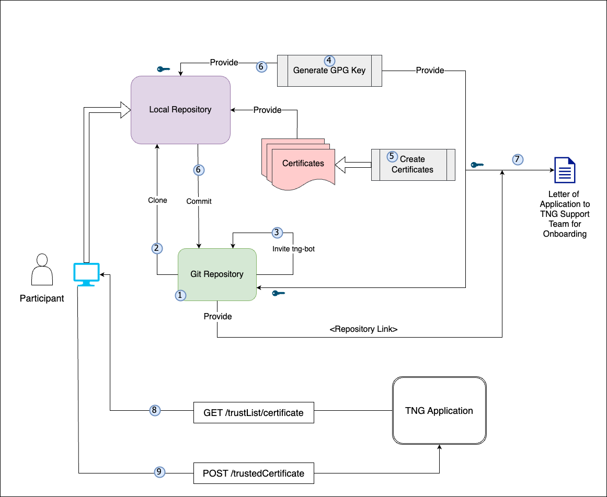
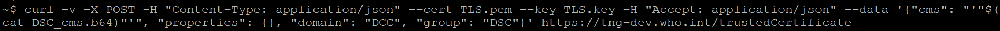
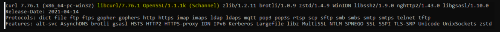
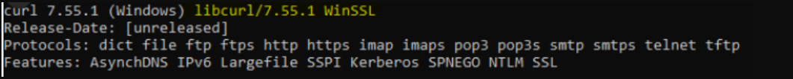

# Deployment - WHO SMART Trust v1.3.0

* [**Table of Contents**](toc.md)
* **Deployment**

## Deployment

## Deployment

This Implementation Guide contains the following deployment support guidance:

* [Security and Privacy Considerations](security_privacy.md)
* [Testing](testing.md)
* [Downloads](downloads.md)

### Onboarding Checklist

This repository contains the a checklist for [onboarding](concepts_onboarding.md) the Trust Network Participants. This includes CSCAs, Auth information, signing information and other relevant files for onboarding a participant. Videos guides to the steps described here are available on this [page](video_tutorial.md).

**Onboarding Process**



**Prerequisites for Onboarding**

Before beginning the onboarding process, please ensure the following tools, permissions, and environment configurations are in place. This checklist is crucial for a seamless setup experience.

| | |
| :--- | :--- |
| **GitHub Account** | - Ensure you have an active GitHub account with access to the relevant repositories.-**Permissions**: Confirm the necessary repository permissions (read/write access if required for pushing commits). |
| **OpenSSL** | - Required for generating and managing digital certificates.-**Minimum Version**: 1.1.1 or higher.-**Verify**:`openssl version`.-**Path Configuration**: Ensure OpenSSL is correctly added to the system path.-[Download OpenSSL](https://www.openssl.org/source/) |
| **cURL** | - Necessary for command-line data transfers, especially useful for API requests.-**Minimum Version**: 7.68.0 or higher.-**Verify**:`curl --version`.-[Download cURL](https://curl.se/download.html) |
| **Git** | - Essential for version control and interacting with GitHub repositories.-**Minimum Version**: 2.28.0 or higher (recommended for improved configuration capabilities).-**Verify**:`git --version`.-[Download Git](https://git-scm.com/downloads) |
| **GPG - Gnu Privacy Guard** | - Essential for singing you git tags in your private repository.-**Minimum Version**: 2.2 - 2.4 any fewer version is outdated.-**Verify**:`gpg --version`.-[Download GPG](https://gnupg.org/download/index.html) |
| **Text Editor or IDE (Optional)** | - Use a reliable text editor or IDE such as**Visual Studio Code**,**Sublime Text**, or**Notepad++**for editing files.-**Extensions**: If using VS Code, consider adding extensions for Markdown and GitHub integration.-[Download Visual Studio Code](https://code.visualstudio.com/) |
| **Network and Firewall Permissions** | -**Network Access**: Ensure network settings allow access to GitHub and other required external resources (e.g., API endpoints).-**Firewall Permissions**: Verify firewall permissions to avoid connectivity issues. |
| **CLI Tools and Path Configuration** | - Confirm that all tools (e.g.,`openssl`,`curl`,`git`) are available in the**system PATH**for easy command-line access.-**OS Compatibility**: These instructions are applicable for Linux, macOS, and Windows. |
| **Environment Configuration** | -**Environment Variables**: Set required environment variables (e.g., API keys, tokens, or paths) as specified. |
| **Additional Resources and Documentation** | - Familiarize yourself with supplementary documentation, including API references, security guidelines, and data handling policies needed for the onboarding process. |

> **Save For Later:**Be sure to securely save items like**GPG Keys, Secrets, GitHub usernames, GitHub Repository URL, GitHub PAT (Personal Access Token)**, and**other configurations**as they will be needed in upcoming steps.

**Steps to Be Followed by Participant Country:**

#### Git Repository

**Create a private git repository on github. One for each Environment (DEV, UAT, PROD)**

> Please check[Create private repository](https://github.com/WorldHealthOrganization/smart-trust/releases/download/v1.1.1/2.1.and2.3.full-video.v2.mp4)video for reference

* From Github profile, go to repositories
* Click on New
* Enter Repository name, follow the convention, it has to contain the ISO 3 letter. All the rest is optional
* Click on Create Repository

> **Save For Later:**Be sure to securely save items like**GitHub usernames**, and**Repository Name, URL**as they will be needed in upcoming steps.

**Create PAT (Personal Access Token) for Github account if not created already**

* Go to Github profile -> Settings
* Go to Developers Settings -> Personal Access Tokens -> Tokens (Classic)
* Click on Generate New Token button (Generate New Token classic)
* Use Authentication code
* Add Note, Expiration, 'Repo' as a scope and click ‘Generate Token’

> **Save For Later:**Be sure to securely save the**GitHub PAT (Personal Access Token)**, as it will be needed in upcoming steps.

#### Local Repository

* Go to local repo
* Clone the new Github repo in your local repo

#### Invite tng-bot

* Add tng-bot to new repository 
>  
Please check[Invite tng-bot to private repository](https://github.com/WorldHealthOrganization/smart-trust/releases/download/v1.1.1/2.2.full-video.v2.mp4)video for reference 
 
* Go to Repository -> Settings
* Go to Collaborators
* Authenticate
* Click on Add people
* Add **tng-bot** for **Prod** and **tng-bot-dev** for **dev** and **UAT**
* **Assign Role**: When inviting both tng-bot and tng-bot-dev, select the **role** as "**Write**" Click **Add Selection** to complete the invitation.

#### Generate GPG Key

* Create GPG Keys for responsible persons for each environment 
>  
Note: Before generating a new GPG key, make sure you've verified your email address. If you haven't verified your email address, you won't be able to sign commits and tags with GPG. Please check[GPG key Creation](https://github.com/WorldHealthOrganization/smart-trust/releases/download/v1.1.1/1.2.full-video.v2.mp4)video for reference 
 
* Download and install the GPG command line tools for your operating system. We generally recommend installing the latest version for your operating system.
* Open Git Bash
* Generate a GPG key pair. Since there are multiple versions of GPG, you may need to consult the relevant man page to find the appropriate key generation command.

* If you are on version 2.1.17 or greater, paste the text below to generate a GPG key pair.
* If you are not on version 2.1.17 or greater, the gpg –full-generate-key command doesn't work. Paste the text below and skip to step 4.
* At the prompt, specify the kind of key you want, or press Enter to accept the default. (Default is RSA)
* At the prompt, specify the key size you want, or press Enter to accept the default. (For RSA go for 4096)
* Enter the length of time the key should be valid. Press Enter to specify the default selection, indicating that the key doesn't expire. Unless you require an expiration date, we recommend accepting this default.
* Verify that your selections are correct.
* Enter your user ID information. 
>  
Note: When asked to enter your email address, ensure that you enter the verified email address for your GitHub account. To keep your email address private, use your GitHub-provided no-reply email address. For more information, see "Verifying your email address" and "Setting your commit email address." 
 
* Authenticate
* Use the **gpg –list-secret-keys –keyid-format=long** command to list the long form of the GPG keys for which you have both a public and private key. A private key is required for signing commits or tags. 

```
  Shell
  gpg --list-secret-keys --keyid-format=long

```

 
>  
Some GPG installations on Linux may require you to use**gpg2 –list-keys –keyid-format LONG**to view a list of your existing keys instead. In this case you will also need to configure Git to use gpg2 by running**git config –global gpg.program gpg2**. 
 
* From the list of GPG keys, copy the long form of the GPG key ID you'd like to use. In this example, the GPG key ID is 3AA5C34371567BD2:
* Paste the text below, substituting in the GPG key ID you'd like to use. In this example, the GPG key ID is 3AA5C34371567BD2:
* Copy your GPG key, beginning with —–BEGIN PGP PUBLIC KEY BLOCK—– and ending with —–END PGP PUBLIC KEY BLOCK—–.
* Add the GPG key to your GitHub account. 
>  
Please check[Adding GPG key to repository](https://github.com/WorldHealthOrganization/smart-trust/releases/download/v1.1.1/1.3.full-video.v2.mp4)video for reference 
 
* Go to Github profile -> Settings
* Go to SSH and GPG Keys
* Click on New GPG Key
* Add Title. Add key copied in last step
* Click on Add GPG Key

#### Create Certificates

##### Certificate Preparation for DEV and UAT

> **Disclaimer**: This script is designed to create self-signed certificates solely for non-production environments, such as DEV and UAT, not intended to be used on production environments. To use it,**choose the appropriate script for your operating system**:**Unix/Linux:**Use the[gen_all_certs.sh](https://github.com/WorldHealthOrganization/tng-participant-template/blob/main/scripts/certgen/gen_all_certs.sh)bash script on[Linux/Unix/Mac](#if-your-operating-systems-is-unixlinuxmac)operating system.**Windows:**Use the[gen_all_certs.ps1](https://github.com/WorldHealthOrganization/tng-participant-template/blob/main/scripts/certgen/gen_all_certs.ps1)PowerShell script on[Windows](#if-your-operating-systems-is-windows)operating system.

These scripts, along with the provided configuration files, serve as guidelines for [certificate preparation](https://github.com/WorldHealthOrganization/tng-participant-template/blob/main/scripts/certgen/README.md) .

##### If your Operating Systems is Unix/Linux/Mac

> 
* To customize certificate parameters, update the [DN_template.cnf](https://github.com/WorldHealthOrganization/tng-participant-template/blob/main/scripts/certgen/DN_template.cnf) file, which will be used by the [gen_all_certs.sh](https://github.com/WorldHealthOrganization/tng-participant-template/blob/main/scripts/certgen/gen_all_certs.sh) script.
* Modify the following default certificate parameters as needed.

```
export OSSL_COUNTRY_NAME="XC"
export OSSL_STATE_NAME="Test State"
export OSSL_LOCALITY_NAME="TEST"
export OSSL_ORGANIZATION_NAME="WHO"
export OSSL_ORGANIZATIONAL_UNIT_NAME="R&D"
export OSSL_COMMON_NAME="NationXC_TNP

```

> Note: OSSL_COUNTRY_NAME should be ISO 2 letter name of the country mapped to the name used in repository.

##### If your Operating Systems is Windows

> For Windows, use the[gen_all_certs.ps1](https://github.com/WorldHealthOrganization/tng-participant-template/blob/main/scripts/certgen/gen_all_certs.ps1)PowerShell script. You can modify the environment variables directly within the script or set them in your current PowerShell session:

1.Open PowerShell on your Windows machine.

2.Set the required environment variables.

```
$env:OSSL_COUNTRY_NAME="XC"
$env:OSSL_STATE_NAME="Test State"
$env:OSSL_LOCALITY_NAME="TEST"
$env:OSSL_ORGANIZATION_NAME="WHO"
$env:OSSL_ORGANIZATIONAL_UNIT_NAME="RND"
$env:OSSL_COMMON_NAME="NationXC_TNP"

```

> Note: OSSL_COUNTRY_NAME should be ISO 2 letter name of the country mapped to the name used in repository.

Please note that you need to have [OpenSSL installed](https://slproweb.com/products/Win32OpenSSL.html) (e.g. Win64 OpenSSL v3.3.0 Light) and added to your PATH environment variable. Also you may need allow the execution by setting an execution policy.

```
Set-ExecutionPolicy -ExecutionPolicy Unrestricted -Scope Process

```

##### How to Run Script :

* Once you execute the script. It will generate all certificates and keys in a subfolder named by current datetime.
* **Notes**: While execution of "gen_all_certs.sh" script on **Unix/Linux/Mac Operating System,** Please provide script argument "DN_template.cnf" file which consists of country related information to generate all required certificates (TLS,SCA,UP)

```
**For Mac/Linux/Unix**
cd scripts/certgen
./gen_all_certs.sh DN_template.cnf	    ## Provide DN_template.cnf file as a script argument.
zsh ./gen_all_certs.sh DN_template.cnf      ## Use this if you are using Zsh on your Ubuntu system.
        
**For Windows:**
cd scripts/certgen
./gen_all_certs.ps1

```

This setup generates all required certificates (TLS, SCA, UP) and keys in a timestamped subfolder, based on the configuration specified in DN_template.cnf for Unix/Linux and the environment variables set in the current PowerShell session for Windows.

##### Prepare Folders

> Note: keep your private keys safe and secure. Do not share them with anyone.

Copy the generated certificates to the respective folders and change the file names to match the naming convention. For the case of self-signed TLS certificates, the CA.pem is just a copy of the TLS.pem (check to have keyCertSign in the keyUsage). The CA.pem should exist, since it is used to verify the TLS client certificate when connecting to the TNG application. Files to be copied in respective folders are as follows:

* SCA.pem -> onboarding/DCC/SCA
* UP.pem -> onboarding/DCC/UP
* CA.pem -> onboarding/DCC/TLS
* TLS.pem -> onboarding/DCC/TLS

> Note: On DEV and UAT environment, if the files are generated using a script, delete the generated folder before committing the files.

##### Certification Preparation for Prod

This guide follows the certificate templates defined in the certificate governance. Public Key Certificates generated by following this guide will include the minimal required fields - further fields can be added in the configuration files if needed.Self-signed certificates are typically used in DEV and UAT environments.

**For production, It is strongly recommended to use certificates signed by a trusted Certificate Authority (CA)**. This is just an example reference on how to use a Trusted CA certificate in a production environment. You should refer to the specific procedures provided by the public Trusted Certificate Authority (CA) of your choice for accurate and detailed instructions [Reference- Recommendation to use Trusted Public CA Certificate in Prod](#steps-to-obtain-and-use-a-ca-signed-certificate)

**Only following signature algoriths are supported for the certificate.**

* ECDSA with SHA-256
* ECDSA with SHA-384
* RSASSA-PSS
* DSA with SHA-256
* Legacy: SHA-256 with RSA Encryption

###### SCA certificate (TNPSCA) generation example

> Please check[SCA Creation](https://github.com/WorldHealthOrganization/smart-trust/releases/download/v1.1.1/1.1.full-video.SCA.v2.mp4)video for reference

* **sca.conf**: Create a new file called sca.conf and replace the dn entries with your jurisdiction’s details.
* **Certificate generation**: Open a command line prompt in the folder where the sca.conf is located and use the following OpenSSL command to create the private key (CAprivkey.key) and the certificate (CAcert.pem):
* **For Prod it's recommended to use** [Trusted CA issued Certificate](#steps-to-obtain-and-use-a-ca-signed-certificate) only. As below command for self-signed certificate generation as it's usually only recommended for **DEV/UAT** environment.

###### DSC generation example

**DSC generation example** Document Signer Certificates (DSCs) must be signed by the SCA. Hence, you have to create the SCA certificate (with the corresponding private key) before you can issue DSCs.

* **DSC.conf**: Please check [DSC generation and deletion](https://github.com/WorldHealthOrganization/smart-trust/releases/download/v1.1.1/3.2.and3.3.full-video.v2.mp4) video for reference
* Create a new file called DSC.conf in the folder where your CA’s private key is located and add the following fields:
* It is recommended that a SCA provides certificate revocation lists. Therefore, replace the crlDistributionPoints URI with the information for your jurisdiction.
* The extendedKeyUsage field is optional, for Covid certificates the below values are recommend to be used to further restrict the DSC certificate as follows:


  **Field** **Value**
 extendedKeyUsage 1.3.6.1.4.1.1847.2021.1.1 for Test Issuers
 extendedKeyUsage 1.3.6.1.4.1.1847.2021.1.2 for Vaccination Issuers
 extendedKeyUsage 1.3.6.1.4.1.1847.2021.1.3 for Recovery Issuers\
* The above example contains all three extended key usages.
* **Create a certificate signing request (CSR)**:In order to create a certificate for a Document Signer, first create a Certificate Signing Request preferably on the machine that will use the certificate in order to avoid copying the private key (DSC01privkey.key) to this machine later. The CSR must contain the Distinguished Name (DN) information that will be included in the DSC. Open a command prompt and use the following command to create the CSR:
* If needed, you can repeat this procedure to create multiple CSRs for different DSCs (on different machines). When prompted, enter the necessary information (e.g. C= your jurisdiction (MUST), O = your Organization (OPTIONAL), CN = non-empty and unique CN (MUST), …).
* **Issue the certificate**: Copy the CSR (DSC01csr.pem) to the folder where the private key of your CA is located. Open a command prompt and use the following command to issue the DSC (DSCcert.pem):
* **Important Recommendations for Prod**: Please replace CAcert.pem and CAprivkey.key with signing material from an officially Trusted Certification Authority instead using your own self-signed one.

###### TNPUP generation example

* **uploadCert.conf** 
>  
Please check[UP Creation](https://github.com/WorldHealthOrganization/smart-trust/releases/download/v1.1.1/1.1.full-video.UP.v2.mp4)video for reference 
 
* Create a new file called **uploadCert.conf** and replace the dn entries with your jurisdiction’s details.
* **Certificate generation**: Open a command line prompt in the folder where the **uploadCert.conf** is located and use the following OpenSSL command to create the private key (**TNP_UP.key**) and the certificate (**TNP_UP.pem**):

###### TNPTLS generation example

* **TLSClient.conf** 
>  
Please check[TLS Creation](https://github.com/WorldHealthOrganization/smart-trust/releases/download/v1.1.1/1.1.full-video.TLS.v2.mp4)video for reference 
 
* Create a new file called **TLSClient.conf** and replace the dn entries with your jurisdiction’s details.

> Note :Beware that self-signed certificates should also contain the key usage Certificate signing (keyCertSign), so that the (self) signature of the certificate can be verified.

```
```
plaintext
[ext]
keyUsage = critical, digitalSignature, keyCertSign
extendedKeyUsage = clientAuth
```

```

* **Certificate generation**: Open a command line prompt in the folder where the **TLSClient.conf** is located and use the following OpenSSL command to create the private key (**TNP_TLS.key**) and the certificate (**TNP_TLS.pem**):

**RSA Public Key Certificates** In case you want to use RSA certificates you can still use the configuration files provided above. During the CSR/certificate creation, replace the `-newkey ec:<(openssl ecparam -name prime256v1)` with `-newkey rsa:4096` for a 4096 Bit RSA key.
 Please be aware that RSA is NOT RECOMMENDED for the DSC and if you want to use RSA as your document signing algorithm, please create either a 2048 bit RSA key or at maximum a 3072 bit RSA key due to the space limitations on the QR codes.

#### Provide

> Please check[Signing (tag) certificates](https://github.com/WorldHealthOrganization/smart-trust/releases/download/v1.1.1/2.4.full-video.v2.mp4)video for reference

* **Git Commands for Configuring, Committing, and Pushing Signed Commits** are also available [here](https://github.com/WorldHealthOrganization/tng-participant-template/blob/main/scripts/certgen/README.md#tagging-for-taking-into-use)
* Finally commit push changes and make a signed tag for the version you want to take into use, by following the steps below:
* List all the GPG keys available on your system


  **Note**: The PUB ID in above output is CD822874C7862BA4BB6B950E40CC62009D9A00B0 , In your case you need to replace with « replace with your Pub ID » with your actual GPG public key ID to configure Git to use a GPG key for signing commits or tags in next command.
* Configure the signing key to be used globally for Git commits and tag
* Retrieve the current GPG signing key configured for Git 

```
  git config --get user.signingkey

```

 
* Configures the global Git username and email 

```
  git config --global user.name "Your Git UserName"
	
  git config --global user.email "Your email Id"

```

 
* Stage all changes for the next commit 

```
  git add .

```

 
* Create a signed Git commit with a commit message, 

```
  git commit -sm "added all certificates files"

```

 
* Push changes to the main branch. 

```
 git push origin main

```

 
* Create a signed Git tag with a message 

```
  git tag -s v1.2 -m 'my signed 1.2 tag'

```

 
* Displays the details of a specific tag
* Pushes all the local tags to the remote repository 

```
  git push --tags 

```

 
* For more detailed git commands please review [Appendix](#more-information-about-git-commit-signing-and-tagging-commands)

**Everyone Must Sign - Always a good idea** Signing tags and commits is great, but if you decide to use this in your normal workflow, you’ll have to make sure that everyone on your team understands how to do so. This can be achieved by asking everyone working with the repository to run git config –local commit.gpgsign true to automatically have all of their commits in the repository signed by default. If you don’t, you’ll end up spending a lot of time helping people figure out how to rewrite their commits with signed versions. Make sure you understand GPG and the benefits of signing things before adopting this as part of your standard workflow.

#### Send an onboarding/participation request

* Send an onboarding/participation request to gdhcn-support@who.int which contains: 
* URL of the private repository created as a prerequisite
* The GPG key ( Beginning with —–BEGIN PGP PUBLIC KEY BLOCK—– and ending with —–END PGP PUBLIC KEY BLOCK—–) exported in Step [1.8.6.4](#generate-gpg-key)
 

#### Validate the connection

* Once the confirmation of successful onboarding is received from the TNG Support Team ( gdhcn-support@who.int), please do the following

THe following are the endpoints for the [Trust Network Gateway](concepts.md#trust-network-gateway-tng) for each of development (DEV), user-acceptence testing (UAT) and production (PROD) ***environment**s:

| | |
| :--- | :--- |
| PROD | https://tng.who.int |
| UAT | https://tng-uat.who.int |
| DEV | https://tng-dev.who.int |

**Please ensure you replace with your actual environment's endpoint URL wherever indicated.**

* After onboarding in the DEV/UAT/PROD Environment, check the connectivity with the Trust Network Gateway using its [API](https://smart.who.int/trust/openapi/). This can be achieved with following command:

```
curl -v <<EndpointURL>>/trustList --cert TLS.pem --key TLS.key

```

You should see a output like:

```
[
{
    "kid": "+jrpHSqdqZY=",
    "timestamp": "2023-05-25T07:55:21Z",
    "country": "XC",
    "certificateType": "UPLOAD",
    "thumbprint": "fa3ae91d...",
    "signature": "MIAGCSqGSIb3D...",
    "rawData": "MIIErTCCA5WgAwIBAgII..."
}
]

```

* Test the other Trustlist Routes in the same style (e.g. with DSC/SCA/Upload/Authentication…)

#### Upload DSC Certificate

* Create an Document Signer Certificate and sign it by the SCA [Refer](#certification-preparation-for-prod) and [DSC generation example](#dsc-generation-example)
* Create an CMS Package :

**Method 1 - Command line .** Before running the below commands we need DSC certificate : [To Generate DSC through command line - Follow section 4.1.1.5.6.2](https://worldhealthorganization.github.io/smart-trust/branches/signerCertificate-to-trustedCertificate/concepts_onboarding_checklist.html#dsc-generation-example)

```
openssl x509 -outform der -in DSC.pem -out cert.der
openssl cms -sign -nodetach -in cert.der -signer UP.pem -inkey UP.key -out signed.der -outform DER -binary
openssl base64 -in signed.der -out DSC_cms.b64 -e -A

```

* Check DSC is already exist before upload CMS package

```
curl -v <<EndpointURL>>/trustList/DSC/XC --cert TLS.pem --key TLS.key

```

* Upload the CMS Package to the Gateway

```
curl -v -X POST -H "Content-Type: application/json" --cert TLS.pem --key TLS.key -H "Accept: application/json" --data '{"cms": "'"$(cat DSC_cms.b64)"'", "properties": {}, "domain": "DCC|IPS-PILGRIMAGE", "group": "DSC|DESC"}' <<EndpointURL>>/trustedCertificate

```

**Note:** Replace domain, group, and EndpointURL with the appropriate values for your onboarding environment.

DCC for domain, DSC for group, and https://tng-dev.who.int for DEV environment endpoint.

**Example**



* Download the Trustlist again, and check if your DSC is available.

```
curl -v <<EndpointURL>>/trustList/DSC/XC --cert TLS.pem --key TLS.key

```

**Method 2 - Scripts**

The DSC generation and upload of CMS package to TNG Gateway could be achieved through the below mentioned scripts. For DEV and UAT environments you may use script.

[Generate DSCs](https://github.com/WorldHealthOrganization/tng-participant-template/tree/main/scripts/certgen#generate-dscs)

[Upload DSCs](https://github.com/WorldHealthOrganization/tng-participant-template/tree/main/scripts/certgen#upload-dscs0)

The Distinguished Name ( DN) configuration file while will parse as source [DN_template.cnf](https://github.com/WorldHealthOrganization/tng-participant-template/blob/main/scripts/certgen/DN_template.cnf) is an example.

Please replace with your actual OSSL_COUNTRY_NAME, OSSL_STATE_NAME etc parameters accordingly of DN_template.cnf file.

The script expects at least two arguments: A configuration file (DN_template.cnf) that contains the Distinguished Name (DN) template. A subdirectory where the SCA (Signing Certificate Authority) PEM and KEY files are located. An optional third argument can be provided to specify the purpose of the DSC (e.g., test, vax, rec). If this argument is not provided, the DSC will be generated for all purposes.

**How to to run DSC Generate Script** [gen_dsc.sh](https://github.com/WorldHealthOrganization/tng-participant-template/blob/main/scripts/certgen/gen_dsc.sh)

```
./gen_dsc.sh DN_template.cnf path/to/sca_directory [test/vax/rec-purpose]

```

./gen_dsc.sh: Script name

/path/to/sca: Create SCA directory which contains SCA.pem and SCA.key

**How to run upload_dsc.sh script to upload CMS Package:** [upload_dsc.sh](https://github.com/WorldHealthOrganization/tng-participant-template/blob/main/scripts/certgen/upload_dsc.sh)

```
./upload_dsc.sh /path/to/subdir  /path/to/DSC_dir [DCC]

```

./upload_dsc.sh: Script name

/path/to/subdir: Create subdir directory which contains UP.pem and UP.key.

/path/to/DSC_dir: Create DSC_dir directory which contain the DSC.pem.

DCC: The domain name to be used. If omitted, the script will default to DCC.

**Important** : Once above command executed sucessfully that's mean your CMS package uploaded to gateway

**Check DSC Status**

Please replace XC with your actual two letter country code

```
curl -v <<EndpointURL>>/trustList/DSC/XC --cert TLS.pem --key TLS.key

```

> Note: Some versions of curl don’t attach the client certificates automatically. This can be checked via curl –version Ensure that the used version is linked to OpenSSL. Especially under Windows (https://curl.se/windows/):**Curl version on Unix/Mac**: We strongly recommend updating curl and nss to newer latest versions for full compatibility with modern cryptographic standards.The outdated version of curl or nss and may not support modern SSL/TLS protocols or elliptic curve cryptography (ECC) cipher suites properly.

**Working Setup**



**Non-working setup**



**Certificate Validation on Grafana:** Once the CMS package is uploaded to the gateway, your DSC certificate entry will be reflected in Grafana.

| |
| :--- |
| [DEV](https://auth-tng-dev.switzerlandnorth.cloudapp.azure.com/grafana/d/dev-cert-expiry/dev-country-certificate-expiry?orgId=2) |
| [UAT](https://auth-tng-uat.switzerlandnorth.cloudapp.azure.com/grafana/d/uat-cert-expiry/uat-country-certificate-expiry?orgId=2) |
| [PROD](https://auth-tng.switzerlandnorth.cloudapp.azure.com/grafana/d/cert-expiry/prod-country-certificate-expiry?orgId=2) |

#### Appendix

##### Further example configuration files

The following configuration files have been provided during the alignment on the [certificate governance](concepts_certificate_governance.md). The configuration files contain additional fields that a Trust Network Participant might want to include and use. The config-files are not tested with the OpenSSL commands provided above.

* **SCA Conf**
* **DSC conf**

##### Steps to Obtain and Use a CA-Signed Certificate

* Generate a Certificate Signing Request (CSR) To begin, generate a CSR using the following OpenSSL command. This request will include a new private key and a configuration file:

```
openssl req -new -nodes -newkey ec:<(openssl ecparam -name prime256v1) -keyout CAprivkey.key -out CAreq.csr -config sca.conf

```

**CAprivkey.key:** This file contains the private key.

**CAreq.csr:** This file contains the Certificate Signing Request.

**sca.conf:** This is the OpenSSL configuration file used during the CSR generation.

* Submit the CSR to a Public Certificate Authority (CA): Submit the generated CAreq.csr file to the public CA of your choice. The CA will use this CSR to issue a certificate. Upon approval, the CA will provide you with:
* Submit CSR to the Public CA: Submit the generated CAreq.csr file to the public CA of your choice. They will use the CSR to issue a certificate. The CA will provide you with the signed certificate and possibly a certificate chain or intermediate certificates.
* Use the CA-Signed Certificate: Once you receive the CA-signed certificate, you will use it instead of generating a new self-signed certificate. Here’s how you can replace the placeholders with the signed certificate: cp signed_CA_cert.pem ${subdir}/CAcert.pem cp CAprivkey.key ${subdir}/CAprivkey.key

##### More information about Git commit, signing and tagging commands

**Signing Your Work**

* Git is cryptographically secure, but it’s not foolproof. If you’re taking work from others on the internet and want to verify that commits are actually from a trusted source, Git has a few ways to sign and verify work using GPG.
* First of all, if you want to sign anything you need to get GPG configured and your personal key installed.
* If you don’t have a key installed, you can generate one with **gpg –gen-key**.
* Once you have a private key to sign with, you can configure Git to use it for signing things by setting the user.signingkey config setting.
* Now Git will use your key by default to sign tags and commits if you want.

**Signing Tags**

* If you have a GPG private key set up, you can now use it to sign new tags. All you have to do is use -s instead of -a:
* If you run git show on that tag, you can see your GPG signature attached to it:

**Verifying Tags**

* To verify a signed tag, you use git tag -v . This command uses GPG to verify the signature. You need the signer’s public key in your keyring for this to work properly:
* If you don’t have the signer’s public key, you get something like this instead:

**Signing Commits**

* In more recent versions of Git (v1.7.9 and above), you can now also sign individual commits. If you’re interested in signing commits directly instead of just the tags, all you need to do is add a -S to your git commit command.
* To see and verify these signatures, there is also a –show-signature option to git log.
* Additionally, you can configure git log to check any signatures it finds and list them in its output with the %G? format.
* Here we can see that only the latest commit is signed and valid and the previous commits are not.
* In Git 1.8.3 and later, git merge and git pull can be told to inspect and reject when merging a commit that does not carry a trusted GPG signature with the –verify-signatures command.
* If you use this option when merging a branch and it contains commits that are not signed and valid, the merge will not work.
* If the merge contains only valid signed commits, the merge command will show you all the signatures it has checked and then move forward with the merge.
* You can also use the -S option with the git merge command to sign the resulting merge commit itself. The following example both verifies that every commit in the branch to be merged is signed and furthermore signs the resulting merge commit.

### Security and Privacy Considerations

### Testing

### Trust Registry Network

The Digital TRUST Infrastructure for Discovery and Validation (Regi-TRUST) is a DNS-based decentralized trust management infrastructure that bridges the gap between different certificate ecosystems and enables trust interoperability. Regi-TRUST's "network of networks" model allows ecosystems of trusted digital services operated by various stakeholders to securely publish service endpoints collated with their independent governance policies and with support for root of trust architectures to allow interoperable verifications. Implementers of Regi-TRUST can leverage tools provided to create purpose-sized networks of trusted digital services operated by all types of entities, using lightweight infrastucture and technical governance due to the decentralized federation approach. Regi-TRUST was originally started by the Linux Foundation in 2021 as the Global COVID-19 Certificate Network (GCCN), and is now sponsored and hosted by the United Nation Development Programme (UNDP).

Within the health certificate context, verifiers can use the discovery mechanism enabled by Regi-TRUST to build a customized trust list based on their own entry policies, check health certificates from issuers participating in disparate trust networks against that list and access the issuer's public key for signature verification. The registry participants will submit service metadata, public keys, business rules and revocation data to the registry in a standardized format via trusted endpoints.

Regi-TRUST is built on the open-source [Trust mAnagement INfrastructure (TRAIN)](https://gitlab.grnet.gr/essif-lab/infrastructure/fraunhofer/train_project_summary), developed by the Fraunhofer IAO as a part of the European Self-Sovereign Identity Framework (ESSIF) Lab. TRAIN uses/supports several established standards and is flexible with existing architectures, providing technical accessibility and inclusivity for implementors.

#### Proof of Concept

The original proof of concept that took place at the Linux Foundation involved 1) COVID certificate services applying to join the network 2) the discovery of COVID certificate services on the network and 3) the verification of COVID certificates using the network. For more detail on execution of this proof of concept and results, [please follow this link.](https://www.lfph.io/2022/04/19/lfph-completes-the-proof-of-concept-of-its-gccn-trust-registry-network/)

#### Implementation Toolkit and Technical Specification

The UNDP project intends to develop and provide an implementation toolkit including an open source reference implementation for the specification, a governance and policy guideline for Regi-TRUST implementers, and technical and functional specifications. Full technical specifications, implementation guides, and more are forthcoming.

* [Public Review Draft of the Technical and Functional Specification](https://docs.google.com/document/d/1MOmhbPsVhGEULUeBhUdieYzpi6VzdPZedCAHb5aHEE0)
* [Github Repository](https://github.com/undp/Regi-TRUST)
* [Community of Practice and Governance Discussion](https://www.sparkblue.org/Regi-TRUST/)

### Trust Network Gateway

The Trust Network Gateway is an open source implementation of a centralized trust network solution available to potential implementers intending to create a local or regional network. This implementation is derived from the [European Union Digital COVID Certificate Gateway (EUDCCG)](https://github.com/ehn-dcc-development/eu-dcc-overview), which has been deployed in an operational setting within the European Union.

In addition to the core functionality of the EUDCCG, the Trust Network Gateway implementation also supports:

* Federation and peer exchange of information between gateways
* Access to metadata content (e.g. value sets/codings, business rules) with explicit adherence to the HL7 FHIR specification
* Explicit means for revocation of digital COVID certificates
* Optional support of online verification and validation workflows

The role of the Trust Network Gateway is to enable the creation of trust networks by additional organizations beyond the EU Member States participating in the EUDCCG, expanding the network of operators and trusted parties to form a federated and documented network of trust gateways, supporting all major health credential certificates.

* [Trust Network Gateway public repository](https://github.com/WorldHealthOrganization/ddcc-gateway)
* [Architecture](./trust_network_gateway_architecture.md)
* [Swagger API](openapi)

### Downloads

 Download the entire implementation guide [here](full-ig.zip) 

* Artifact Definitions: Examples
  * [XML](definitions.xml.zip): [XML](examples.xml.zip)
  * [JSON](definitions.json.zip): [JSON](examples.json.zip)
  * [Turtle](definitions.ttl.zip): [Turtle](examples.ttl.zip)

### Changes

 This provides a list of changes to the SMART Trust IG 

 **2024-01-29 v1.0.0 - First stable release** 

**2024-01-29 v1.0.0 - First stable release**

* First stable release

* First stable release

 **2024-02-01 v1.1.0** 

**2024-02-01 v1.1.0**

* Hcert specifications added

* Hcert specifications added

 **2024-02-21 v1.1.1** 

**2024-02-21 v1.1.1**

* video tutorials added

* video tutorials added

 **2024-03-22 v1.1.2 - release** 

**2024-03-22 v1.1.2 - release**

* HCert Logical Model and specification updated with subclaim details and notes
* Rapid assessment template for proposing new trust domains added
* Content Profiles include details about Trust Domain
* FAQ page added
* Link to country participation dashboard added

* HCert Logical Model and specification updated with subclaim details and notes

* Rapid assessment template for proposing new trust domains added

* Content Profiles include details about Trust Domain

* FAQ page added

* Link to country participation dashboard added

 **2024-10-28 v1.1.4 - release** 

**2024-10-28 v1.1.4 - release**

* HCert Logical Model updated with subclaim for DVC
* Onboarding Checklist updated
* Onboarding process revised to remove Transitive processes
* Latest country participation status updated

* HCert Logical Model updated with subclaim for DVC

* Onboarding Checklist updated

* Onboarding process revised to remove Transitive processes

* Latest country participation status updated

 **2024-12-19 v1.1.5 - release** 

**2024-12-19 v1.1.5 - release**

* Onboarding Checklist updated

* Onboarding Checklist updated

### Endpoints

The following describes the active services and endpoints for the GDHCN Trust Network Gateway.

#### Operational Metadata

##### Trust Domains

The list of active trust domains is maintained in the [GDHCN Trust Domain Value Set](ValueSet-Domains.md).

##### Key Usage Codes

The list of key usage codes is maintained in the [GDHCN Key Usage Value Set](ValueSet-KeyUsage.md).

##### Participants

The list of onboarded Trust Network Participants is availabe in the [GDHCN Participants Value Set](ValueSet-Participants.md).

#### Trustlist Distribution Endpoints

THe following are the endpoints for the [GDHCN DID Trust List](concepts_did_gdhcn.md) for each of development (DEV), user-acceptence testing (UAT) and production (PROD) ***environment**s:

| | | |
| :--- | :--- | :--- |
| DEV | Embedded | [https://tng-cdn-dev.who.int/v2/trustlist/did.json](https://tng-cdn-dev.who.int/v2/trustlist/did.json) |
| DEV | Reference | [https://tng-cdn-dev.who.int/v2/trustlist-ref/did.json](https://tng-cdn-dev.who.int/v2/trustlist-ref/did.json) |
| UAT | Embedded | [https://tng-cdn-uat.who.int/v2/trustlist/did.json](https://tng-cdn-uat.who.int/v2/trustlist/did.json) |
| UAT | Reference | [https://tng-cdn-uat.who.int/v2/trustlist-ref/did.json](https://tng-cdn-uat.who.int/v2/trustlist-ref/did.json) |
| PROD | Embedded | [https://tng-cdn.who.int/v2/trustlist/did.json](https://tng-cdn.who.int/v2/trustlist/did.json) |
| PROD | Reference | [https://tng-cdn.who.int/v2/trustlist-ref/did.json](https://tng-cdn.who.int/v2/trustlist-ref/did.json) |

#### Trust Network Gateway

THe following are the endpoints for the [Trust Network Gateway](concepts.md#trust-network-gateway-tng) for each of development (DEV), user-acceptence testing (UAT) and production (PROD) ***environment**s:

| | |
| :--- | :--- |
| PROD | https://tng.who.int |
| UAT | https://tng-uat.who.int |
| DEV | https://tng-dev.who.int |

#### Status Monitoring Dashboards

The following dashboards reflect the realtime status of key materials for each of development (DEV), user-acceptence testing (UAT) and production (PROD) ***environment**s:

| | |
| :--- | :--- |
| DEV | [Country certificate expiry](https://tng-monitor-dev.who.int/grafana/d/dev-cert-expiry/dev-country-certificate-expiry) |
| DEV | [Country Onboarding Status](https://tng-monitor-dev.who.int/grafana/d/ddh0xqz9diio0c/dev-country-onboarding-status) |
| DEV | [Country Queries](https://tng-monitor-dev.who.int/grafana/d/dev-country-queries/dev-country-queries) |
| DEV | [Gateway Availability Dashboard](https://tng-monitor-dev.who.int/grafana/d/gw-availability/dev-gateway-availability-dashboard) |
| UAT | [Country certificate expiry](https://tng-monitor-uat.who.int/grafana/d/uat-cert-expiry/uat-country-certificate-expiry) |
| UAT | [Country Queries](https://tng-monitor-uat.who.int/grafana/d/uat-country-queries/uat-country-queries) |
| UAT | [Gateway Availability Dashboard](https://tng-monitor-uat.who.int/grafana/d/c3ed3dbe-6cc0-4f16-8f0a-c7bcebd36420/uat-gateway-availability-dashboard) |
| PROD | [Country certificate expiry](https://tng-monitor.who.int/grafana/d/cert-expiry/prod-country-certificate-expiry) |
| PROD | [Country Queries](https://tng-monitor.who.int/grafana/d/prod-country-queries/prod-country-queries) |
| PROD | [Gateway Availability Dashboard](https://tng-monitor.who.int/grafana/d/gateway-availability/prod-gateway-availability-dashboard) |

