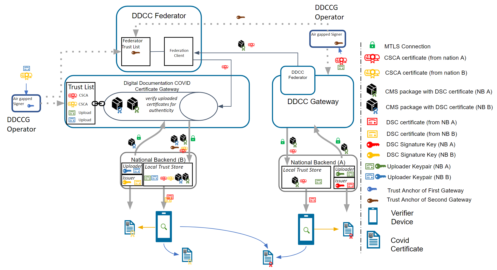

# Trust Network Gateway Architecture - WHO SMART Trust v1.3.0

* [**Table of Contents**](toc.md)
* [**Data Models and Exchange**](data_exchange.md)
* **Trust Network Gateway Architecture**

## Trust Network Gateway Architecture

#### Terminology

These [concepts](concepts.md) and the following table contains abbreviations and terminology used throughout this document.

| | |
| :--- | :--- |
| DCC | Digital COVID-19 Certificate. |
| DDCC | Digital Documentation COVID-19 Certificate. |
| DCC Gateway | REST web-application for exchange of document signer certificates, DCC value sets, DCC business rules and revocation lists for dcc verification purposes between the national backends of connected states. |
| ffline SCA certificates. |   |
| CMS | Cryptographic Message Syntax. According to[RFC5652](https://datatracker.ietf.org/doc/html/rfc5652). This syntax is used to digitally sign, digest, authenticate or encrypt arbitrary message content. |
| JRC | European Joint Research Centre. |
| OG | Origin Gateway. |
| [CQL](https://cql.hl7.org/) | Clinical Quality Language. |

#### Introduction

This architectural specification provides the means to establish a federated trust network for use with health records like WHO Digital Documentation of COVID-19 Certificates (DDCC) technical specifications and implementation guidance documents. This is based on the assumption that Trust Network Participant may establish their own independent national trust networks, participate in a regional trust network, or wish to participate in a global federated trust network. Furthermore, Trust Network Participant may wish for these trust networks to be interoperable for domestic and cross-jurisdictional use cases. While specific governance and policy considerations required in the establishment of such interoperable trust networks is out of scope of this document, the intent is that the technical design within this document would support intra-jursidictional and cross-jurisdictional policies of Trust Network Participant.

The Trust Network Gateway (TNG) specifications in this document are designed to support the DDCC specification, which acts as bridging/umbrella specification for various health records like digital COVID certificates (e.g., EU’s DCC, SMART Health Cards, DIVOC, and ICAO). This specification builds on the [EU Digital Covid Certificate Gateway](https://ec.europa.eu/health/sites/default/files/ehealth/docs/digital-green-certificates_v2_en.pdf) by extending it in several important ways:

* allowing for federation and peer exchange of information between gateways;
* supporting access to metadata content (e.g. value sets/codings, business rules) with explicit adherence to the HL7 FHIR specification;
* providing an explicit means for revocation of digital COVID certificates; and
* allowing for (optional) support of online verification and validation workflows.

Within the current DCC system the centralized gateway plays the key role of establishing trust between all of the connected Trust Network Participant. The gateway operators follow a well-documented process to establish the identity and onboard the trust anchor of each Trust Network Participant. The TNG builds upon this system to enable the creation of trust gateways by other organizations which allows to form a federated network of trust gateways, supporting all of the major COVID-19 credential certificates.

##### Trusted Party vs. National Backend

The current gateway design is focused on the trust establishment between “National Backends” in terms of a system operated/owned by a national health authority. This can be a script, a fully automated solution or a manual process, which is able to connect the gateway trustfully and able to do uploads and downloads of the content. What other concrete solutions are behind is not in scope of the gateway itself. Within the DDCC scope, the term “National Backend” is worded too sharply, because there can be other parties which can be connected with their publishing system to a gateway in the trust network. Therefore the term “national backend” should be understood within this scope more as “Trusted Party” in terms of an attendee which has received access to a trusted gateway. The trusted gateway or the federator acts then as well as “Trusted Party” to other gateways.

#### Gateway Design Vision

Currently EU DCC Gateway is a single centralized system which establishes trust between DCC participants and enables the sharing of business rules, value sets and revocation lists. If another region in the world establishes such a gateway, there is currently no method in the architecture to exchange these trusted data between the two gateways. In this new architecture within the DDCC context, multiple gateways can be connected to each other and share trusted data. In the long term, this architecture will allow the creation of groups and ultimately the establishment of a federation. Such an architecture may be applicable and of interest for non-authority parties e.g. airlines, which desire a read only copy of the gateway content. This can be established by onboarding the airline in a gateway specially setup for this purpose and is connected to the official gateway. To achieve this goal, the architecture must support multiple operation modes e.g. Primary-Secondary. The current implementation of EU DCCG is, as mentioned before, a single centralized system which serves as a hub for storing and managing the necessary information gathered from the Trusted Parties.


The TNG should realize this enhancement of the current implementation of DCCG with the purpose to create a network between multiple gateways for exchanging health record associated public key material, value sets and business rules between different parties (authority, non-authority, commercial). In this architecture a gateway can connect to any other gateway by manually configuring the list of connections and trust relationships. To manage the connections and their download behavior a new component federator is introduced. The federator is a microservice which acts as an automated download client between two gateways and fulfills all responsibilities of trusted data exchange.


The backbone of this data exchange is the functionality of the current connector library which connects to the gateway and provides for the consumer the most necessary functionalities. This library is enhanced by the functionality to connect multiple gateways instead of one.

##### Use Cases

###### Bilateral Onboarding

In Bilateral Onboarding use case the [connector library](https://github.com/WorldHealthOrganization/ddcc-gateway-lib) connects as a trusted party to multiple gateways for downloading/uploading content. This requires onboarding on both gateways.


###### Peer to Peer Exchange

In the peer-to-peer exchange use case, two or more gateways are able to exchange their data in a bi-directional manner. The source and the target gateway enable each other to download the data. All exchanged data will be appended to the existing data within the gateway. This can include the data of third-party gateways, if permitted by the data exchange agreement between two gateways.


###### Primary-Secondary Exchange

In the primary-secondary exchange use case one or several gateways act as primary source, and another set of gateways act as secondary source . Within this mode, secondaries will download the data of the primary and append it to their own dataset or replace their dataset with the downloaded data. The primary ignores the data of the secondaries, which act just as read copies of the primary gateway. The leading national backends can connect to the primary gateway and upload the data to the one primary gateway.


###### Combined Sources Exchange

In the combined sources exchange use case, the gateway will download data from multiple gateways and append it to its own data set. This results in a combined collection.


###### Trust Mediator

The gateway content can be used to establish trust between attendees which are just loosely coupled, for example Verifier Devices which are known by Trusted Party A, but not directly known by Trusted Party B.


To establish the trust between attendees, a trust mediator can be generated which relies on the trustlist of the gateway. The mediator can then use this information to decide whether the trust relationship should be established or not. For instance, the interceptor can check if a signature of a JWT was created by the public key of a certificate which was signed by an onboarded SCA. When the SCA is onboarded and trusted, it proves that the signature was made by someone which has the trust of this SCA. The trust for this attendee is then also given.


#### Architecture Overview

The Trust Network Gateway purpose is to enable the secured and trusted exchange of data within a trust network.

##### Data exchanged by TNG

###### Metadata Exchange

TNG provides an interoperable means for exchanging key metadata in support of digital COVID-19 certificates using the HL7 FHIR standards. This includes, in particular:

* **Value Sets** which should be shared using the transactions defined in the IHE Sharing Value Sets and Concept Maps (SVCM) profile and include the following resources: 
* HL7 FHIR ValueSet resources to share codings and terminologies referenced by the various digital COVID certificate specifications (e.g. allowed vaccines or tests). - HL7 FHIR ConceptMaps may be used to provide mappings between jurisdictionally defined coding DDCC specification coding.
 
* **Business Rules** which should follow the [Knowledge Artifact](https://docs.google.com/presentation/d/1Bb6oA-4_qPYwvg6iQcZS8CNL1XvdT0R30Vmv9zIstPs/edit#slide=id.gcb76b23c16_2_169) and [Clinical Decision Support infrastructure](https://build.fhir.org/clinicalreasoning-cds-on-fhir.html) including the following resources: 
* HL7 FHIR Library resources to share libraries of business rules expressed using Clinical Quality Language (CQL)
* HL7 FHIR PlanDefinition resources to indicate which business rule should be executed based on the relevant validation or continuity of care use cases.
 

To abstract these requirements, the Trust Network Gateway will introduce a new functionality called “Trusted References”, which allows the gateway to share any kind of service endpoint without sharing the content itself. For backwards compatibility, the functionalities of the DCC Business Rules and Value Sets remain in the architecture, but can be configured to be disabled using profiles. The explicit endpoints for business rules and value sets will be replaced by the trusted references, as the wide variance of medical content should be left to FHIR server implementations instead of the implementation of each service in the gateway itself.

###### Public Key Exchange

TNG provides a way to share public keys that are used to sign digital COVID certificates as well as provide lists of revoked public key certificates.

###### Reference Exchange

TNG provides the functionality to store secure and trustful resources (i.e. FHIR value sets or Business Rule) which ensures that all attendees in the system have precise knowledge about important sources. These references can be stored in the form of URLs.

###### Issuer Exchange

For some Credential Types such as Verifiable Credentials, TNG is necessary to ensure the trust in issuers of those credentials. Most credentials carry an issuer ID such as an HTTP URL or a DID with the public key material to verify these credentials. To provide a trusted list of these issuers, the gateway provides functionality to upload issuer IDs.

##### Solution Concept

To realize the architectural vision, the existing DCC Gateway will be enhanced by a microservice which implements the TNG Federator component. This federator component is deployed next to the gateway and it handles the communication with other federators. Each federator is able to download the data of other components. Uploading the data to other federators is not foreseen (each gateway downloads over a federator). The trusted consumers can decide to use the federation information and must explicitly activate this feature. To summarize, the federator acts as a gateway connector/synchronizer and as an interface provider for accessing the federated data.


**Note**: The DCC Gateway core architecture remains untouched. Just backwards compatible enhancements will be introduced to support the federation.

###### Connection Establishment to the Gateway

The DDCC specification provides interoperable standards for exchanging metadata content such as trusted references, trusted certificates and signer certificates with systems via a Trust Network Gateway. This metadata is managed through Trusted Systems which will need a connection/proxying or facade service with the Trust Network Gateway (“TNG Mediator”). This mediator must be onboarded and trusted by the operator of the TNG before upload or download of content is possible. Technically this can be a script, a backend system or an OpenHIM mediator. The main tasks of this kind of software is to establish a mTLS connection with the gateway, sign the uploaded content (e.g. CMS Cryptographic Message Syntax) and upload signed DSCs, revocation entries or releasing business rules. The procedures used in background is out of scope. There may be manual release processes, automatic decisions or other processes, however it is crucial to ensured that the trusted channel and the security of the used certificates for upload/tls connection are not compromised.

###### Options for Bridging to other Systems

A bridge tool for translating the received entries of the origin system to the HL7 FHIR / [Rest API](openapi) of the gateway is necessary for bridging existing systems (i.e. PKDs or any other systems which contain PKI certificates (e.g. ICAO), Business Rules or Value Sets (e.g. FHIR Servers)) to the TNG. For example, to translate an LDAP based Public Key directory to the gateway, a script/mediator may be set up to extract the DSCs and upload them automatically to the gateway. Please note that in this scenario all SCAs must be onboarded prior to the upload for this process to work.

Under special circumstances when some “mass data transactions” or heavy synchronisations are necessary there may be an option to set up an adapter directly on top of the gateway database. The TNG itself supports JDBC which is able to accept other databases than mysql. For instance if a Cassandra, MongoDb or CouchDB is used and a JDBC driver is available, the data can be replicated across multiple nodes.

**Note**: Database Replications have their own behavior and the functionality of the gateway can not cover each available database. Therefore JDBC feature should be used only if necessary and at own risk.

##### Building Blocks

The Trust Network Gateway consists of the DCC Gateway enhanced by callback mechanisms and additional trust list sources, a new federator component with the download client, a federation API, a proxy for outgoing calls and an interface to the routes of the different services.


##### Trust Model

###### Overview

The trust model of the gateway is based on the [PKI certificate governance of the DCC Gateway](https://github.com/eu-digital-green-certificates/dgc-overview/blob/main/guides/certificate-governance.md). All security relevant items are uploaded in signed CMS format and secured by different kinds of PKI certificates as defined by the PKI certificate governance. The central items of the trust model are the SCA to protect the Document Signer Certificates and the CMS messages to protect the uploaded content.

###### SCA & DSC

To sign digital COVID-19 certificates, a Document Signer Certificate (“DSC”) is created by an issuing authority. Each authority distributes their DSCs to verifiers, so that DSC can be used to prove the validity of an issued certificate. To establish a trust chain between used DSCs and the distributors of the national trust lists, each of the DSC is signed by a root authority (“SCA”) to verify the authenticity of the DSC itself. For security reasons, the SCA is declared as air gapped, and the public part is later on-boarded into the gateway. During the onboarding, the SCA is signed by the operator of the gateway to give the trust in the initial check. After onboarding, each incoming DSC can be checked against the trusted SCA. The operator signature (signed by DCCGTA) establishes the trust with different certificates such as the uploader certificate and the TLS authentication certificate as defined by the certificate governance.


###### CMS Usage

To support multiple content in the gateway in the same security level, the trust model introduces CMS as a generic container for security relevant items. The CMS format allows it to standardize signing and encryption regardless of the content, for single or multiple recipients.


###### Enhancement

The current trust model of the DCC Gateway supports only the connection of multiple backends and the exchange of content between them (see below).


To realize the architecture vision, the gateway trust model will be enhanced so that the federator can support multiple trust anchors. For this purpose, the TNG Federator will be onboarded in the source gateway with an TNPTLS and TNPUP certificate to access the gateway content. In the destination gateway, the trust anchor of the source gateway is configured (and signed by the operator) to accept the source content as valid. If the verification is successful, the content will be added as a subset to the existing gateway content. The connected national backends can then download all information by activating the federation option, to get the content from both gateways. The trust chain can be verified about the trust anchor of the connected gateway and the trust list of onboarded trust anchors.



**Note**: The Federator acts as a special kind of “National Backend”, therefore all TNP associated certificates except the TNPUP will be onboarded normally.

###### Raw Public Keys

The trust model doesn’t support raw public keys due to security reasons especially in cases where:

Raw keys cannot be verified for validity Raw key ca not be verified by the source (e.g. Root Authority) Raw keys can be created and shared easily and bad governance “opens the door” to all participants in the trust network

Therefore all raw keys must be converted to an x509 certificate wrapper to be a DSC on the gateway, which must be signed by a properly onboarded SCA. Verification of a COVID-19 certificate is not affected by this process, as long as the correct KID is applied during the upload (and in the certificate).

###### DSC Limitation

For legacy support, or any need for differentiation in the verification process such as for correct issuers or differentiation in KID calculation. It is recommended that the DSCs contain the following OIDs in the extended key usage field:

| | | |
| :--- | :--- | :--- |
| extendedKeyUsage | 1.3.6.1.4.1.1847.2021.1.1 | For Test Issuers |
| extendedKeyUsage | 1.3.6.1.4.1.1847.2021.1.2 | For Vaccination Issuers |
| extendedKeyUsage | 1.3.6.1.4.1.1847.2021.1.3 | For Recovery Issuers |
| extendedKeyUsage | 1.3.6.1.4.1.1847.2022.1.20 | For raw keys of DIVOC |
| extendedKeyUsage | 1.3.6.1.4.1.1847.2022.1.21 | For raw key of SHC |
| extendedKeyUsage | 1.3.6.1.4.1.1847.2022.1.22 | For raw keys in DCCs (calculate kid on Public Key only) |

The usage of the OID can limit the scope of a Document Signer Certificate during the verification process (if supported by the verifier app). For instance, fraudulent vaccination certificates issued by test centers, will not be valid, as it is signed by an DSC limited to test result certificate issuers.

OID can also be used as an verification indicator as it can indicate that this certificate is a wrapper around raw keys.

Other limitations on the DSC may exist and can be defined, as and when new use cases arise.

**Note**: All extendedKey usages should be well documented on github to avoid confusion regarding the usage. Each necessary attribute should be set up to support the verification process in the best way.

##### Federator Architecture

###### Overview

The federator is designed as a new sub component which can be hosted as microservice or within the gateway in one deployment. This behavior can be configured during the installation. Overall the federator offers the functionality for automated download of gateway or federation content. The downloaded content is stored in the gateway database to provide the content to the gateways federation endpoints. Trusted parties can download from these endpoints then the federated data.

###### Black-box View


###### Whitebox View


###### Data Model

####### Federator Configuration

**Note**: Each Federation Route of the Gateway must be configured manually for explicit download, to avoid misunderstandings in configuration. This is important for security reasons. All trust anchors must be onboarded otherwise the content is filtered out.

| | | |
| :--- | :--- | :--- |
| ID | int | Unique ID of the table row |
| GatewayId | GUID | Unique ID of the other origin gateway. |
| GatewayEndpoint | Varchar | URL of the other Gateway. |
| GatewayKid | Varchar | KID of the Origin Gateway Client Certificate to be used to connect to the other gateway. (TNGTLS FED |
| GatewayPublicKey | Varchar | ECDSA Public Key of the Gateway Signature |
| AuthenticationKID | Varchar Array | KIDs of the onboarded TNGTLS GWof the other gateway. |
| TrustAnchorKIDs | Varchar Array | KIDs of the onboarded Trust Anchor (TNGTA) |
| DownloadTarget | String | FEDERATION or GATEWAYONLY |
| Mode | int | Enum for the download mode. APPEND or OVERRIDE.The append mode adds the downloaded data to the existing data set (existing federation data will be replaced). Override deletes the existing datasets (excepting the own TNPTLS, Trust anchors and federation configurations) |
| Signature | Varchar | Trust Anchor Signature |

####### Download Scheduler

| | | |
| :--- | :--- | :--- |
| GatewayID | GUID | Unique ID of the Gateway |
| DownloadInterval | int | Download Interval |
| LastDownload | TimeStamp | Last Time of Download |
| Retry | boolean | Retry Flag |
| Message | String | Message of Federator |
| Failed Retries | int | Number of failed Retries |

###### Endpoints

To use the federated data, the gateway will be enhanced by federation endpoints which are modified variants of the common GET routes. By using this new endpoints, the common content is modified returned:

| | | | | |
| :--- | :--- | :--- | :--- | :--- |
| GET | X | X | /trustlist/certificates | Returns the list of trusted certificates. The list can be filtered with optional query parameters. For legacy reasons, all signercertificates introduced in the “DSC” certificate group (if profile enabled) All other certificates should be delivered over query parameter. |
| GET | X | X | /trustlist/issuers | Returns the list of trusted issuers. The list can be filtered with optional query parameters. |
| GET | X | X | /trustlist/signatures | Returns the list signatures for existing trust lists. |
| GET | X | X | /trustlist/references | Returns the list of trusted references. The list can be filtered with optional query parameters. |

**Note**: All routes should filter the delivered content by hash to avoid duplicate content delivery. Two different federations can receive from a single TP the same content in some circumstances.

**Common Query Parameters**

Each route which delivers federated data must provide an query parameter to filter the federations by using an array:

```
/URL?federationId=id1,id2,id3&Domain=DCC&ResourceType=...

```

If the mode set to “GATEWAYONLY”, it must be used to query just for the configured gateway id.

**Federation Format**

The data format of the federated data should always contain a federation wrapper with the information of federationID, Domain and resource type.

##### Download Process

To federate multiple gateway data, a download process is introduced which should ensure that only trusted data is downloaded to a local gateway. Trusted data means in this context, that the operator of a local gateway has the total control which federated data is accepted and which not. To achieve this target, the local gateway operator must explicitly onboard any remote federators plus the trust anchors of the data which can be accepted. This is necessary because each remote federator may deliver the data of multiple other gateways (which are trusted by the origin gateway operator), but this means not necessarily that this data is trusted automatically by the local gateway operator as well (implicit trust relations must be avoided). Therefore, during the download process, a check should be run which skips all data that is not explicitly trusted by the local operator. This can be reached over the whitelisting of multiple trust anchors and the cross check over the TNPUP certificates. If the trust chain is established in this way, each content can be downloaded, verified and pushed to the store. The entire download process itself follows a delta download mechanism, which downloads daily the entire content, and within the day just the deltas. This means for the trust network, that a certificate “bubbles” from the origin gateway step by step to all other gateways. Through this behavior, it must be considered that around one day between creating a key pair, and issuing the first certificates with it is considered.


#### Architecture Modifications & Changes

##### EU DCC Gateway Modifications (Spec)

###### Data Tables

The trusted party table (see chapter 4.2.3.1, EU DCC Gateway) is enhanced with a new certificate type “TRUSTANCHOR” in the [API](openapi) call for trust lists these new types appearing. To distinguish between a federator and a normal trusted party, a type (“TP”, “FEDERATOR”,”GATEWAY”) for the trusted item is introduced. To distinguish between different domains of certificates, the table also gets a new column ''DOMAIN”, which has the default content “DCC''. Other content can be in the moment “ICAO”, “DIVOC” and “SHC”. The domain appears in the trustlist routes.

Each Data Table (SignerInformation, Trusted Issuer, Trusted Reference etc.) gets a new column for the UUID, federation ID and objectVersion. The primary keys are changed to ID + federation id to guarantee the uniqueness.

###### SignerInformation Upload

The signer information endpoints must be configurable by a profile to be switched on and off the routes. This is necessary to maintain backwards compatibility with the EU DCC Gateway. In the DDCC context these routes are deactivated.

###### Trusted Certificate Upload

To support additional use cases, the gateway will be modified with endpoints which allows it to upload certificates signed by the SCA of a Trust Network Partcipant. The upload endpoint works similar to the signer information upload endpoint with the difference that the upload contains more additional information about the certificate. The concrete template for this additional information must be defined by a schema. The certificate upload must support the choice of a kid, because other standards define static kids or choose it in other ways than the DCC. If no kid is provided, the DCC standard calculation of the first 8 bytes of the SHA256 hash is applied.

###### Health Check

To monitor the status of the Gateway, a health check is introduced. The new route returns 200 if the gateway is up and running. When the gateway is in maintenance, the routes must return 204. All other return codes indicate an error.

###### Route Profiles

The routes for POST, PUT and DELETE will be modified by profiles to make them configurable. This allows it to switch off the data upload, which is especially for the primary-secondary/combined sources use case. Within this setup, no TNPUP certificates need to be onboarded.

###### Value Set and Business Rules Endpoints

The ValueSet and Business Rules endpoints must be configurable by configuration of profiles for enabling/disabling.

Business Rules gets a new endpoint which is returning single objects by using the business rule id (/rules/{TrustNetworkPartcipant}/{ruleId}}.

Note: This new route is introduced to create a migration path to the trusted references. Within EU DCC Standard Mode, there is no backwards compatibility impact.

###### Trusted References

The trusted references are URLs which are uploaded by the Trust Network Participants to propagate their service endpoint about value sets, business rules and other content for interoperability. Within the trusted references are just public GET methods allowed. Authorization must be covered by trust mediators, if necessary.

| | | | | | |
| :--- | :--- | :--- | :--- | :--- | :--- |
| UUID | No | String | UUID for the object. |   |   |
| URL | No | String | Can be a HTTP(s) |   |   |
| Type | No | String | FHIR | DCC… |   |
| Version | No | String | Any version string. |   |   |
| Country | No | String | Trust Network Participant where the URL relates to. |   |   |
| Service | No | String | e.g. ValueSet, PlanDefinition etc. |   |   |
| Thumbprint | No | String | SHA256 Hash of the content behind it |   |   |
| Name | No | String | Name of the Service |   |   |
| SSLPublicKey | No | String | SSL Certificate of the endpoint (if applicable). |   |   |
| Content-Type | No | String | MIME Type of Content |   |   |
| SignatureType | No | String | NONE | JWS | CMS |

###### Trusted Issuer

Currently it is possible to onboard SCAs as Issuer Trust Reference for DSCs which makes it hard to use it outside the PKI world. Other credential types like Verifiable Credentials are using DIDs or other Issuer IDs which are not necessarily linked to any SCA, but with crypto material behind it e.g. JWKs sources etc. To support these issuers and their credentials, the gateway will be enhanced by a trusted issuer interface which makes it possible to receive this kind of trusted ids. All of these trusted issuers must be onboarded as SCAs and all other certificates.

A trusted issuer entry which can be onboarded is defined as :

| | | | |
| :--- | :--- | :--- | :--- |
| URL | No | String | Can be a HTTP(s) or DID URL. |
| Type | No | String | HTTP or DID |
| Country | No | String | Trust Network Participant where the URL relates to. |
| Thumbprint | Yes | String | SHA256 Hash of the content behind it (if applicable) |
| Name | No | String | Name of the Service |
| SSLPublicKey | Yes | String | SSL Certificate of the endpoint (if applicable). |
| KeyStorageType | Yes | String | Type of Key Storage. E.g JWKS, DIDDocument, JKS etc. |

The Entry will be onboarded in the Gateway and signed by the trust anchor.

**Note**: When the URL in this table does not resolve, all the optional fields can be empty. This is less trustful and should be avoided within operations.

###### Deployment

####### Constraints The TNG may be operated in front with a network component (Load Balancer, [API Gateway](openapi) , Reverse Proxy etc.) which handles the Client Certificate Authentication and Client Certificate Attribute extraction of the TLS connection. After the TLS Offloading it depends on the infrastructure, if an internal secured TLS network must be established or not. For example when the TNG is deployed in a distributed service mesh, it’s recommended to use TLS protected channels e.g. SPIFFE/SPIRE based service meshes. Which mode fits better to the deployment depends on the operators infrastructure. The gateway itself can be operated in a SSL Passthrough mode as well.

All other components like proxies, must be aligned in the configured settings to avoid HTTP Smuggling or similar vulnerabilities.

####### Kubernetes Setup


##### WHO Trust Network Gateway Modifications

In the last version of the TNG[1](#fn:1) architecture, the changes for trusted issuers and trusted certificates were made to allow different types of technologies in trust verification. This could be either X509 or DIDs according to the DID Core Specification[2](#fn:2). During the last iterations of specification and alignment, there were some key points which must be additionally supported in the gateway:

* Native DID Support for the Gateway's Trustlists (DID Document Format) (optional)
* Decentralized Exchange of DID Documents to provide it to verifiers
* WHO aligned onboarding process for eligible Trust Network Participants

This section describes these changes.

###### Technical Changes

To support the DID document feature according to the [trust specification](https://github.com/WorldHealthOrganization/ddcc-trust/blob/main/TrustListSpecification.md#leading-contender-did-document), the gateway will be enhanced by a DID document generator and the capability to sign these DID documents. This contains a way to generate signing keys over a vault and register the public key of the signature over a decentralized key registry.


###### Azure Architecture & Deployment

Microsoft Azure public cloud is the targeted operation environment for the Trust Network Gateway hosted by WHO. The TNG will be operated on Azure Kubernetes Service (AKS) and uses Azure CDN for public key distribution via DID documents.


###### Onboarding Process Concept

The WHO Global Digital Health Certification Network Secretariat is responsible to manage the [onboarding](concepts_onboarding.md) application of eligible Trust Network Participants to connect as a trusted party to the trust network.

-------

1. TNG Trust Network Gateway, formerly named Digital Documentation of Covid Certificates (DDCC) Gateway [↩](#fnref:1)
1. DID Core, https://www.w3.org/TR/did-core/ [↩](#fnref:2)

